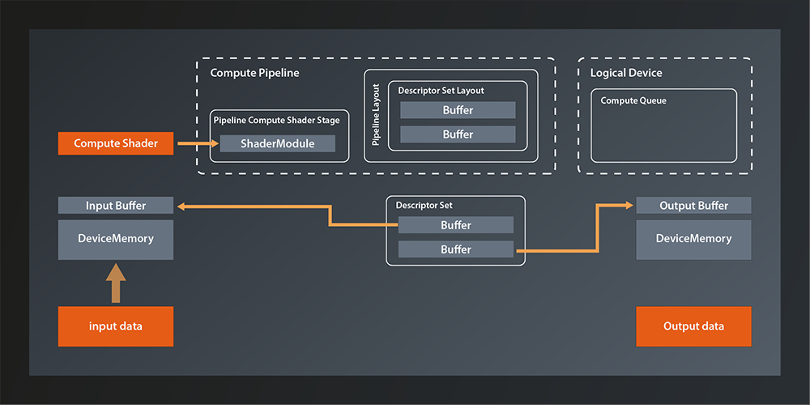

# Command Buffers

An apology upfront: last time I promised that this would be the lesson where we put it all together. When writing the lesson however, I realized that it would be way too long if I put everything that's still missing in this article. So I decided to make it two lessons, which means our pipeline won't be producing output until next time. Sorry for that.

Last time we created the descriptor set that represents our input and output buffers. Which means that our Vulkan environment looks something like that now:



So the main things missing is connecting the descriptor set to the pipeline and running the pipeline on the logical device queue. And of course we also want the data to be accessible from our main application in the end, but we already know how to do that.

You might expect the pipeline-related tasks to be implemented as high level API functions, but this is not how Vulkan was designed. Instead, queues are executing small programs themselves, known as command buffers, which are pre-built in the host application and submitted to the GPU as a whole. This mechanism has multiple advantages:
- it allows the host application to use multiple threads when building the command buffers and thus make better use of modern CPUs.
- the command buffers can be reused (e.g. the tasks that are executed in a rendering pipeline will often not change in between frames, only some of the data will. So instead of re-issuing the same API calls over and over, you can just execute the same command buffers)
- the overhead of CPU-GPU communication is reduced

For us this means that we need to do to the following to get our pipeline up and running:
- create a command buffer
- add the necessary commands to it (Vulkan-speak for that is 'recording the commands'):
  - use our compute pipeline
  - bind our descriptor set to the pipeline
  - run the pipeline by dispatching a number of local workgroups
- submit the command buffer to the queue on the device

Alright, sounds doable, doesn't it? Let's get going.

## Allocating the Command Buffer
Here's the function to create a command buffer:
```
class Device
{
    ...
    std::vector< vk::CommandBuffer > allocateCommandBuffers( const CommandBufferAllocateInfo& allocateInfo, ... );
    ...
};
```
The fact that the function is called `allocate...` already suggests that we'll need some kind of pool. Which is why - although in this case there is also a `...Unique` version of the function - we don't have to worry about releasing the command buffers in the end.

Let's look at the allocation info struct:
```
struct CommandBufferAllocateInfo
{
    ...
    CommandBufferAllocateInfo& setCommandPool( CommandPool commandPool_ );
    CommandBufferAllocateInfo& setLevel( CommandBufferLevel level_ );
    CommandBufferAllocateInfo& setCommandBufferCount( uint32_t commandBufferCount_ );
    ...
};
```
That seems pretty straightforward. We already anticipated that we'd need a pool and here is the confirmation. The `CommandBufferLevel` determines whether we want a primary or a secondary command buffer. Secondary command buffers can be used as building blocks for primary command buffers. We won't use secondary buffers for now. The `commandBufferCount_` specifies how many command buffers we want to allocate.

So, it seems we have everything we need except for the pool. Where do we get that from? Once again the logical device is our friend:
```
class Device
{
    ...
    UniqueCommandPool createCommandPoolUnique( const CommandPoolCreateInfo& createInfo, ... );
    ...
};
```
... with:
```
struct CommandPoolCreateInfo
{
    ...
    CommandPoolCreateInfo& setFlags( CommandPoolCreateFlags flags_ );
    CommandPoolCreateInfo& setQueueFamilyIndex( uint32_t queueFamilyIndex_ );
    ...
};
```
There are a few flags that specify details about how the command buffers allocated from the pool will be used. At this point we don't need any of those. The `queueFamilyIndex` is the index of the queue family that we want to use our command buffer with. That one is a bit unfortunate since we've encapsulated the queue selection in our `create_logical_device` function and thus do not have access to the index outside of it right now. I don't really want to undo that encapsulation, but I also don't want to start resorting to C paradigms like out-parameters. So let's do the same that we did for the GPU buffer and the associated memory(1):
```
struct logical_device {
    vk::UniqueDevice device;
    std::uint32_t queueFamilyIndex;

    operator const vk::Device&() const { return *device; }
};

logical_device create_logical_device( const vk::PhysicalDevice& physicalDevice )
{
    ...

    return logical_device{
        std::move( physicalDevice.createDeviceUnique( deviceCreateInfo ) ),
        queueFamilyIndex
    };
}
```
Of course there need to be a few refactorings in our `main` function to adapt to the new return value. This is where the cast operator helps us because you can simply replace every use of `*logicalDevice` with `logicalDevice`. The other usages are similarly straightforward to adapt, they just require a bit more typing.

Now that we have access to the `queueFamilyIndex`, we can create the command pool and allocate the buffer:
```
const auto commandPool = logicalDevice.device->createCommandPoolUnique(
    vk::CommandPoolCreateInfo{}.setQueueFamilyIndex( logicalDevice.queueFamilyIndex )
);

const auto commandBufferAllocateInfo = vk::CommandBufferAllocateInfo{}
    .setCommandPool( *commandPool )
    .setLevel( vk::CommandBufferLevel::ePrimary )
    .setCommandBufferCount( 1 );
const auto commandBuffer = logicalDevice.device->allocateCommandBuffers( commandBufferAllocateInfo )[0];
```
The allocation function always returns a vector but we only have one buffer. We therefore just take the only element from that vector right away to make the following code more concise.

## Preparing the Command Buffer
Alright, we have the command buffer now so let's prepare it for recording our commands. We do this by using the `begin` function:
```
class CommandBuffer
{
    ...
    void begin( const CommandBufferBeginInfo& beginInfo, ... ) const noexcept;
    ...
};
```
... with:
```
struct CommandBufferBeginInfo
{
    ...
    CommandBufferBeginInfo& setFlags( vk::CommandBufferUsageFlags flags_ );
    CommandBufferBeginInfo& setPInheritanceInfo( const vk::CommandBufferInheritanceInfo* pInheritanceInfo_ );
    ...
};
```
The flags are actually relevant this time, as we have to use them to tell Vulkan how we intend to use this command buffer:
- CommandBufferUsageFlagBits::eOneTimeSubmit: This flag being set indidcates that the command buffer will only be submitted once. Before any subsequent submit, the commands in it will have been re-recorded. The absence of this flag indicates that the buffer may be re-submitted.
- CommandBufferUsageFlagBits::eRenderPassContinue: This one is only relevant for secondary command buffers and ignored for primary ones. It indicates that this command buffer will be used within a render pass(2).
- CommandBufferUsageFlagBits::eSimultaneousUse: This indicates that the command buffer might be used multiple times in parallel.

The inheritance info on the other hand is related to command buffer inheritance which we will not cover for now and so we can ignore this parameter.

Once we're done adding commands to the buffer we have to stop recording. That is simple:
```
class CommandBuffer
{
    ...
    void end( ... ) const;
    ...
};
```

Putting that together we can prepare our command buffer for recording like this:
```
const auto beginInfo = vk::CommandBufferBeginInfo{}
    .setFlags( vk::CommandBufferUsageFlagBits::eOneTimeSubmit );
commandBuffer.begin( beginInfo );

// record commands here

commandBuffer.end();
```

The command buffer is ready to take in commands now. In the next lesson we'll add the concrete commands and finally get our compute pipeline running for real.


1. If you want to get away with less refactoring or fewer custom types, you could make the return value a tuple of device and queue index. On the call side you could then use C++17 structured bindings to decompose those two again. That would be a totally valid approach, I just feel that the queue index and the logical device are semantically so connected that it justifies coupling them in a dedicated type.
2. A render pass is a concept that becomes relevant when we create the graphics pipeline. We'll get into more detail when we get there.

Further reading:
https://cybertic.cz/vulkan-vs-opengl-part-2/