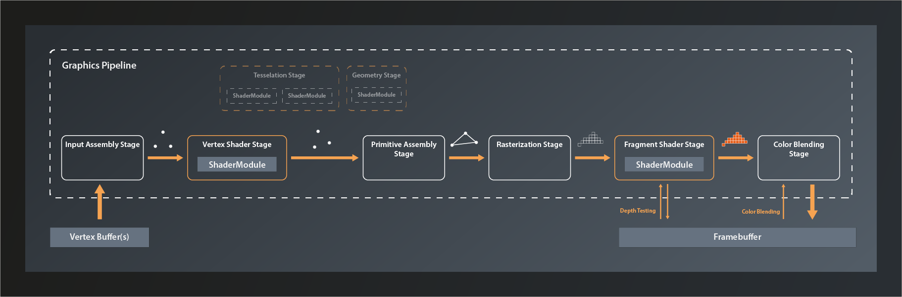

# Lesson 14: The graphics pipeline

So, now that we have our window and the associated surface ready, let's get started implementing our graphics pipeline. Obviously, to be able to do that, it might help to understand how a graphics pipeline actually works.

## The Logical Graphics Pipeline

Like the compute pipeline, the graphics pipeline takes some input data, processes it and outputs the result. The key difference is that while a compute pipeline is pretty much 'general purpose', the graphics pipeline is tailored to a very specific use case: to transform a 3D world that is made of thousands of primitives (usually triangles) into a 2D image of that world. Where the compute pipeline only has one processing stage that is freely programmable, a graphics pipeline has at least five stages with clearly defined responsibilities. Some of those stages are fixed in their functionality, the behaviour of others is controlled by a shader program that we provide (like the compute shader). Each stage takes the output of the previous one as its input - hence the name pipeline.

So let's look at the logical structure of a Vulkan graphics pipeline:

The main input to the graphics pipeline is a collection of so-called vertices[^1] that are stored in a specific type of buffer. Technically speaking, a vertex is just a tuple of values that don't have any predefined meaning. In practice however it is almost always the coordinates of a point in 3D space plus associated attributes such as e.g. its color, the corresponding texture index and so on. These vertices are the corners of all the primitives that make up the 3D world we want to render.

The first stage of the pipeline itself is the _Input Assembly Stage_. This is a fixed stage whose main responsibility is to collect the vertex input data from the specified buffer(s) and to ensure that the right vertices in the right order are passed on to the vertex shader stage. This enables e.g. re-using vertices that are shared between multiple primitives and thus saving memory bandwidth.

Next in line is the _Vertex Shader Stage_. This is one of the programmable stages, and it's the only one that is mandatory to be specified. So we are always required to write a vertex shader. This shader's main responsibility is to transform one input vertex coordinate to an output coordinate so that it ends up in the right position in our 3D world, relative to the location of our virtual camera. We'll talk about this process in more detail later in this series. The vertex shader may also perform additional tasks like e.g. per-vertex lighting calculations.

_Tessellation and Geometry Stages_ are also programmable, but they are optional and we won't be using them for now. I therefore won't go into details here. Suffice it to say that they can be used to let the GPU create additional vertices to add geometry to the scene and improve the level of detail.

The _Primitive Assembly_ is a fixed stage that takes the processed (and - if we have tessellation and/or geometry shaders - generated ) vertices and groups them into primitives by using the information from the input assembly stage. Without this step, the next stage would not be able to do its job as it would still only see individual vertices and couldn't process primitives as a whole. The primitive assembly stage is also the one that applies the viewport transformation, i.e. it transforms vertices from normalized 3D device coordinates into 2D image coordinates.

_Rasterization_ is another fixed stage whose main job it is to transform the logical representation of a primitive (up to now those are still defined by their vertices) into a collection of so-called fragments that are interpolated between the vertices and make up the actual visual shape on your screen[^2]. The rasterization stage is also responsible for operations like back-face culling and depth clamping (more on those later), and to determine whether the geometry ultimately is drawn as points, lines or filled shapes.

Each fragment is then sent to the next stage: the _Fragment Shader_. This is a programmable stage that is run once per fragment[^3], usually primarily to determine its color as a result of lighting and surface properties. Depth testing and multisampling - if enabled - also happen in the context of the fragment shader stage. It is actually not mandatory to provide a shader for this stage and there are use cases where it makes sense to omit that[^4]. We want to generate output on the screen however, so we will write a fragment shader.

And finally the _Color Blending Stage_. This is where the color of each new fragment is merged with the already existing color value at the respective location. Depending on the configuration of this stage, this allows for hardware-accelerated transparency, translucency etc.

The output data of the graphics pipeline is stored in a so-called framebuffer. In the simplest case the output is just one rendered image, but the framebuffer can hold multiple of those, e.g. for also storing the depth values for each fragment. This is why the fragment shader stage and the color blending stage have to interact with the framebuffer instead of just writing to it.

---

[^1]: In reality there usually is also other input like vertex indices, global variables (aka uniforms) etc. They are not relevant for understanding the basic principles of the pipeline though, therefore I'm ignoring them at this point.
[^2]: A fragment is basically a position in the 2D space of the framebuffer with an associated a depth value, plus potentially some interpolated data from previous stages. For simplicity you can think of the fragments as the pixels of the image that are finally drawn on the screen, although this is not really accurate as there is not always a 1:1 equivalence between a fragment and a pixel (e.g. in the presence of multisampling).
[^3]: It's good to keep in mind that the fragment shader, since it is run a lot more often than the other shaders, has a significant impact on the overall processing time of the pipeline.
[^4]: This makes sense e.g. when you're only interested in the depth value of a fragment because you're doing shadow mapping or a related technique
