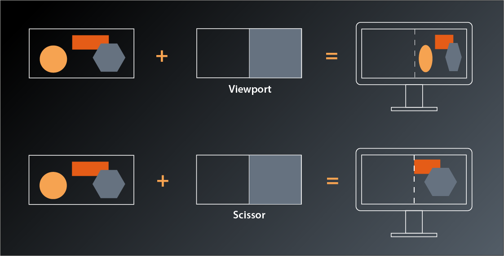

# Creating the Graphics Pipeline - Part 2
We're still in the process of filling the `GraphicsPipelineCreateInfo` structure with data to create our first pipeline, so without further ado let's continue where we left off last time.

## Viewport State
The next thing we need to set is the viewport state. Here's the declaration:
```
struct PipelineViewportStateCreateInfo
{
    ...
    PipelineViewportStateCreateInfo & setFlags( PipelineViewportStateCreateFlags flags_ );
    PipelineViewportStateCreateInfo & setViewports( const container_t< const Viewport >& viewports_ );
    PipelineViewportStateCreateInfo & setScissors( const container_t< const Rect2D >& scissors_ );
    ...
};
```
The flags are once again reserved for future use and not used yet. Which leaves viewports and scissors and it seems we are actually able to set several of each.

Viewports are pretty straightforward, they just define the dimensions of the 'window' through which we look at our 3D scene, its position in our application window and the depth range which we're able to see (in normalized device coordinates):
```
struct Viewport
{
    ...
    Viewport& setX( float x_ );
    Viewport& setY( float y_ ); 
    Viewport& setWidth( float width_ );
    Viewport& setHeight( float height_ );
    Viewport& setMinDepth( float minDepth_ );
    Viewport& setMaxDepth( float maxDepth_ );
    ...
};
```
Usually you will just set `x_` and `y_` to 0, and `width_` and `height_` to the size of the application window. But it's possible to specify other values to e.g. draw only in the lower right quarter and leave the rest of the window blank to be filled with other things. You could also stretch the output by scaling width and height with different factors.
The depth values specify the z-value range in which primitives need to fall so that they are rendered. Usually you'll set this range to 0 and 1.0 to actually apply the clipping range defined in the perspective transformation(1).

The scissor is somewhat similar in that you can specify a region of your output image that the drawing will be limited to. The difference to the viewport is that the whole rendered image will be drawn into the viewport, whereas the scissor can be used to cut out a subsection of the rendering. Usually you will want to set the scissor to the whole output window size as well.



Which leaves the question why we should be able to set multiple viewports and scissors for our pipeline? The most obvious example I can think of is a CAD or 3D modeling application, where the same scene is shown from different angles and with different perspectives. In Vulkan you could render those with a single pipeline(2). We'll stick to one viewport in this tutorial.

Let's put that into practice. We want our pipeline creation to be independent from any application-specific constants like the window size and therefore pass the desired viewport extent as a parameter:
```
vk::UniquePipeline create_graphics_pipeline(
    const vk::Device& logicalDevice,
    const vk::ShaderModule& vertexShader,
    const vk::ShaderModule& fragmentShader,
    const vk::Extent2D& viewportExtent
)
{
    ...

    const auto viewport = vk::Viewport{}
        .setX( 0.f )
        .setY( 0.f )
        .setWidth( static_cast< float>( viewportExtent.width ) )
        .setHeight( static_cast< float>( viewportExtent.height ) )
        .setMinDepth( 0.f )
        .setMaxDepth( 1.f );

    const auto scissor = vk::Rect2D{ { 0, 0 }, viewportExtent };

    const auto viewportState = vk::PipelineViewportStateCreateInfo{}
        .setViewports( viewport )
        .setScissors( scissor );

    const auto pipelineCreateInfo = vk::GraphicsPipelineCreateInfo{}
        .setStages( shaderStageInfos )
        .setPVertexInputState( &vertexInputState )
        .setPInputAssemblyState( &inputAssemblyState )
        .setPViewportState( &viewportState );
    ...
}
```
... and modify our `main` function like so:
```
int main()
{
    constexpr int windowWidth = 800;
    constexpr int windowHeight = 600;

    try
    {
        const auto glfw = vcpp::glfw_instance{};
        const auto window = vcpp::create_window( windowWidth, windowHeight, "Vulkan C++ Tutorial" );

        ...

        const auto pipeline = create_graphics_pipeline(
            logicalDevice,
            *vertexShader,
            *fragmentShader,
            vk::Extent2D{ windowWidth, windowHeight } );
        ...
}
```

## Rasterization state
Next in line is the rasterization state. Here's the interface:
```
struct PipelineRasterizationStateCreateInfo
{
    ...
    PipelineRasterizationStateCreateInfo& setFlags( PipelineRasterizationStateCreateFlags flags_ );
    PipelineRasterizationStateCreateInfo& setDepthClampEnable( Bool32 depthClampEnable_ );
    PipelineRasterizationStateCreateInfo& setRasterizerDiscardEnable( Bool32 rasterizerDiscardEnable_ );
    PipelineRasterizationStateCreateInfo& setPolygonMode( PolygonMode polygonMode_ );
    PipelineRasterizationStateCreateInfo& setCullMode( CullModeFlags cullMode_ );
    PipelineRasterizationStateCreateInfo& setFrontFace( FrontFace frontFace_ );
    PipelineRasterizationStateCreateInfo& setDepthBiasEnable( Bool32 depthBiasEnable_ );
    PipelineRasterizationStateCreateInfo& setDepthBiasConstantFactor( float depthBiasConstantFactor_ );
    PipelineRasterizationStateCreateInfo& setDepthBiasClamp( float depthBiasClamp_ );
    PipelineRasterizationStateCreateInfo& setDepthBiasSlopeFactor( float depthBiasSlopeFactor_ );
    PipelineRasterizationStateCreateInfo& setLineWidth( float lineWidth_ );
    ...
};
```
Okay, so there's actually quite a number of parameters to configure this stage. Let's have a closer look:
- the `flags_` are once more reserved for future use and therefore not relevant for us
- `depthClampEnable_` controls whether calculated depth values are clamped to the viewport's min and max depth values. Enabling this can avoid 'holes' in your rendered geometry that result from fragments being discarded because their depth values are outside of the clipping range.
- `rasterizerDiscardEnable_` can be used to turn off the whole rasterization stage (and all subsequent stages with it). This might be useful if you want to use the results of the calculations in preceding shader stages for something else than drawing. 
- `setPolygonMode` controls whether Vulkan will draw only points, lines or filled primitives. This is not the same as the topology from the input assembly stage: that one controlled how the vertices are to be combined to shapes while the `polygonMode_` here only changes how the resulting geometry is rasterized.
- `setCullMode` and `setFrontFace` control the back face culling optimization's behaviour. We'll get to that eventually, but for now let's just leave the parameters at their defaults.
- the depth bias functions are related to a more advanced technique that helps prevent rendering errors which are caused by rounding effects when calculating the depth values of different primitives. We won't need that for our single triangle either.
- the `lineWidth_` is only relevant when rasterizing in the polygon mode `vk::PolygonMode::eLines`. Which means we don't really need that, however we're still required to set it and the validation will yell at us if we set anything but 1.0.

So, it turns out that it's actually not that complicated to set the rasterization parameters for our use case:
```
const auto rasterizationState = vk::PipelineRasterizationStateCreateInfo{}
    .setDepthClampEnable( false )
    .setRasterizerDiscardEnable( false )
    .setPolygonMode( vk::PolygonMode::eFill )
    .setLineWidth( 1.f );
```
If you run this version you might spot that one of the error messages has changed and is now complaining about the multisample state missing. That one's next on our list so let's get right to it.

## Multisampling
As I mentioned in lesson 14 we won't be using multisampling for now, but Vulkan requires us to configure it anyway. Luckily we can just use a default-constructed `PipelineMultisampleStateCreateInfo`:
```
vk::UniquePipeline create_graphics_pipeline(
    const vk::Device& logicalDevice,
    const vk::ShaderModule& vertexShader,
    const vk::ShaderModule& fragmentShader,
    const vk::Extent2D& viewportExtent
)
{
    ...

    const auto multisampleState = vk::PipelineMultisampleStateCreateInfo{};

    const auto pipelineCreateInfo = vk::GraphicsPipelineCreateInfo{}
        .setStages( shaderStageInfos )
        .setPVertexInputState( &vertexInputState )
        .setPInputAssemblyState( &inputAssemblyState )
        .setPViewportState( &viewportState )
        .setPRasterizationState( &rasterizationState )
        .setPMultisampleState( &multisampleState );
    ...
}
```
And with that we're yet another error down. Yay!

As mentioned before, we'll not be using the depth stencil state for now since we will only draw one triangle in the beginning. And in this case we also don't need to do anything to satisfy Vulkan, so let's move on to the color blending configuration.

## Color blending
Color blending is what happens after the graphics pipeline has determined the color of a fragment and updates the corresponding framebuffer image accordingly. In the simplest case the new color just replaces whatever color was stored in that location before. This is the behavior when blending is disabled and this is what we want to do for now. Nevertheless, Vulkan requires us to be explicit here again and provide a `PipelineColorBlendStateCreateInfo`.

A framebuffer may contain multiple destination images (so-called color attachments) and Vulkan allows us to set individual color blending modes for each one. Therefore the create info is basically a collection of `PipelineColorBlendAttachmentState` structures:
```
struct PipelineColorBlendStateCreateInfo
{
    ...
    PipelineColorBlendStateCreateInfo& setAttachments( const container_t< const vk::PipelineColorBlendAttachmentState >& attachments_ );    
    ...
}
```
This time we also don't get away with simply using a default constructed `PipelineColorBlendAttachmentState`. Instead we need to disable color blending explicitly but still instruct Vulkan which color channels we want to write:
```
struct PipelineColorBlendAttachmentState
{
    ...
    PipelineColorBlendAttachmentState& setBlendEnable( Bool32 blendEnable_ );
    PipelineColorBlendAttachmentState& setColorWriteMask( ColorComponentFlags colorWriteMask_ );
    ...
};
```

So here's how we configure our color blend state:
```
const auto colorBlendAttachment = vk::PipelineColorBlendAttachmentState{}
    .setBlendEnable( false )
    .setColorWriteMask(
        vk::ColorComponentFlagBits::eR |
        vk::ColorComponentFlagBits::eG |
        vk::ColorComponentFlagBits::eB |
        vk::ColorComponentFlagBits::eA );

const auto colorBlendState = vk::PipelineColorBlendStateCreateInfo{}
    .setAttachments( colorBlendAttachment );
```

Running this version you'll still get the validation errors and the crash. Nevertheless we're slowly making progress and I want to stop it here for today. I know that this is annoying, after all it's the second lesson in a row after which our code doesn't really work. Please be patient my friends, we'll soon be over the hump and start to have real fun.


1. Perspective transformation is essentially the virtual camera with which you look at the scene and usually happens in the vertex shader. Mathematically speaking it transforms the coordinates of each vertex from the view space to a normalized space, i.e. the output coordinates are in the range -1...1 for x and y and 0...1 for z. We'll get into more details in a later session.
2. Note that multi-viewport support is not mandatory to be implemented in your graphics driver, so you need to check the `maxViewports` member of the `PhysicalDeviceLimits` described in lesson 3 if you want to make use of that feature.