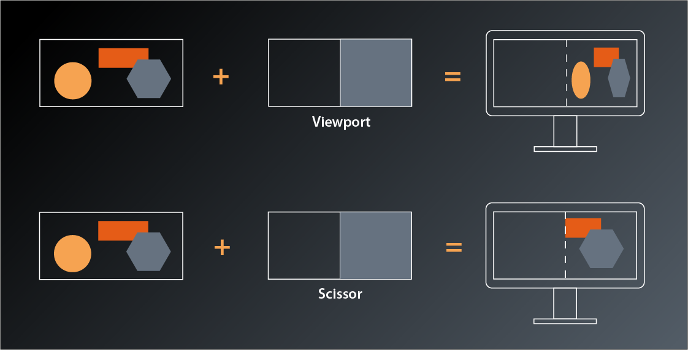

# Lesson 16: Creating the Graphics Pipeline - Part 2
We're still in the process of filling the `GraphicsPipelineCreateInfo` structure with data to create our first pipeline, so without further ado let's continue where we left off last time.

## Viewport State
The next thing we need to set is the viewport state. Here's the declaration:
```cpp
struct PipelineViewportStateCreateInfo
{
    ...
    PipelineViewportStateCreateInfo & setFlags( PipelineViewportStateCreateFlags flags_ );
    PipelineViewportStateCreateInfo & setViewports( const container_t< const Viewport >& viewports_ );
    PipelineViewportStateCreateInfo & setScissors( const container_t< const Rect2D >& scissors_ );
    ...
};
```
The flags are once again reserved for future use and not used yet. Which leaves viewports and scissors and it seems we are actually able to set several of each.

Viewports are pretty straightforward, they just define the dimensions of the 'window' through which we look at our 3D scene, its position in our application window and the depth range which we're able to see (in normalized device coordinates):
```cpp
struct Viewport
{
    ...
    Viewport& setX( float x_ );
    Viewport& setY( float y_ );
    Viewport& setWidth( float width_ );
    Viewport& setHeight( float height_ );
    Viewport& setMinDepth( float minDepth_ );
    Viewport& setMaxDepth( float maxDepth_ );
    ...
};
```
Usually you will just set `x_` and `y_` to 0, and `width_` and `height_` to the size of the application window. But it's possible to specify other values to e.g. draw only in the lower right quarter and leave the rest of the window blank to be filled with other things. You could also stretch the output by scaling width and height with different factors.
The depth values specify the z-value range in which primitives need to fall so that they are rendered. Usually you'll set this range to 0 and 1.0 to actually apply the clipping range defined in the perspective transformation[^1].

The scissor is somewhat similar in that you can specify a region of your output image that the drawing will be limited to. The difference to the viewport is that the whole rendered image will be drawn into the viewport, whereas the scissor can be used to cut out a subsection of the rendering. Usually you will want to set the scissor to the whole output window size as well.



Which leaves the question why we should be able to set multiple viewports and scissors for our pipeline? The most obvious example I can think of is a CAD or 3D modeling application, where the same scene is shown from different angles and with different perspectives. In Vulkan you could render those with a single pipeline[^2]. We'll stick to one viewport in this tutorial.

Let's put that into practice. We want our pipeline creation to be independent from any application-specific constants like the window size and therefore pass the desired viewport extent as a parameter:
```cpp
auto createGraphicsPipeline(
    const vk::Device& logicalDevice,
    const vk::ShaderModule& vertexShader,
    const vk::ShaderModule& fragmentShader,
    const vk::Extent2D& viewportExtent
) -> vk::UniquePipeline
{
    ...

    const auto viewport = vk::Viewport{}
        .setX( 0.f )
        .setY( 0.f )
        .setWidth( static_cast< float >( viewportExtent.width ) )
        .setHeight( static_cast< float >( viewportExtent.height ) )
        .setMinDepth( 0.f )
        .setMaxDepth( 1.f );

    const auto scissor = vk::Rect2D{ { 0, 0 }, viewportExtent };

    const auto viewportState = vk::PipelineViewportStateCreateInfo{}
        .setViewports( viewport )
        .setScissors( scissor );

    const auto pipelineCreateInfo = vk::GraphicsPipelineCreateInfo{}
        .setStages( shaderStageInfos )
        .setPVertexInputState( &vertexInputState )
        .setPInputAssemblyState( &inputAssemblyState )
        .setPViewportState( &viewportState );
    ...
}
```
... and modify our `main` function like so:
```cpp
int main()
{
    constexpr int windowWidth = 800;
    constexpr int windowHeight = 600;

    try
    {
        const auto glfw = vcpp::GlfwInstance{};
        const auto window = vcpp::createWindow( windowWidth, windowHeight, "Vulkan C++ Tutorial" );

        ...

        const auto pipeline = vcpp::createGraphicsPipeline(
            logicalDevice,
            *vertexShader,
            *fragmentShader,
            vk::Extent2D{ windowWidth, windowHeight }
        );
        ...
}
```

---

[^1]: Perspective transformation is essentially the virtual camera with which you look at the scene and usually happens in the vertex shader. Mathematically speaking it transforms the coordinates of each vertex from the view space to a normalized space, i.e. the output coordinates are in the range -1...1 for x and y and 0...1 for z. We'll get into more details in a later session.
[^2]: Note that multi-viewport support is not mandatory to be implemented in your graphics driver, so you need to check the `maxViewports` member of the `PhysicalDeviceLimits` described in lesson 3 if you want to make use of that feature.