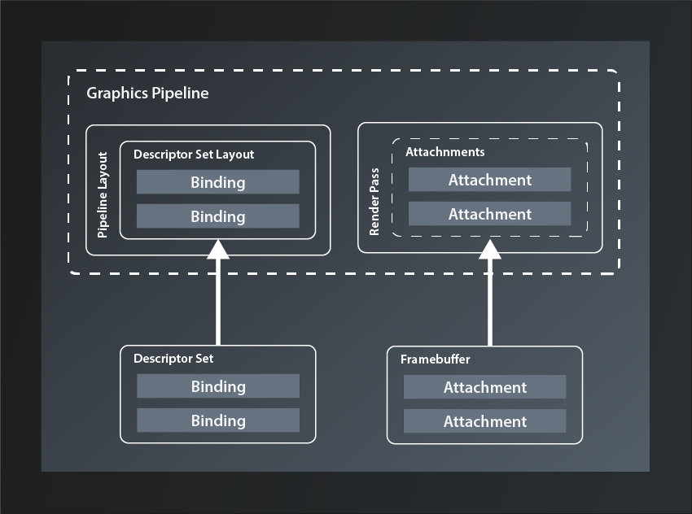

# Creating the Graphics Pipeline - Part 3

## Pipeline Layout
The next thing we need to configure for our graphics pipeline is the `PipelineLayout`. You may remember that we had to create one for our compute pipeline as well (see lesson 8), and that the pipeline layout is a structure that describes the data that our pipeline interacts with.

Now, because a graphics pipeline is so much tailored towards its one specific use case, the main input to the pipeline (the vertex data) is actually not modeled in the pipeline layout but has its own dedicated structure (the vertex input state that we covered two lessons ago). The same applies to the output (we'll get to that in a minute). So while we will need the pipeline layout later when we start working with uniforms, textures etc, we can just pass in an empty layout for now:
```
UniquePipeline create_graphics_pipeline(
    const Device& logicalDevice,
    const ShaderModule& vertexShader,
    const ShaderModule& fragmentShader,
    const Extent2D& viewportExtent
)
{
    ...
    const auto pipelineLayout = logicalDevice.createPipelineLayoutUnique( PipelineLayoutCreateInfo{} );

    const auto pipelineCreateInfo = GraphicsPipelineCreateInfo{}
        .setStages( shaderStageInfos )
        .setPVertexInputState( &vertexInputState )
        .setPInputAssemblyState( &inputAssemblyState )
        .setPViewportState( &viewportState )
        .setPRasterizationState( &rasterizationState )
        .setPMultisampleState( &multisampleState )
        .setPColorBlendState( &colorBlendState )
        .setLayout( *pipelineLayout );
    ...
}
```

## Render Pass
The `RenderPass` structure might be a bit confusing at first, not least because of its name, but it is actually not that difficult. A render pass describes where the pipeline stores the output it produces. Since that output is normally color and depth values for each fragment it seems logical that images are used as the storage structure. The render pass contains descriptions of those images and how to use them, those descriptions are called 'attachments'.

So conceptually the render pass is not that different from the pipeline layout. The attachments correspond to the descriptor bindings in that they are the logical representation of concrete data structures that will be bound to the pipeline when that is executed. The equivalent to the descriptor set is called 'framebuffer' (because it stores the data for one rendered frame):



But why is the structure called 'render pass' and not something like 'output layout' or 'target layout'? My guess is that the name was chosen because a new framebuffer is bound to the attachments for every frame, i.e. for every pass of the render loop. I still think something like 'RenderTargetLayout' or so would have been more confusing, all the more since the actual cycle of the pipeline to produce one frame is also typically referred to as a render pass.

Anyway, the data structure we need to describe a render pass looks like this:
```
struct RenderPassCreateInfo
{
    ...
    RenderPassCreateInfo& setFlags( RenderPassCreateFlags flags_ );
    RenderPassCreateInfo& setAttachments( const container_t< const AttachmentDescription >& attachments_ );
    RenderPassCreateInfo& setSubpasses( const container_t< const SubpassDescription >& subpasses_ );
    RenderPassCreateInfo& setDependencies( const container_t< const SubpassDependency >& dependencies_ );
    ...
};
```
- there's only one flag defined at this point which we don't need, so once more we're going to ignore that parameter. 
- as said, the `attachments_` describe the target images that the pipeline will output to. We'll look at them in more depth in a minute
- in a simple application like ours, the pipeline only renders one scene in one go. Complex graphical applications like games on the other hand often compose the pictures that are shown on screen from multiple passes, e.g. to render a user interface on top of the 3D scene or to apply post-processing effects. Therefore a render pass is actually a collection of `subpasses_`, each of which can use a different selection of the attachments as their in- or output. So, even though we don't need more than one pass, we'll have to define that as a subpass to the render pass.
- the subpass `dependencies_` are used to inform Vulkan about subpasses that require the output of another subpass as their input. We obviously won't need that yet.

With that knowledge under our belt, let's first implement a stub function to create our render pass:
```
vk::UniqueRenderPass create_render_pass( const vk::Device& logicalDevice )
{
    const auto renderPassCreateInfo = vk::RenderPassCreateInfo{};
    return logicalDevice.createRenderPassUnique( renderPassCreateInfo );
}
```
... and pass the result to our pipeline creation:
```
// pipelines.cpp

vk::UniquePipeline create_graphics_pipeline(
    const vk::Device& logicalDevice,
    const vk::ShaderModule& vertexShader,
    const vk::ShaderModule& fragmentShader,
    const vk::RenderPass& renderPass,
    const vk::Extent2D& viewportExtent
)
{
    ...
    const auto pipelineCreateInfo = vk::GraphicsPipelineCreateInfo{}
        .setStages( shaderStageInfos )
        .setPVertexInputState( &vertexInputState )
        .setPInputAssemblyState( &inputAssemblyState )
        .setPViewportState( &viewportState )
        .setPRasterizationState( &rasterizationState )
        .setPMultisampleState( &multisampleState )
        .setPColorBlendState( &colorBlendState )
        .setLayout( *pipelineLayout )
        .setRenderPass( renderPass );
    ...
}
```
```
// main.cpp

int main()
{
    ...
    const auto renderPass = vcpp::create_render_pass( logicalDevice );

    const auto pipeline = create_graphics_pipeline(
        logicalDevice,
        *vertexShader,
        *fragmentShader,
        *renderPass,
        vk::Extent2D{ windowWidth, windowHeight } );
    ...
}
```
Running this version brings us down to two validation errors (and the exception) - we're getting closer!

## Attachments
So let's actually configure our render pass and see what that gets us. The first thing we need to set are the attachments. We want to draw a simple triangle on screen for now, which means that we only need the color output of the pipeline (and not depth values or anything else). So we should probably create a color attachment and pass that to the configuration. All attachments are created with the same structure:
```
struct AttachmentDescription
{
    ...
    AttachmentDescription& setFlags( AttachmentDescriptionFlags flags_ );
    AttachmentDescription& setFormat( Format format_ );
    AttachmentDescription& setSamples( SampleCountFlagBits samples_ );
    AttachmentDescription& setLoadOp( AttachmentLoadOp loadOp_ );
    AttachmentDescription& setStoreOp( AttachmentStoreOp storeOp_ );
    AttachmentDescription& setStencilLoadOp( AttachmentLoadOp stencilLoadOp_ );
    AttachmentDescription& setStencilStoreOp( AttachmentStoreOp stencilStoreOp_ );
    AttachmentDescription& setInitialLayout( ImageLayout initialLayout_ );
    AttachmentDescription& setFinalLayout( ImageLayout finalLayout_ );
    ...
};
```
- there is one possible flag defined, but that is only relevant for advanced use cases where multiple attachments share the same physical memory. We therefore once more ignore the `flags_` parameter
- the `format_` specifies the color format of the attachment, i.e. the number of bits per color channel, how they are to be interpreted (e.g. signed vs unsigned) and the order of the channels. 
- the `samples_` parameter defines the number of multisample fragments per pixel. Since we're not using multisampling for now, we'll set it to `SampleCountFlagBits::e1`
- `loadOp_` tells Vulkan what to do when loading the attachment at the beginning of the render cycle. The following options are available:
  - `AttachmentLoadOp::eLoad`: load the attachment and don't touch the content. This is useful if you want to modify an already existing image by rendering into it
  - `AttachmentLoadOp::eClear`: set the whole attachment to the clear color initially. The clear color can be set at the beginning of the render cycle. Essentially you set a background color for your image with this option.
  - `AttachmentLoadOp::eDontCare`: allow Vulkan to do whatever it wants with the contents of the attachment. If you're sure that you'll render every single fragment in the image anyway, this is probably the most efficient option.
- similarly, `storeOp_` tells Vulkan what to do with the attachment at the end of the render cycle. The available options here are:
  - `AttachmentStoreOp::eStore`: this is the option you want to set if you intend to use the image after the render pass has ended, e.g. for displaying it on the screen.
  - `AttachmentStoreOp::eDontCare`: this tells Vulkan that you don't need the attachment after the end of the render cycle, so it can do with it whatever it wants. This usually is the case for the depth values or for any intermediate images that are only needed during the render cycle.
- `stencilLoadOp_` and `stencilStoreOp_` are essentially the same. They are only needed if the attachment is a combined depth-stencil attachment, in which case you can use different operations for the depth values (those are controlled by `loadOp_` and `storeOp_`) and the stencil values.
- `initialLayout_` tells Vulkan what layout the respective image will have at the beginning of the render cycle, `finalLayout_` is the layout that Vulkan should leave the attachment in at the end of the render cycle. We'll talk more about image layouts at a later point, for now we'll set our initial layout to `eUndefined` and the final layout to be optimized for use with a surface.

So let's put that into practice and extend our `create_render_pass` function. Since we don't want to be limited to a specific color format we'll just pass that one in as a parameter.
```
vk::UniqueRenderPass create_render_pass(
    const vk::Device& logicalDevice,
    const vk::Format& colorFormat
)
{
    const auto colorAttachment = vk::AttachmentDescription{}
        .setFormat( colorFormat )
        .setSamples( vk::SampleCountFlagBits::e1 )
        .setLoadOp( vk::AttachmentLoadOp::eClear )
        .setStoreOp( vk::AttachmentStoreOp::eStore )
        .setStencilLoadOp( vk::AttachmentLoadOp::eDontCare )
        .setStencilStoreOp( vk::AttachmentStoreOp::eDontCare )
        .setInitialLayout( vk::ImageLayout::eUndefined )
        .setFinalLayout( vk::ImageLayout::ePresentSrcKHR );

    const auto renderPassCreateInfo = vk::RenderPassCreateInfo{}
        .setAttachments( colorAttachment );

    return logicalDevice.createRenderPassUnique( renderPassCreateInfo );
}
```
On the call site we set the format parameter to a default `vk::Format` for the time being:
```
const auto renderPass = vcpp::create_render_pass( logicalDevice, vk::Format{} );
```
This doesn't yet change much because as described above, we need to define at least one subpass for our render pass.

## Subpasses
To define a subpass we need the `vk::SubpassDescription` structure:
```
struct SubpassDescription
{
    ...
    SubpassDescription& setFlags( SubpassDescriptionFlags flags_ );
    SubpassDescription& setPipelineBindPoint( PipelineBindPoint pipelineBindPoint_ );
    SubpassDescription & setInputAttachments( const container_t< const AttachmentReference >& inputAttachments_ );
    SubpassDescription & setColorAttachments(const container_t< const AttachmentReference >& colorAttachments_ );
    SubpassDescription & setResolveAttachments(const container_t< const AttachmentReference >& resolveAttachments_ );
    SubpassDescription & setPDepthStencilAttachment( const AttachmentReference* pDepthStencilAttachment_ );
    SubpassDescription & setPreserveAttachments( const container_t< const uint32_t >& preserveAttachments_ );
    ...
};
```
- there are actually a few `flags_` that we could set, but none of them is relevant for us at this point
- the `pipelineBindPoint_` determines the part of the pipeline that this subpass will use. There's only few choices: `eGraphics`, `eCompute` or `eRaytracing`. Obviously we want to use `eGraphics`.
- `inputAttachments_` are the attachments that this subpass needs as input, i.e. the ones that already contain valid data which it will use.
- `colorAttachments_` are the images that this subpass will write its color output to. It is in principle possible to use the same attachment for input and output in one subpass, but there are quite a few tricky details to that, so I'd recommend to not do it unless you're sure you need to.
- `resolveAttachments_` are used when working with multisampling. They are the single-sample-per-pixel images that the multisampled color attachments will be downsampled to.
- `depthStencilAttachment_` is - surprise - the image that will receive the depth and stencil data. As you see there can only be one of those, but we don't need one anyway for now.
- `preserveAttachments` tells Vulkan explicitly to leave those attachments alone although the subpass doesn't use them. This is needed if you have 3 or more subpasses and want to use an attachment that was rendered to in a subpass other than the previous one. Without referencing that attachment in the `preserveAttachments_` field, Vulkan might assume that you're done with it and apply some optimization that destroys its content. Since we only have one subpass we can leave this parameter alone for now.

So it looks like we only need one `AttachmentReference` for our color attachment. Defining an `AttachmentReference` is pretty simple for a change:
```
struct AttachmentReference
{
    ...
    AttachmentReference& setAttachment( uint32_t attachment_ );
    AttachmentReference& setLayout( ImageLayout layout_ );
    ...    
};
```
- `attachment_` is the index of the attachment in the `attachments_` container in `RenderPassCreateInfo` (see above). 
- `layout_` tells Vulkan which layout the subpass can expect the respective attachment to have. For our standard color attachment we'll use `eColorAttachmentOptimal`.

And with all that information we can now finally complete the creation of our render pass:
```
vk::UniqueRenderPass create_render_pass(
    const vk::Device& logicalDevice,
    const vk::Format& colorFormat
)
{
    const auto colorAttachment = vk::AttachmentDescription{}
        .setFormat( colorFormat )
        .setSamples( vk::SampleCountFlagBits::e1 )
        .setLoadOp( vk::AttachmentLoadOp::eClear )
        .setStoreOp( vk::AttachmentStoreOp::eStore )
        .setStencilLoadOp( vk::AttachmentLoadOp::eDontCare )
        .setStencilStoreOp( vk::AttachmentStoreOp::eDontCare )
        .setInitialLayout( vk::ImageLayout::eUndefined )
        .setFinalLayout( vk::ImageLayout::ePresentSrcKHR );

    const auto colorAttachmentRef = vk::AttachmentReference{}
            .setAttachment( 0 )
            .setLayout( vk::ImageLayout::eColorAttachmentOptimal );

    const auto subpass = vk::SubpassDescription{}
        .setPipelineBindPoint( vk::PipelineBindPoint::eGraphics )
        .setColorAttachments( colorAttachmentRef );

    const auto renderPassCreateInfo = vk::RenderPassCreateInfo{}
        .setAttachments( colorAttachment )
        .setSubpasses( subpass );

    return logicalDevice.createRenderPassUnique( renderPassCreateInfo );
}
```
Compile and run this version - et voilà! We still get one validation error that informs us about the color format being invalid (which is not really surprising given the fact that we use a default constructed `Format` structure), but the exception is finally gone.

## Color Format
So, let's deal with that color format parameter. As mentioned above, the color format basically describes how the color information for each pixel is represented in memory. That is definitely good to know, but it doesn't really help us decide which format we should use. And there are many possible formats.
Thinking about it, what we want to do with the rendered image is to display it on screeen. Or, more precisely we want to display it in our window. So we probably want the color format to be compatible to the surface we created in lesson 13. Is there a way to find out which color format our surface expects?

Turns out there is:
```
class PhysicalDevice
{
    ...
    std::vector< SurfaceFormatKHR > getSurfaceFormatsKHR( SurfaceKHR surface, ... ) const;
    ...
};
```
So this one returns a vector of `SurfaceFormatKHR` which probably is not the same as a `vk::Format`. Let's have a look:
```
struct SurfaceFormatKHR
{
    Format format;
    ColorSpaceKHR colorSpace;
};
```
Alright, seems like this is pretty straightforward, we just have to use the `format` property (we'll talk about color spaces in a later lesson).

Which leaves the question which format we should select if the surface supports more than one format and so the vector has more than one entry. In a real world application you'd probably have to create a sort of heuristic to find the supported color format that best matches your use case. We'll go with the simplest approach here and just use the first format available(1):
```
const auto surfaceFormats = physicalDevice.getSurfaceFormatsKHR( *surface );
const auto renderPass = vcpp::create_render_pass( logicalDevice, surfaceFormats[0].format );
```
And now the last validation error is finally gone as well, so we have a correct and working program again. Problem is: we still don't see anything on the screen. This is to be expected as we did not connect our pipeline to any output yet. That's what we're going to do next time but I'd say this lesson has been long enough.


1. As said before: if you encounter problems with this simplistic approach, please let me know and I'll extend the tutorial to make it work for you as well.