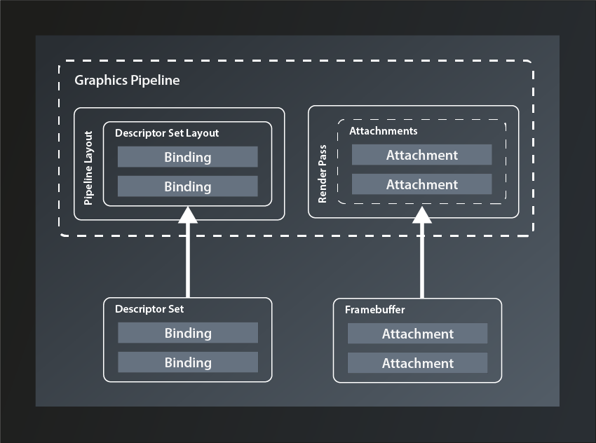

# Lesson 17: Creating the Graphics Pipeline - Part 3

## Pipeline Layout
The next thing we need to configure for our graphics pipeline is the `PipelineLayout`. You may remember that we had to create one for our compute pipeline as well (see lesson 8), and that the pipeline layout is a structure that describes the data that our pipeline interacts with.

Now, because a graphics pipeline is so much tailored towards its one specific use case, the main input to the pipeline (the vertex data) is actually not modeled in the pipeline layout but has its own dedicated structure (the vertex input state that we covered two lessons ago). The same applies to the output (we'll get to that in a minute). So while we will need the pipeline layout later when we start working with uniforms, textures etc, we can just pass in an empty layout for now. Still, to be properly prepared, let's update our creation function
```cpp
auto createGraphicsPipeline(
    const vk::Device& logicalDevice,
    const vk::PipelineLayout& pipelineLayout,
    const vk::ShaderModule& vertexShader,
    const vk::ShaderModule& fragmentShader,
    const vk::Extent2D& viewportExtent
) -> vk::UniquePipeline
{
    ...
    const auto pipelineCreateInfo = vk::GraphicsPipelineCreateInfo{}
        .setStages( shaderStageInfos )
        .setPVertexInputState( &vertexInputState )
        .setPInputAssemblyState( &inputAssemblyState )
        .setPViewportState( &viewportState )
        .setPRasterizationState( &rasterizationState )
        .setPMultisampleState( &multisampleState )
        .setPColorBlendState( &colorBlendState )
        .setLayout( pipelineLayout );
    ...
}
```
... and create a second version of the createPipelineLayout function to return an empty layout:
```cpp
auto createPipelineLayout( const vk::Device& logicalDevice ) -> vk::UniquePipelineLayout
{
    return logicalDevice.createPipelineLayoutUnique( vk::PipelineLayoutCreateInfo{} );
}
```

## Render Pass
The `RenderPass` structure might be a bit confusing at first, not least because of its name, but it is actually not that difficult. A render pass describes where the pipeline stores the output it produces. Since that output is normally color and depth values for each fragment it seems logical that images are used as the storage structure. The render pass contains descriptions of those images and how to use them, those descriptions are called 'attachments'.

So conceptually the render pass is not that different from the pipeline layout. The attachments correspond to the descriptor bindings in that they are the logical representation of concrete data structures that will be bound to the pipeline when that is executed. The equivalent to the descriptor set is called 'framebuffer' (because it stores the data for one rendered frame):



But why is the structure called 'render pass' and not something like 'output layout' or 'target layout'? My guess is that the name was chosen because a new framebuffer is bound to the attachments for every frame, i.e. for every pass of the render loop. I still think something like 'RenderTargetLayout' or so would have been less confusing, all the more since the actual cycle of the pipeline to produce one frame is also typically referred to as a render pass.

Anyway, the data structure we need to describe a render pass looks like this:
```cpp
struct RenderPassCreateInfo
{
    ...
    RenderPassCreateInfo& setFlags( RenderPassCreateFlags flags_ );
    RenderPassCreateInfo& setAttachments( const container_t< const AttachmentDescription >& attachments_ );
    RenderPassCreateInfo& setSubpasses( const container_t< const SubpassDescription >& subpasses_ );
    RenderPassCreateInfo& setDependencies( const container_t< const SubpassDependency >& dependencies_ );
    ...
};
```
- there's only one flag defined at this point which we don't need, so once more we're going to ignore that parameter.
- as said, the `attachments_` describe the target images that the pipeline will output to. We'll look at them in more depth in a minute
- in a simple application like ours, the pipeline only renders one scene in one go. Complex graphical applications like games on the other hand often compose the pictures that are shown on screen from multiple passes, e.g. to render a user interface on top of the 3D scene or to apply post-processing effects. Therefore a render pass is actually a collection of `subpasses_`, each of which can use a different selection of the attachments as their in- or output. So, even though we don't need more than one pass, we'll have to define that as a subpass to the render pass.
- the subpass `dependencies_` are used to inform Vulkan about subpasses that require the output of another subpass as their input. We obviously won't need that yet.

With that knowledge under our belt, let's first implement a stub function to create our render pass:
```cpp
auto createRenderPass( const vk::Device& logicalDevice ) -> vk::UniqueRenderPass
{
    const auto renderPassCreateInfo = vk::RenderPassCreateInfo{};
    return logicalDevice.createRenderPassUnique( renderPassCreateInfo );
}
```
... and pass the result to our pipeline creation:
```cpp
// pipelines.cpp

auto createGraphicsPipeline(
    const vk::Device& logicalDevice,
    const vk::PipelineLayout& pipelineLayout,
    const vk::ShaderModule& vertexShader,
    const vk::ShaderModule& fragmentShader,
    const vk::RenderPass& renderPass,
    const vk::Extent2D& viewportExtent
) -> vk::UniquePipeline
{
    ...
    const auto pipelineCreateInfo = vk::GraphicsPipelineCreateInfo{}
        .setStages( shaderStageInfos )
        .setPVertexInputState( &vertexInputState )
        .setPInputAssemblyState( &inputAssemblyState )
        .setPViewportState( &viewportState )
        .setPRasterizationState( &rasterizationState )
        .setPMultisampleState( &multisampleState )
        .setPColorBlendState( &colorBlendState )
        .setLayout( pipelineLayout )
        .setRenderPass( renderPass );
    ...
}
```
```cpp
// main.cpp

int main()
{
    ...
    const auto renderPass = vcpp::createRenderPass( logicalDevice );

    const auto pipelineLayout = vcpp::createPipelineLayout( logicalDevice );

    const auto pipeline = vcpp::createGraphicsPipeline(
        logicalDevice,
        *pipelineLayout,
        *vertexShader,
        *fragmentShader,
        *renderPass,
        vk::Extent2D{ windowWidth, windowHeight } );
    ...
}
```
Running this version brings us down to two validation errors (and the exception) - we're getting closer!
