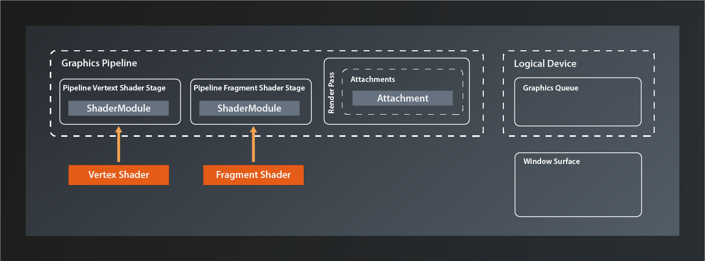
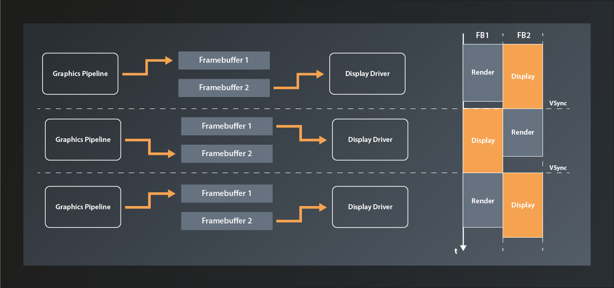
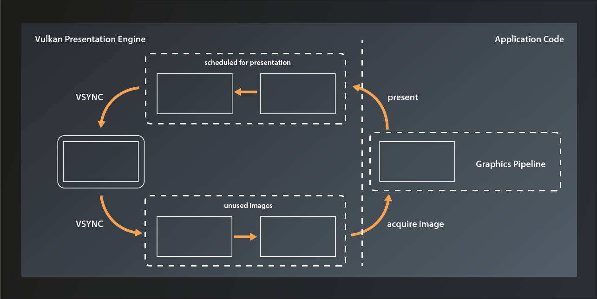

# Lesson 18: The Swapchain
Alright, let's have look where we are at right now. We've created the pipeline alright, but we're not actually running it on the device yet. And even if we did - while we made sure that the pipeline renders in a color format that is supported by our surface, we did not actually connect the pipeline to that surface yet.



In the last lesson we already established that to do so we need to bind a structure called 'framebuffer' to the pipeline. This framebuffer then contains the references to the actual images which the pipeline will render to. It seems logical to assume that those images should be provided by the surface, since that is the canvas we want to render to after all. And yes, in principle that is how it works, but unfortunately it's once again not that simple in Vulkan. To understand why, we need to have a quick look at how images generated on the graphics hardware end up being displayed on screen.

## Double buffering and the swapchain
A simplified model of how that works is this: the color data of the picture resides in a block of graphics memory (which is also called a 'framebuffer'). The screen driver reads one pixel at a time from this array and updates the corresponding dot on the display accordingly, starting at the top left corner and then drawing the lines pixel by pixel until it reaches the bottom right and jumps back to the start(1).

The problem is that if we'd render to the framebuffer while the display is reading from it we'd see ugly graphical artifacts because the screen will likely display unfinished images and/or the rendering process will be visible. The most common technique to solve this issue is to render to a different buffer than the one that the display is currently fed from. Once the rendering has completed, the buffers are swapped. This technique is known as 'double buffering'.



By itself double buffering still has one problem: if the swapping happens while the display update is currently in progress, the screen will show partially the previous image and partially the one that was just finished. This produces visible artifacts known as 'tearing'. Therefore the swapping ideally happens right at the VSYNC signal, i.e. the moment when the display update has finished the bottom right pixel and is about to start again at the top left.

Double buffering was the standard in older graphics engines and frameworks, e.g. in OpenGL. However, it still has some limitations and shortcomings, depending on the use case(2). That is why Vulkan generalizes the concept to become the 'swapchain'. A swapchain is essentially a ring-buffer of images that the application can acquire to render to and then send off to be presented. After presentation has finished the images are available again to be re-acquired. The swapchain can operate in different modes (which we'll get to later in this lesson), but this basic function principle is the same for all of them.




## Preparations
Since presentation is not part of the Vulkan core specification the swapchain is - like the general surface support - also implemented by an extension. Only this time it's a device-specific capability, so we need to enable the respective extension by adding its name to the list of required device extensions(3):
```
std::vector< const char* > get_required_device_extensions(
    const std::vector< vk::ExtensionProperties >& availableExtensions
)
{
    auto result = std::vector< const char* >{
        VK_KHR_SWAPCHAIN_EXTENSION_NAME
    };
    ...
}
```
The creation of the logical device will now fail if the device extension is not present. That's a rather theoretical use case though, unless you're working with servers. To be on the absolute safe side you could make the selection of the logical device dependent on swapchain support, but for a tutorial like this one it would be overkill to do so.

## Creating the swapchain
With that being out of our way, let's create the swapchain. We once more use the familiar pattern:
```
class Device
{
    ...
    UniqueSwapchainKHR createSwapchainKHRUnique( const SwapchainCreateInfoKHR& createInfo, ... );
    ...
}
```
... with:
```
struct SwapchainCreateInfoKHR
{
    ...
    SwapchainCreateInfoKHR& setFlags( SwapchainCreateFlagsKHR flags_ );
    SwapchainCreateInfoKHR& setSurface( SurfaceKHR surface_ );
    SwapchainCreateInfoKHR& setMinImageCount( uint32_t minImageCount_ );
    SwapchainCreateInfoKHR& setImageFormat( Format imageFormat_ );
    SwapchainCreateInfoKHR& setImageColorSpace( ColorSpaceKHR imageColorSpace_ );
    SwapchainCreateInfoKHR& setImageExtent( Extent2D const & imageExtent_ );
    SwapchainCreateInfoKHR& setImageArrayLayers( uint32_t imageArrayLayers_ );
    SwapchainCreateInfoKHR& setImageUsage( ImageUsageFlags imageUsage_ );
    SwapchainCreateInfoKHR& setImageSharingMode( SharingMode imageSharingMode_ );
    SwapchainCreateInfoKHR& setQueueFamilyIndices( const container_t<const uint32_t>& queueFamilyIndices_ );
    SwapchainCreateInfoKHR& setPreTransform( SurfaceTransformFlagBitsKHR preTransform_ );
    SwapchainCreateInfoKHR& setCompositeAlpha( CompositeAlphaFlagBitsKHR compositeAlpha_ );
    SwapchainCreateInfoKHR& setPresentMode( PresentModeKHR presentMode_ );
    SwapchainCreateInfoKHR& setClipped( Bool32 clipped_ );
    SwapchainCreateInfoKHR& setOldSwapchain( SwapchainKHR oldSwapchain_ );
    ...
};
```
Again a rather complex structure. Let's unpack:
- there are a few `SwapchainCreateFlagsKHR` defined, but we don't need any of them at this point
- the `surface_` parameter should be straightforward
- `minImageCount_` sets the minimum number of swapchain images that the application wants to be able to use at the same time. Note that this is not necessarily the number of swapchain images that will actually be created. Depending on internal factors and the selected presentation mode, Vulkan might actually create more(4)
- we already needed to specify the `imageFormat_` for our `AttachmentDescription` in the previous lesson, it's the same here
- the `imageColorSpace_` defines how to interpret the color values for the individual channels. Depending on the used color space, the same numeric representation of a color may yield very different visual results. Therefore it is important to pay attention and not mix up color spaces between storage format, calculation and display. In our case we will want to use the color format that the surface uses for our swapchain.
- `imageExtent_` is straightforward again - it's the dimensions of our swapchain images
- `imageArrayLayers` refers to a Vulkan feature named 'array images' that lets you store multiple pictures of the same size in the same image object. For our purposes, this will always be 1
- as its name suggests, `imageUsage_` defines how the swapchain images will be used (apart from presentation). There are multiple flags defined, but not all of them make sense in this context. We want to use the images as color attachments, so we'll pass `ImageUsageFlagBits::eColorAttachment`
- `imageSharingMode_` defines whether the swapchain images will be shared between multiple queues. If that is the case, `queueFamilyIndices_` has to contain all queues that will access them. We already established that while theoretically the presentation queue could be different from the rendering queue we'll assume that it will be the same queue (see lesson 13). We'll therefore just use `vk::SharingMode::eExclusive` here
- `setPreTransform` allows us to specify that a transformation (like e.g. a 90 degree clockwise rotation or horizontal flip) be applied to images in the swap chain. 
- if supported, `compositeAlpha_` can be used to blend the rendered image with the background provided by your windowing system. I.e. you could use this to implement e.g. transparent or translucent windows.
- `presentMode_` controls the exact behaviour of the swapchain. [This article](https://www.intel.com/content/www/us/en/developer/articles/training/api-without-secrets-introduction-to-vulkan-part-2.html#inpage-nav-4-5) gives a detailed explanation of the different modes, but in short they are:
  - `PresentModeKHR::eImmediate`: any image that is scheduled for presentation will be displayed as soon as possible, without waiting for the VSYNC. Apart from the two shared modes below, this is the mode with the smallest possible latency, but it will likely result in visible tearing.
  - `PresentModeKHR::eMailbox`: the image that was scheduled last will be displayed after the next VSYNC signal. Any images that have been scheduled before but not yet presented will be discarded.
  - `PresentModeKHR::eFifo`: all images scheduled for presentation will be added to the tail of a queue. At every VSYNC, the image at the head of the queue (if there is one) will be popped and displayed. For our simple tutorial application we do not care about latency. Since the fifo mode is guaranteed to be supported on all devices we will just use this one.
  - `PresentModeKHR::eFifoRelaxed`: same as the fifo mode, only that a new image will be displayed immediately if the previous one was on screen for more than one vsync period. I.e. if you're not rendering fast enough you will probably see tearing effects.
  - `PresentModeKHR::eSharedDemandRefresh` and `PresentModeKHR::eSharedContinuousRefresh` are implemented by an additional extension. They allow rendering to an already presented image to further reduce latency. 
- setting `clipped_` to true will allow Vulkan to not render the parts of the surface that are off-screen or obfuscated by another window or so. If set to false, the entire scene will always be rendered.

One thing to keep in mind is that many of the swapchain configuration options are dependent on what is actually supported by the concrete hardware and driver implementation. Our requirements here should be met by the vast majority of systems, but in production code you should definitely verify that upfront using `PhysicalDevice::getSurfaceCapabilitiesKHR`.

Alright, so let's put what we learned into practice. The swapchain is not a part of the pipeline, nor it is in any way directly related to GLFW. Therefore let's keep our codebase well structured and create a new source code file pair: `presentation.hpp` / `.cpp` (don't forget to add those files to the `CmakeLists.txt`). We'll then add the function for our swapchain creation:
```
vk::UniqueSwapchainKHR create_swapchain(
    const vk::Device& logicalDevice,
    const vk::SurfaceKHR& surface,
    const vk::SurfaceFormatKHR& surfaceFormat,
    const vk::Extent2D& surfaceExtent,
    const std::uint32_t numSwapchainImages
)
{
    const auto createInfo = vk::SwapchainCreateInfoKHR{}
        .setSurface( surface )
        .setMinImageCount( numSwapchainImages )
        .setImageFormat( surfaceFormat.format )
        .setImageColorSpace( surfaceFormat.colorSpace )
        .setImageExtent( surfaceExtent )
        .setImageArrayLayers( 1 )
        .setImageUsage( vk::ImageUsageFlagBits::eColorAttachment )
        .setImageSharingMode( vk::SharingMode::eExclusive )
        .setPreTransform( vk::SurfaceTransformFlagBitsKHR::eIdentity )
        .setCompositeAlpha( vk::CompositeAlphaFlagBitsKHR::eOpaque )
        .setPresentMode( vk::PresentModeKHR::eFifo )
        .setClipped( true );
    
    return logicalDevice.createSwapchainKHRUnique( createInfo );
}
```
We pass in everything related to the surface so that we're sure our swapchain is compatible to it. Additionally I decided to make the number of images required by the application a parameter because that one needs to be in sync with the requirements of our rendering function. We can now go on and create the swapchain:
```
int main()
{
    constexpr int windowWidth = 800;
    constexpr int windowHeight = 600;
    constexpr uint32_t swapchainImageCount = 2u;

    try
    {
        ...
        const auto swapchainExtent = vk::Extent2D{ windowWidth, windowHeight };

        const auto pipeline = create_graphics_pipeline(
            logicalDevice,
            *vertexShader,
            *fragmentShader,
            *renderPass,
            swapchainExtent );

        const auto swapchain = vcpp::create_swapchain(
            logicalDevice,
            *surface,
            surfaceFormats[0],
            swapchainExtent,
            swapchainImageCount );
        ...
    }
    ...
}
```
As you can see, I made a small refactoring here because it seems we'll need the swapchain extent more often. Other than that the call should be very straightforward.

That seems to work - running the program doesn't yield any issues or validation messages. We do now have the images that we want to render into, so the next step will be to create the framebuffers that link them with our pipeline. That's what we're going to do next time.


1. Yes, also modern LCD and OLED displays work like that (mainly because of compatibility reasons afaik)
2. For more information see https://developer.samsung.com/sdp/blog/en-us/2019/07/26/vulkan-mobile-best-practice-how-to-configure-your-vulkan-swapchain
3. We implicitly made sure that our graphics queue supports swapchains back in lesson 13 already when we checked that the device queue supports our surface.
4. For an in-depth discussion about this, see https://github.com/KhronosGroup/Vulkan-Docs/issues/909
