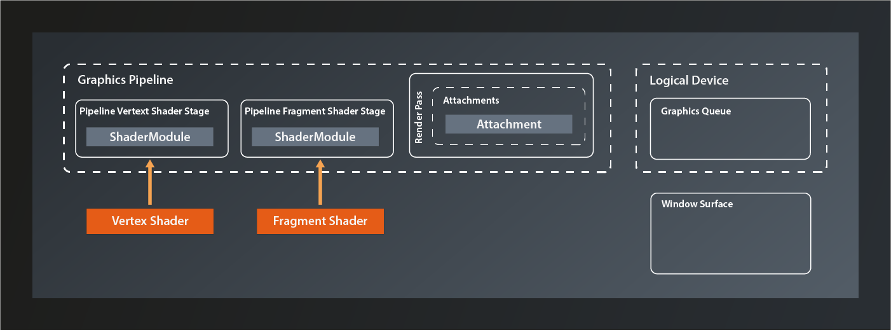
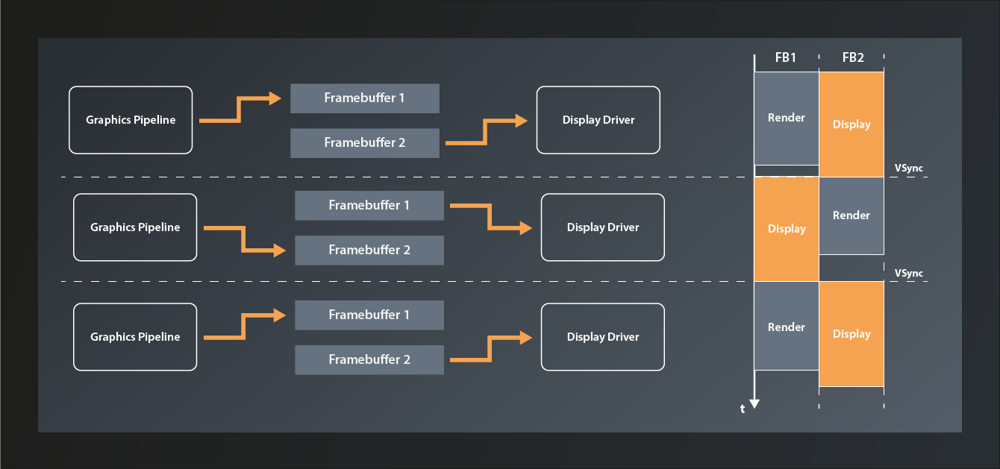
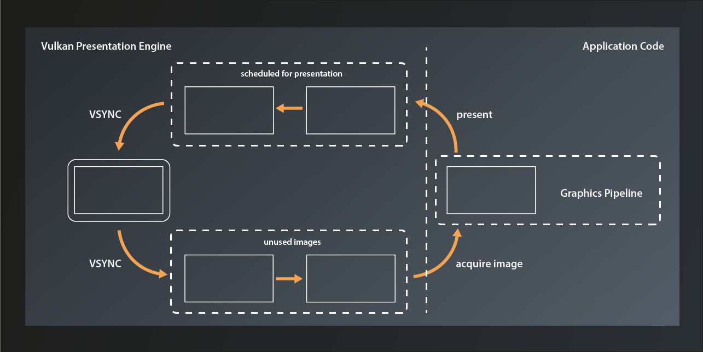

# Lesson 18: The Swapchain
Alright, let's have look where we are at right now. We've created the pipeline alright, but we're not actually running it on the device yet. And even if we did - while we made sure that the pipeline renders in a color format that is supported by our surface, we did not actually connect the pipeline to that surface yet.



In the last lesson we already established that to do so we need to bind a structure called 'framebuffer' to the pipeline. This framebuffer then contains the references to the actual images which the pipeline will render to. It seems logical to assume that those images should be provided by the surface, since that is the canvas we want to render to after all. And yes, in principle that is how it works, but unfortunately it's once again not that simple in Vulkan. To understand why, we need to have a quick look at how images generated on the graphics hardware end up being displayed on screen.

## Double buffering and the swapchain
A simplified model of how that works is this: the color data of the picture resides in a block of graphics memory (which is also called a 'framebuffer'). The screen driver reads one pixel at a time from this array and updates the corresponding dot on the display accordingly, starting at the top left corner and then drawing the lines pixel by pixel until it reaches the bottom right and jumps back to the start[^1].

The problem is that if we'd render to the framebuffer while the display is reading from it we'd see ugly graphical artifacts because the screen will likely display unfinished images and/or the rendering process will be visible. The most common technique to solve this issue is to render to a different buffer than the one that the display is currently fed from. Once the rendering has completed, the buffers are swapped. This technique is known as 'double buffering'.



By itself double buffering still has one problem: if the swapping happens while the display update is currently in progress, the screen will show partially the previous image and partially the one that was just finished. This produces visible artifacts known as 'tearing'. Therefore the swapping ideally happens right at the VSYNC signal, i.e. the moment when the display update has finished the bottom right pixel and is about to start again at the top left.

Double buffering was the standard in older graphics engines and frameworks, e.g. in OpenGL. However, it still has some limitations and shortcomings, depending on the use case[^2]. That is why Vulkan generalizes the concept to become the 'swapchain'. A swapchain is essentially a ring-buffer of images that the application can acquire to render to and then send off to be presented. After presentation has finished the images are available again to be re-acquired. The swapchain can operate in different modes (which we'll get to later in this lesson), but this basic function principle is the same for all of them.



## Preparations
Since presentation is not part of the Vulkan core specification the swapchain is - like the general surface support - also implemented by an extension. Only this time it's a device-specific capability, so we need to enable the respective extension by adding its name to the list of required device extensions[^3]:
```cpp
auto getRequiredDeviceExtensions(
    const std::vector< vk::ExtensionProperties >& availableExtensions
) -> std::vector< const char* >
{
    auto result = std::vector< const char* >{
        VK_KHR_SWAPCHAIN_EXTENSION_NAME
    };
    ...
}
```
The creation of the logical device will now fail if the device extension is not present. That's a rather theoretical use case though, unless you're working with servers. To be on the absolute safe side you could make the selection of the logical device dependent on swapchain support, but for a tutorial like this one it would be overkill to do so.

Compile and run this and you'll see: the last validation error is gone. Yay!


---

[^1]: Yes, also modern LCD and OLED displays work like that (mainly because of compatibility reasons afaik)
[^2]: For more information see https://developer.samsung.com/sdp/blog/en-us/2019/07/26/vulkan-mobile-best-practice-how-to-configure-your-vulkan-swapchain
