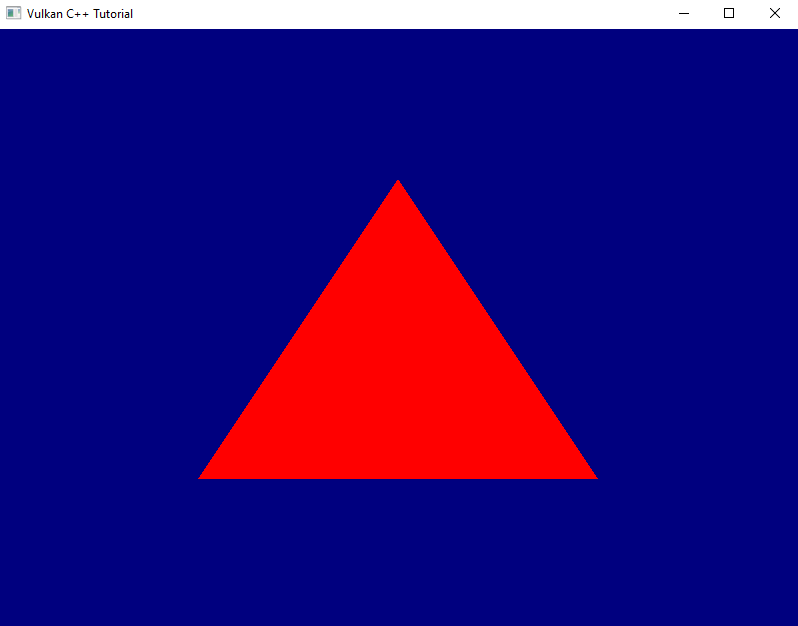

# Executing the Graphics Pipeline
The time has finally come: today we're going to see the triangle being rendered into our window. So without further ado, let's get going!

The one thing that we're still missing for it all to work is to execute our pipeline on the GPU. Looking back at lesson 10, we already know that in order to make the GPU do anything we need to record instructions into command buffers. Those buffers need to be allocated from a command pool. So let's start by creating the pool (remember, we didn't keep that code around because it's only a single function call).
```
const auto commandPool = logicalDevice.device->createCommandPoolUnique(
    vk::CommandPoolCreateInfo{}
        .setFlags( vk::CommandPoolCreateFlagBits::eResetCommandBuffer )
        .setQueueFamilyIndex( logicalDevice.queueFamilyIndex )
);
```
This time we need to set the `eResetCommandBuffer` flag because we're going to re-use our command buffers(1). So we need to inform Vulkan about that.

From the pool we can now create the actual command buffers. We're going to create as many as the number of frames we asked for when creating the swapchain(2):
```
const auto commandBufferAllocateInfo = vk::CommandBufferAllocateInfo{}
    .setCommandPool( *commandPool )
    .setLevel( vk::CommandBufferLevel::ePrimary )
    .setCommandBufferCount( requestedSwapchainImageCount );
const auto commandBuffers = logicalDevice.device->allocateCommandBuffers( commandBufferAllocateInfo );
```

## Recording the command buffers
Now that we have the command buffers, let's create a stub to record into them in a new sourcecode file pair `rendering.cpp` / `rendering.hpp`:
```
void record_command_buffer(
    const vk::CommandBuffer& commandBuffer
)
{
    commandBuffer.begin( vk::CommandBufferBeginInfo{} );
    commandBuffer.bindPipeline( vk::PipelineBindPoint::eGraphics, pipeline );

    commandBuffer.end();
}
```
This should look pretty familiar as we had to do pretty much the same already when we recorded the commands for our compute pipeline.

Back then the next step was to bind the descriptor set to the pipeline. We don't have to do this here, as our pipeline doesn't require a descriptor set. What we do need to bind to the pipeline however is a framebuffer. Conceptually this works in a very similar fashion, only that there is no such function as `bindFramebuffer`. Instead we need to begin (and later end) recording our render pass:
```
class CommandBuffer
{
    ...
    void beginRenderPass( const RenderPassBeginInfo& renderPassBegin, SubpassContents contents, ... );
    void endRenderPass( ... ); 
    ...
};
```
The `SubpassContents` parameter defines where the subsequent commands for the subpass(es) come from. They can be recorded into the current command buffer or loaded from another one. We're going to record them directly into the framebuffer.

`RenderPassBeginInfo` looks like this:
```
struct RenderPassBeginInfo
{
    ...
    RenderPassBeginInfo& setRenderPass( RenderPass renderPass_ );
    RenderPassBeginInfo& setFramebuffer( Framebuffer framebuffer_ );
    RenderPassBeginInfo& setRenderArea( Rect2D const & renderArea_ ); 
    RenderPassBeginInfo& setClearValues( const container_t< const ClearValue >& clearValues_ )
    ...
};
```
- `renderPass_` and `framebuffer_` should be self-explanatory. 
- `renderArea_` can be used to limit the rendering to only a certain portion of the attached framebuffer images(3). 
- the `clearValues_` specify the color that the respective framebuffer attachment is filled with before the rendering starts, i.e. they set the background color. Note that this only works if a `loadOp` of `eClear` has been set for the respective attachment (see lesson 17).

So we can extend our recording function as follows:
```
void record_command_buffer(
    const vk::CommandBuffer& commandBuffer,
    const vk::Pipeline& pipeline,
    const vk::RenderPass& renderPass,
    const vk::Framebuffer& frameBuffer,
    const vk::Extent2D& renderExtent
)
{
    const auto clearValues = std::array< vk::ClearValue, 1 >{
        vk::ClearValue{}.setColor( std::array< float, 4 >{ { 0.f, 0.f, .5f, 1.f } } )
    };

    const auto renderPassBeginInfo = vk::RenderPassBeginInfo{}
        .setRenderPass( renderPass )
        .setFramebuffer( frameBuffer )
        .setRenderArea( vk::Rect2D{ vk::Offset2D{ 0, 0 }, renderExtent } )
        .setClearValues( clearValues );

    commandBuffer.begin( vk::CommandBufferBeginInfo{} );
    commandBuffer.bindPipeline( vk::PipelineBindPoint::eGraphics, pipeline );

    commandBuffer.beginRenderPass( renderPassBeginInfo, vk::SubpassContents::eInline );
 
    commandBuffer.endRenderPass();

    commandBuffer.end();
}
```
As you can see we keep things flexible by passing in most of the necessary information. We're also setting a blue color for the background to make it obvious whether that works or not.

So far so good, but there's one somewhat important bit still missing from that function. You might notice that we're not actually doing anything in between beginning and ending the render pass. That doesn't seem right, does it? So let's think about it for a moment: we've configured our graphics pipeline, we've loaded the shaders, we've bound the framebuffers to it and connected them to the swapchain. What we didn't do so far though is to tell the pipeline to draw anything. Let's see if we can change that:
```
class CommandBuffer
{
    ...
    void draw( uint32_t vertexCount, uint32_t instanceCount, uint32_t firstVertex, uint32_t firstInstance, ... );
    ...
};
```
Since we specified three vertices in our shader we probably should ask Vulkan to also draw three vertices, starting with the very first one. Instanced drawing is a topic we'll cover in a later lesson, for now we just want to draw one instance starting at index 0. That means we can complete our recording function like so:
```
void record_command_buffer(
    const vk::CommandBuffer& commandBuffer,
    const vk::Pipeline& pipeline,
    const vk::RenderPass& renderPass,
    const vk::Framebuffer& frameBuffer,
    const vk::Extent2D& renderExtent
)
{
    ...
    commandBuffer.beginRenderPass( renderPassBeginInfo, vk::SubpassContents::eInline );
    commandBuffer.draw( 3, 1, 0, 0 );
    commandBuffer.endRenderPass();

    commandBuffer.end();
}
```
## Completing the Render Loop
So we've got our recording function ready. If we now want to call it, we need to give it one command buffer and one framebuffer. That means that we need the appropriate indices into our respective arrays. Those indices will probably be different as we only have one command buffer for each swapchain image we requested, but we have one framebuffer for each image that the swapchain actually created.

Let's start with the command buffer index. This one is pretty straightforward: we simply count the index up and wrap around when we reach the number of images we requested (which is equal to the maximum number of images we want to have in use at the same time).
```
size_t frameInFlightIndex = 0;
while ( !glfwWindowShouldClose( window.get() ) )
{
    glfwPollEvents();

    frameInFlightIndex = ++frameInFlightIndex % requestedSwapchainImageCount;
}
```
I called the counter `frameInFlightIndex` because I tend to prefer names that describe what the variables actually represent rather than what I choose to use them for.

Now to the framebuffer index. Here we need to know which swapchain image we're about to use, and that's something we don't have direct control over. So we need to ask the swapchain. We also should probably inform the swapchain that we're about to start using that image. Both tasks can be accomplished with a single call:
```
class Device
{
    ...
    uint32_t acquireNextImageKHR( 
        SwapchainKHR swapchain, 
        uint64_t timeout, 
        Semaphore semaphore, 
        Fence fence, 
        ... 
    ) const;
    ...
};
```
- `swapchain` is straightforward
- `timeout` is the time (in nanoseconds) the function should wait if there is no image available immediately. If the timeout is exceeded without an image being available, the function will throw an exception of `Result::eNotReady`
- I've mentioned semaphores briefly in lesson 11 but did not really explain them. I haven't talked about fences at all yet. And for once I will keep it that way and not go into explaining the concepts in detail just yet. Suffice it to say that we have to pass a valid object for at least one of the parameters to the function. We'll go for the `semaphore`, the `fence` parameter has a default value and so we can ignore that one for now.

Creating a semaphore is straightforward, and in our case here we can just use a default-constructed create info:
```
class Device
{
    ...
    UniqueSemaphore createSemaphoreUnique( const SemaphoreCreateInfo& createInfo, ... ) const;
    ...
};
```

Now we have all we need to call our `record_command_buffer` function. Let's extend the render loop accordingly:
```
...
const auto semaphore = logicalDevice.device->createSemaphoreUnique( vk::SemaphoreCreateInfo{} );

size_t frameInFlightIndex = 0;
while ( !glfwWindowShouldClose( window.get() ) )
{
    glfwPollEvents();

    auto imageIndex = logicalDevice.device->acquireNextImageKHR(
        *swapchain,
        std::numeric_limits< std::uint64_t >::max(),
        *semaphore ).value;

    vcpp::record_command_buffer( 
        commandBuffers[ frameInFlightIndex ],
        *pipeline,
        *renderPass,
        *framebuffers[ imageIndex ],
        swapchainExtent );

    frameInFlightIndex = ++frameInFlightIndex % requestedSwapchainImageCount;
}
...
```
Running this version will yield an exception related to the semaphore almost immediately. We'll take care of this eventually, for now let's continue.

At this point we're recording the command buffer for each new frame(4), but we're not actually sending any of them off to the queue to be executed. That's easy to change though, we already learned how to submit command buffers to a queue back in lesson 11:

```
...
while ( !glfwWindowShouldClose( window.get() ) )
{
    ...
    const auto submitInfo = vk::SubmitInfo{}
        .setCommandBuffers( commandBuffers[imageIndex] );
    queue.submit( submitInfo );

    frameInFlightIndex = ++frameInFlightIndex % requestedSwapchainImageCount;
}
...
```
This still doesn't change much though, we're still not seeing anything and get an exception almost immediately. We're apparently still missing something.

Have a look at Fig 3. back in lesson 18. The basic principle of how to work with a swapchain is to acquire an image, render to that image and then sending it off to be presented. We've now implemented the first two of those steps, but we're not yet scheduling the images for presentation. The function we need to do that is this one:
```
class Queue
{
    ...
    void Queue::presentKHR( const PresentInfoKHR & presentInfo, ... ) const;
    ...
};
```
with
```
struct PresentInfoKHR
{
    ...
    PresentInfoKHR& setWaitSemaphores( const container_t< const Semaphore >& waitSemaphores_ );
    PresentInfoKHR& setSwapchains( const container_t< const SwapchainKHR >& swapchains_ );
    PresentInfoKHR& setImageIndices( const container_t< const uint32_t >& imageIndices_ );
    PresentInfoKHR& setResults( const container_t< Result >& results_ );
    ...
};
```
- `waitSemaphores_` optionally specifies one or more semaphores that Vulkan should wait for before presenting. Again, more on semaphores and synchronization in general in a later lesson. . For now we ignore that parameter.
- Vulkan can actually present to multiple swapchains at the same time with one single call to `presentKHR`. This is why the present info takes a container of `swapchains_`.
- for the same reason you can specify multiple `imageIndicies_` to be presented. The container needs to be of the same size as the one for the swapchains. Each image index refers to the respective swapchain image.
- because each individual presentation request can produce a different result you can optionally set the `results_` container as an out parameter that will retrieve the respective result of the presentation request.

So let's enhance our render loop accordingly. We only have one swapchain and one image to present in each cycle. The image index is the one we retrieved from our call to `acquireNextImageKHR` and we're going to ignore the results for now:
```
while ( !glfwWindowShouldClose( window.get() ) )
{
    ...
    queue.submit( submitInfo );

    const auto presentInfo = vk::PresentInfoKHR{}
        .setSwapchains( *swapchain )
        .setImageIndices( imageIndex );
    queue.presentKHR( presentInfo );

    frameInFlightIndex = ++frameInFlightIndex % requestedSwapchainImageCount;
}
```
Et voilà, if you run this version you should finally see a red triangle being rendered on top of a blue background. Time to celebrate!



Yes, there is still a continuous stream of validation errors, and if you play around with your application window you'll probably notice quite a few more shortcomings. We'll address those in the next lesson.

But still: congratulations and thank you for your perseverance. You've made it through the most tedious part of working with Vulkan. I promise, from now on it's going to be much more fun because we'll get a noticeable improvement of our rendering pipeline in almost every lesson.


1. The alternative would be to create a new command buffer for every single frame, which would be terribly inefficient
2. We requested two swapchain images because we only ever want two frames to actually be 'in flight'. I.e. once we're done rendering the second image we want to wait if necessary until the first has finished presenting and only then start rendering the next frame. So we also only need that number of command buffers and not one for every swapchain image.
3. This would produce the same visible effect as using the respective scissor (see lesson 16)
4. Since our current scene never changes, re-recording the command buffers is strictly speaking unnecessary overhead. We could also have pre-recorded one command buffer for each framebuffer and then just use those. However, ultimately we want our pipeline to be able to render dynamic scenes, so I decided to prepare the render loop for that already now.