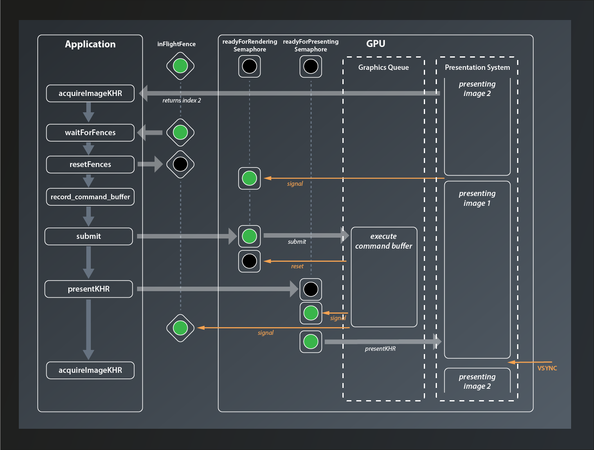

# Synchronization
So, we're rendering our triangle now and that's great. However, we get a constant flow of two different validation errors. This is probably not so good, let's try to fix them.

The first error looks something like that:
```
> ... Calling vkBeginCommandBuffer() on active VkCommandBuffer 0x1de3f331090[] before it has completed ...
```
The validation complains that we are trying to begin recording a command buffer which is in use. And that is true: while we said we only ever want two buffers to be 'in flight' at the same time, we're not actually enforcing that anywhere yet. Rendering one simple triangle is so fast that it outpaces the presentation easily, so eventually we are indeed calling `vk::CommandBuffer::begin` on a buffer that is still being executed for a previous image.

So we need to make sure that the buffer is not in use anymore before recording into it. We're going to learn how to properly do that later in this lesson. For now I want to implement a temporary fix that gets us rid of the error so we can make progress.

```C++
...
while ( !glfwWindowShouldClose( window.get() ) )
{
    glfwPollEvents();

    logicalDevice.device->waitIdle();
    ...
}
...
```

We've already used `vk::Device::waitIdle` in lesson 11. This is a very blunt tool and it costs a lot of performance because now host and GPU work sequentially instead of in parallel (effectively limiting the number of frames 'in flight' to 1). But it does the job: the validation errors about the command buffer being in use are gone. As said, we're going to implement a better solution later in this lesson.

Let's look at the remaining errors now:
```
> ... vkAcquireNextImageKHR: Semaphore must not be currently signaled or in a wait state ...
```
Alright, I think it's time to finally talk about semaphores and fences now.

## Semaphores and Fences
Both, semaphores and fences, are synchronization primitives(1). This is not a tutorial about asynchronous programming or multithreading, so I'm not going to go into too much detail here. Suffice it to say that if multiple tasks on a computer run in parallel, there are situations where you want to be sure that one or more of them have reached a certain state before you start doing something in the scope of another. This is e.g. always the case if you want to transfer data from one thread to another.

Conceptually, semaphores and fences work very similar. Both can be in one of two states: unsignaled or signaled. Vulkan functions that make use of them are designed so that execution of the respective task halts at unsignaled semaphores/fences and only resumes when they become signaled.


The difference between semaphores and fences is that the former are used to synchronize internal operations on the GPU and you have no way to explicitly signal/unsignal them from your application code. Instead you pass them to Vulkan functions such as e.g. `queue::submit` and let the implementation take care of that. Fences on the other hand are designed to synchronize the execution flow between the host application and the GPU. You can explicitly wait for a Fence to be set (signaled) by the GPU and then reset it (put them back to the unsignaled state). You cannot signal them actively though, that's the privilege of the GPU.

## Using Semaphores
So what does that now mean in practice? We've already created a semaphore, although we did not really understand it or look at the create info structure in detail back then. As it turns out we didn't miss too much there:

```C++
struct SemaphoreCreateInfo
{
    ...
    SemaphoreCreateInfo& setFlags( SemaphoreCreateFlags flags_ );
    ...
};
```

So the only parameter we could set are the `flags_`, but even that one is only reserved for future use. Nothing more for us to do here.

The validation error complains that the semaphore passed to `vkAcquireNextImageKHR` is 'signaled or in a wait state'. Let's see: `acquireNextImageKHR` is the first function we pass our semaphore to. Since semaphores are created in an unsignaled state this cannot be the problem, at least not in the first iteration.

According to the documentation, the semaphore passed to `acquireNextImageKHR` will be signaled when the image is ready to be rendered to. That may sound strange at first, intuitively we might expect the image to be ready immediately when the function call completes. However, to allow maximum throughput `acquireNextImageKHR` returns the index of the next image even if the presentation engine is still using that image. This enables the host application to use the index already and prepare the rendering of the next frame. When the image is finally available, rendering can start right away.

So we have a signaled semaphore now, but take a look at our code: we're not actually doing anything with it. That explains the error: after the first call to `acquireNextImageKHR`, the semaphore remains signaled forever. Effectively we're not using the semaphore at all. We need to change that.

The next thing we do after acquiring the image is to record the command buffer. This is safe: we don't actually render anything here, so the image is not used yet and there's no problem if it's still being presented. What is not safe anymore is to submit the command buffer. Once that happens the GPU can start rendering to the image at any time, so here we need to make sure that our image is actually ready. This is where two members of `SubmitInfo` come into play that I've glossed over back in lesson 11: `setWaitSemaphores` and `setWaitDstStageMask`:

- the GPU will wait for the semaphores that are passed to `setWaitSemaphores` to be signaled before continuing execution of this command buffer
- however, the GPU might actually be able to do some useful stuff before accessing the resources that are protected by the semaphores. So for maximum parallelization Vulkan enables you to specify exactly where in the pipeline it is supposed to wait for each semaphore. This is what `setWaitDstStageMask` is for: for each entry in this list, the GPU will wait for the corresponding semaphore to be signaled before entering the respective stage. So the containers passed to `setWaitSemaphores` and `setWaitDstStageMask`need to be of the same size.

For us that means that we can pass our semaphore directly as a wait semaphore to the submit info. The GPU will then wait until it is signaled and automatically reset it. Since this semaphore protects the image that is used as the color attachment, the wait stage should be set to `eColorAttachmentOutput`:

```C++
...
const vk::PipelineStageFlags waitStages[] = {
    vk::PipelineStageFlagBits::eColorAttachmentOutput };
const auto submitInfo = vk::SubmitInfo{}
    .setCommandBuffers( commandBuffers[imageIndex] )
    .setWaitSemaphores( *semaphore )
    .setPWaitDstStageMask( waitStages );
queue.submit( submitInfo, *inFlightFences[ frameInFlightIndex ] );
...
```

Cool, with that version the validation errors are gone. We're not done yet though. You might have spotted another synchronization issue already: we currently schedule the image for presentation immediately after submitting the command buffer. How is the presentation engine supposed to know when the image is actually fully rendered and thus ready to be put on screen?

The answer is: it doesn't know. It works for us at the moment because we render only one triangle, which is really fast. If we were to render a real scene chances are that the presentation would access an unfinished image. That's not good. So we need a way to tell the presentation to wait until rendering the image has completed.

In the last lesson we already learned that `PresentInfoKHR` - just like `SubmitInfo` has a member `setWaitSemaphores` which we can use to specify a list of semaphores which will block the presentation until they all become signaled. So telling the presentation to wait would be easy if we could make the GPU signal a semaphore once it's done with the rendering. And it turns out that there is yet another parameter in `SubmitInfo` that we ignored so far: `setSignalSemaphores`. This allows us to specify a number of semaphores that will be signaled once the command buffer(s) in this batch have completed execution. Which means the whole thing is actually pretty straightforward:

```C++
...
auto readyForRenderingSemaphore = logicalDevice.device->createSemaphoreUnique(
    vk::SemaphoreCreateInfo{}
);
auto readyForPresentingSemaphore = logicalDevice.device->createSemaphoreUnique(
    vk::SemaphoreCreateInfo{}
)
...
while ( !glfwWindowShouldClose( window.get() ) )
{
    ...
    const auto submitInfo = vk::SubmitInfo{}
        .setCommandBuffers( commandBuffers[ frameInFlightIndex ] )
        .setWaitSemaphores( *readyForRenderingSemaphore )
        .setSignalSemaphores( *readyForPresentingSemaphore )
        .setPWaitDstStageMask( waitStages );
    queue.submit( submitInfo);

    const auto presentInfo = vk::PresentInfoKHR{}
        .setSwapchains( *swapchain )
        .setImageIndices( imageIndex )
        .setWaitSemaphores( *readyForPresentingSemaphore );
    ...
}
...
```
We create another semaphore(2) just as before and add it to the `SubmitInfo` as semaphore to signal when the command buffer has completed. We also add it to the `PresentInfoKHR` as semaphore to wait for. That way presenting will not happen before the command buffer is done with the respective image. I've renamed the semaphore we already had to make the usage of both clearer.

Nice, so we have that one sorted out. However, there's still one problem we need to address. Remember, at the moment we are only ever processing one image at a time (because of the call to `waitIdle`), so having only one semaphore for each purpose is fine. Once we enable our render loop to start with the next image already while the previous is still being processed on the GPU, things will get messy very soon because we're signaling and waiting on the same semaphores for different images.

Luckily the fix is pretty straightforward: we simply use multiple semaphores instead. The naive approach would be to create one semaphore for each swapchain image. This has a problem though: we only learn about the index of the swapchain image we're going to use when we call `acquireNextImageKHR`. However, we'd already need that index to pass the correct semaphores to the functions, so we're in a chicken-egg situation here. But actually we don't need that many semaphores anyway: we still intend to limit the number of frames in flight, so we also only need that number of semaphores:

```C++
...
std::vector< vk::UniqueSemaphore > readyForRenderingSemaphores;
std::vector< vk::UniqueSemaphore > readyForPresentingSemaphores;
for( std::uint32_t i = 0; i < requestedSwapchainImageCount; ++i )
{
    readyForRenderingSemaphores.push_back( logicalDevice.device->createSemaphoreUnique(
        vk::SemaphoreCreateInfo{}
    ) );

    readyForPresentingSemaphores.push_back( logicalDevice.device->createSemaphoreUnique(
        vk::SemaphoreCreateInfo{}
    ) );
}
const auto queue = logicalDevice.device->getQueue( logicalDevice.queueFamilyIndex, 0 );
    
size_t frameInFlightIndex = 0;
while ( !glfwWindowShouldClose( window.get() ) )
{
    ...
    auto imageIndex = logicalDevice.device->acquireNextImageKHR(
        *swapchain,
        std::numeric_limits< std::uint64_t >::max(),
        *readyForRenderingSemaphores[ frameInFlightIndex ] ).value;

    vcpp::record_command_buffer(
        commandBuffers[ frameInFlightIndex ],
        *pipeline,
        *renderPass,
        *framebuffers[ imageIndex ],
        swapchainExtent );

    const vk::PipelineStageFlags waitStages[] = {
        vk::PipelineStageFlagBits::eColorAttachmentOutput };
    const auto submitInfo = vk::SubmitInfo{}
        .setCommandBuffers( commandBuffers[ frameInFlightIndex ] )
        .setWaitSemaphores( *readyForRenderingSemaphores[ frameInFlightIndex ] )
        .setSignalSemaphores( *readyForPresentingSemaphores[ frameInFlightIndex ] )
        .setPWaitDstStageMask( waitStages );
    queue.submit( submitInfo);

    const auto presentInfo = vk::PresentInfoKHR{}
        .setSwapchains( *swapchain )
        .setImageIndices( imageIndex )
        .setWaitSemaphores( *readyForPresentingSemaphores[ frameInFlightIndex ] );
    ...
}
```

And with that we're prepared for processing multiple framebuffers in parallel. To actually do that however we need to go back to the first validation error. As said, fixing it with `waitIdle` effectively limited the number of frames 'in flight' to one, so we're wasting performance here. We need to find a better solution.

## Using Fences
The problem that the validation errors informed us about was that we were trying to use a command buffer before the GPU was done with it. In a real-world application this will probably not be a very common problem, as the rendering will likely take more time and we'll rather have the opposite problem. But still, it hints at something that is not quite optimal in our rendering loop yet, so let's try to fix it.

What we need to do is to make our application wait recording a command buffer until that command buffer becomes available again. So the host application needs to wait for the GPU, which means the right synchronization primitive for this use case is probably a fence. So let's create a fence for every command buffer in flight:

```C++
...
std::vector< vk::UniqueFence > inFlightFences;
std::vector< vk::UniqueSemaphore > readyForRenderingSemaphores;
std::vector< vk::UniqueSemaphore > readyForPresentingSemaphores;
for( std::uint32_t i = 0; i < requestedSwapchainImageCount; ++i )
{
    inFlightFences.push_back( logicalDevice.device->createFenceUnique(
        vk::FenceCreateInfo{}.setFlags( vk::FenceCreateFlagBits::eSignaled )
    ) );
    ...
}
...
```

`FenceCreateInfo` is almost as uninteresting as `SemaphoreCreateInfo`. Also for this one there's only the function `setFlags`. However, in contrast to the latter, there is one flag we can set: `eSignaled` will create a signaled fence instead of the unsignaled default. Since the fences we create here are supposed to block execution when the command buffers are not ready, we create them in the signaled state (because on first use all command buffers will be ready).

Making the application wait for a fence to be signaled is achieved by the following function:

```C++
class Device
{
    ...
    Result waitForFences( const container_t< const Fence >& fences, Bool32 waitAll, uint64_t timeout, ... );
    ...
}
```

- the function takes a list of `fences` to wait for.
- if `waitAll` is set to `true`, the function will block until all fences have been signaled, otherwise any fence becoming signaled will cause the function to return.
- `timeout` is the number of nanoseconds the function is supposed to wait at max

Putting that into practice our code looks like this now:

```C++
...
while ( !glfwWindowShouldClose( window.get() ) )
{
    ...
    auto result = logicalDevice.device->waitForFences(
        *inFlightFences[ frameInFlightIndex ],
        true,
        std::numeric_limits< std::uint64_t >::max()
    );

    vcpp::record_command_buffer(
    ...
    result = queue.presentKHR( presentInfo );
    ...
}
...
```

Since we're now defining `result` at the beginning of the render loop, we should not redefine it for the return value of `presentKHR`. Reusing the variable also avoids a compiler warning about it being assigned a value but never used.

Unfortunately, running this version yields the original validation errors again because our fences never become unsignaled and so effectively we don't ever wait at all. At some point we need to reset them and then tell the GPU to signal them once the command buffer becomes available again.

The first part is easy: once we have waited, the fence has done its duty for this cycle and we can immediately reset it:

```C++
...
auto result = logicalDevice.device->waitForFences(
    *inFlightFences[ frameInFlightIndex ], 
    true, 
    std::numeric_limits< std::uint64_t >::max() );
logicalDevice.device->resetFences( *inFlightFences[ frameInFlightIndex ] );

vcpp::record_command_buffer(
...
```

For the second part we need to look a bit closer at the `Queue::submit` function again, because it actually has an optional second parameter that now is of interest for us:

```C++
class Queue
{
    ...
    void submit( const container_t< SubmitInfo >& submits, Fence fence, ... );
    ...
};
```

So we can pass a fence that will be signaled when all the submits have been completed by the queue. Which means that with

```C++
...
queue.submit( submitInfo, *inFlightFences[ frameInFlightIndex ] );
...
```

... the render loop behaves exactly as we wanted it to and the validation errors are gone.

This has been a lot and it's easy to get lost in all that synchronization, so let's quickly recap how our rendering loop is synchronized now by looking at an example:



At the beginning of the loop we call `acquireImageKHR` which returns the index of the next image to process (in this case 2). Next, we wait for the `inFlightFence` that protects the current command buffer from being recorded while still in use. In our example here this is already signaled, so we don't have to wait and can directly reset it. Then we call `record_command_buffer` before submitting the buffer to the GPU. The `readyForRendering` semaphore has been signaled in the meantime when the presentation engine was done with the image, so we don't have to wait either. When the GPU starts processing the command buffer, the `readyForRenderingSemaphore` semaphore is immediately reset. Our host application meanwhile has moved on and issued the `presentKHR` call. However, since the command buffer has not been fully executed yet, the `readyForPresentingSemaphore` is not signaled yet and presentation is deferred. Once the graphics queue has finished executing the command buffer it signals both, the `readyForPresentingSemaphore` and the `inFlightFence`, and presentation of the image is scheduled (it has to wait for the VSYNC signal though).

## Finishing up
Now everything works fine - until you close the application. At that point you get several validation errors again, all complaining about destroying something that is in use. What causes them is the fact that when we exit the render loop we also reach the end of our try block. All of the `Unique...` objects that we created are thus being cleaned up while there's still at least one command buffer being executed on the GPU.

To fix that we make use of `waitIdle` again. This time the blunt tool is actually appropriate: we are exiting the application, so we no longer care about loosing rendering performance or blocking our host application for a few milliseconds. Anything more sophisticated than that would add unnecessary complexity.

```C++
...
try
{
    ...
    while ( !glfwWindowShouldClose( window.get() ) )
    {
        ...
    }

    logicalDevice.device->waitIdle();
}
...
```

With that in place the validation errors on exit should be gone as well. 

And that's finally it for today. It's been quite a bit of work, but we've made our pipeline much more robust already.


1. There's a third type of synchronization primitive: events. They are used in more advanced cases, so we're not going to talk about them here.
2. You might be tempted to reuse the same semaphore as for acquiring the image. After all that one will be reset once the rendering starts, so it should be fine to use it to signal render completion. Well, not really: the submit call might wait for so long that the presentation request also has been issued already. So we'd have two commands waiting for the same semaphore, which means we're in fact synchronizing rendering and presentation to start at the same time.
