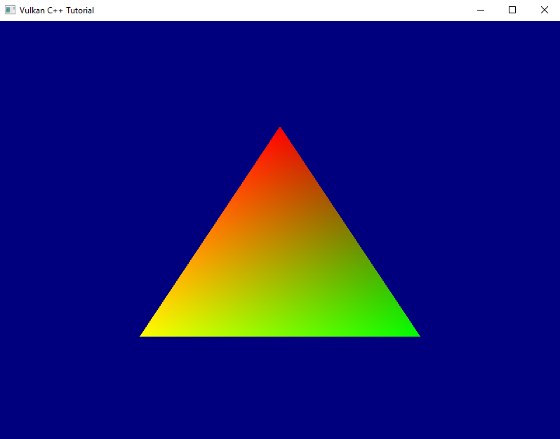

# Vertex Input - Part 2

So, we can send the positions of our vertices from our application now. But so far all of our geometry will always be red because the color information is still hardcoded in the fragment shader. I'd like to have a bit more flexibility here as well and this is what we'll address today.

It would be possible to send the color data directly to the fragment shader, e.g. by using descriptors. However, that wouldn't make much sense since it would imply that we already know the color of each fragment upfront. Remember: the fragment shader runs once for every fragment (think: every pixel, see lesson 14). So the data we send needs to be available and valid for every fragment. For our current triangle this is true because we only ever use the same red color. But it would break as soon as we were to move towards a bit more realistic use cases, so let's do it the proper way right from the start.

The usual way to pass color data to the fragment shader is via the vertex shader. The vertex shader outputs a color value for the respective vertex, the rasterization stage then interpolates the color for each fragment between the colors of the current triangle's vertices and passes that interpolated color to the fragment shader.

So the first step is to modify our fragment shader so that it uses color information that is coming in:

```GLSL
#version 450

layout(location = 0) in vec4 inColor;

layout(location = 0) out vec4 outColor;

void main() 
{
    outColor = inColor;
}
```

Next, let's modify the vertex shader to output a color for each vertex. To make it obvious whether it works let's change our color from red to green:

```GLSL
#version 450

layout(location = 0) in vec4 inPosition;

layout(location = 0) out vec4 outColor;

void main()
{
    gl_Position = inPosition;
    outColor = vec4( 0.0, 1.0, 0.0, 1.0 );
}
```

With these changes to the shaders you should now see a green triangle instead of a red one. If we wanted to see the interpolation in action we could create an array of color values in the vertex shader and use the `gl_VertexIndex` variable just as we originally did with the positions. But actually we want to be able to pass the color information from the application, so let's not invest that effort and instead prepare the vertex shader to pass the colors through:

```GLSL
#version 450

layout(location = 0) in vec4 inPosition;
layout(location = 1) in vec4 inColor;

layout(location = 0) out vec4 outColor;

void main()
{
    gl_Position = inPosition;
    outColor = inColor;
}
```

Now the shader expects each vertex to consist of two attributes: a `vec4` for the position and another `vec4` for the color. As described in the last lesson, `location` specifies the order of the attributes so that shader and pipeline know exactly which component comes first.

So let's add the color information to our vertices in the application:

``` C++
constexpr size_t vertexCount = 3;
const std::array< float, 8 * vertexCount > vertices = {
    0.f, -.5f, 0.f, 1.f,    1.f, 0.f, 0.f, 1.f,
    .5f, .5f, 0.f, 1.f,     0.f, 1.f, 0.f, 1.f,
    -.5f, .5f, 0.f, 1.f,    1.f, 1.f, 0.f, 1.f };
```

As you can see I use different vertex colors, so that we have an obvious visible indication that the colors are indeed interpolated.

Apart from that no other changes are required in main. However, the pipeline creation function still assumes only one 4 element vector per vertex as input to the vertex shader stage. Let's change that:

```C++
...
const auto vertexBindingDescription = vk::VertexInputBindingDescription{}
    .setBinding( 0 )
    .setStride( 8 * sizeof( float ) )
    .setInputRate( vk::VertexInputRate::eVertex );

const auto vertexAttributeDescriptions = std::array< vk::VertexInputAttributeDescription, 2 >{
    vk::VertexInputAttributeDescription{}
        .setBinding( 0 )
        .setLocation( 0 )
        .setOffset( 0 )
        .setFormat( vk::Format::eR32G32B32A32Sfloat ),
    vk::VertexInputAttributeDescription{}
        .setBinding( 0 )
        .setLocation( 1 )
        .setOffset( 4 * sizeof( float ) )
        .setFormat( vk::Format::eR32G32B32A32Sfloat ) 
};

const auto vertexInputState = vk::PipelineVertexInputStateCreateInfo{}
    .setVertexBindingDescriptions( vertexBindingDescription )
    .setVertexAttributeDescriptions( vertexAttributeDescriptions );
...
```

Since every vertex is now 8 floats, the `stride` needs to be changed accordingly. We also need to add the second attribute for the color and make sure that the attribute indices match those in the shader. The `offset` of the second attribute is the size of the first because our vertex data doesn't contain any padding.

Try out this version, you should see something like the following:



So we can now give each vertex an individual color and the interpolation works as we expect it. Nice.

Before we close for today I want to do a bit more refactoring: one thing that bothers me are the magic numbers we use to create the attribute descriptions in `create_graphics_pipeline`. Magic numbers are rarely a good idea. In this case they require us to change the pipeline creation code whenever our attribute format changes, which is cumbersome and error-prone. I want to fix that.

At first sight it seems we need the offset, the size and the format for each vertex attribute description. We also need the stride, i.e. total size of one vertex in bytes. But thinking a bit more about it: the offset is just the sum of all the previous sizes. The stride is just the sum of all sizes(1). And the size is directly related to the format (after all we learned in the previous session that Vulkan uses the format to specify the size as well). So we actually only need the format:

```C++
std::uint32_t get_vertex_format_size( vk::Format format )
{
    switch ( format )
    {
    case vk::Format::eR32G32B32A32Sfloat:
        return static_cast< std::uint32_t >( 4 * sizeof( float ) );
    default:
        throw std::invalid_argument( "unsupported vertex format" );
    }
}

vk::UniquePipeline create_graphics_pipeline(
    const vk::Device& logicalDevice,
    const vk::ShaderModule& vertexShader,
    const vk::ShaderModule& fragmentShader,
    const vk::RenderPass& renderPass,
    const vk::Extent2D& viewportExtent,
    const std::vector< vk::Format >& vertexFormats
)
{
    ...

    auto vertexAttributeDescriptions = std::vector< vk::VertexInputAttributeDescription >{};
    std::uint32_t offset = 0;
    for( std::uint32_t v = 0; v < vertexFormats.size(); ++v )
    {
        vertexAttributeDescriptions.push_back(
            vk::VertexInputAttributeDescription{}
                .setBinding( 0 )
                .setLocation( v )
                .setOffset( offset )
                .setFormat( vertexFormats[ v ] )
        );
        offset += get_vertex_format_size( vertexFormats[ v ] );
    }

    const auto vertexBindingDescription = vk::VertexInputBindingDescription{}
        .setBinding( 0 )
        .setStride( offset )
        .setInputRate( vk::VertexInputRate::eVertex );

    const auto vertexInputState = vk::PipelineVertexInputStateCreateInfo{}
        .setVertexBindingDescriptions( vertexBindingDescription )
        .setVertexAttributeDescriptions( vertexAttributeDescriptions );
    ...
}
```

The `vertexFormats` parameter can not be an array because we do no longer know how many formats are going to come in(2). We also had to reorder things a bit to streamline the calculations. But otherwise the code is pretty much the same as before, but now we can define the vertex structure from the outside. The only thing left to do is adapt the code in `main()` accordingly:

```C++
...
const auto vertexFormats = std::vector< vk::Format  >{
    vk::Format::eR32G32B32A32Sfloat,
    vk::Format::eR32G32B32A32Sfloat,
};

...

while ( !glfwWindowShouldClose( window.get() ) )
{
    ...
    pipeline = create_graphics_pipeline(
        logicalDevice,
        *vertexShader,
        *fragmentShader,
        *renderPass,
        swapchainExtent,
        vertexFormats );
    ...
}
```

Alright, that's better. I'm still not too happy with the way we currently create everything related to our vertex buffer directly in the main function, but I'm going to leave it for now until we have a bit more clarity where this is all going.

Next time we're finally going to go 3D for real.


1. This assumes that the vertex buffer is tightly packed. For performance reasons it might be better to pad the vertex data to reach a multiple of 16 bytes or so. In this tutorial we'll keep things simple though and not look into that.

2. We actually probably know at compile time how many formats are going to come in. Insofar it would be more performant to make the whole function a template with the number of parameters as a template argument and the `vertexFormats` parameter an array. However, since this function is unlikely to be called very often I decided for the more convenient version of using a vector.