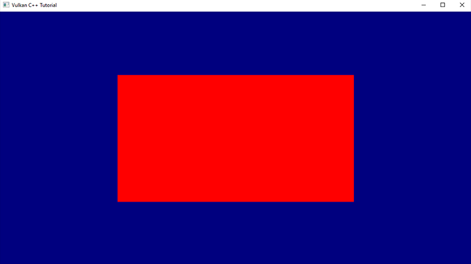
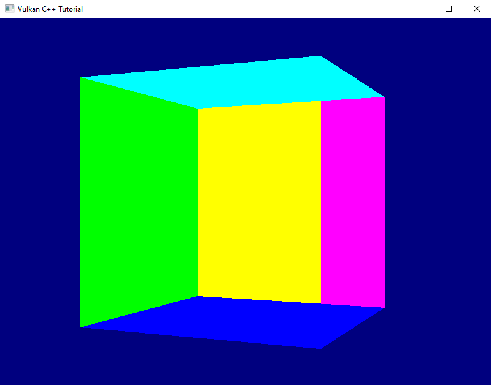

# Going 3D
So far all that we've created is one flat triangle, which is still pretty far from a proper 3D scene. I think it's time to change this.

Our vertices already have three dimensional coordinates, only that we're not using the third dimension yet. So we should be able to create a three-dimensional object without any changes to the pipeline. Let's modify our vertex buffer to contain a cube:

``` C++
constexpr size_t vertexCount = 36;
const std::array< float, 8 * vertexCount > vertices = {
    // front               (red)
    -.5f, -.5f, .5f, 1.f,  1.f, 0.f, 0.f, 1.f,
    .5f, -.5f, .5f, 1.f,   1.f, 0.f, 0.f, 1.f,
    -.5f, .5f, .5f, 1.f,   1.f, 0.f, 0.f, 1.f,
    .5f, -.5f, .5f, 1.f,   1.f, 0.f, 0.f, 1.f,
    .5f, .5f, .5f, 1.f,    1.f, 0.f, 0.f, 1.f,
    -.5f, .5f, .5f, 1.f,   1.f, 0.f, 0.f, 1.f,
    
    // back                (yellow)
    -.5f, -.5f, -.5f, 1.f, 1.f, 1.f, 0.f, 1.f,
    .5f, -.5f, -.5f, 1.f,  1.f, 1.f, 0.f, 1.f,
    -.5f, .5f, -.5f, 1.f,  1.f, 1.f, 0.f, 1.f,
    .5f, -.5f, -.5f, 1.f,  1.f, 1.f, 0.f, 1.f,
    .5f, .5f, -.5f, 1.f,   1.f, 1.f, 0.f, 1.f,
    -.5f, .5f, -.5f, 1.f,  1.f, 1.f, 0.f, 1.f,

    // left                (violet)
    -.5f, -.5f, .5f, 1.f,  1.f, 0.f, 1.f, 1.f,
    -.5f, -.5f, -.5f, 1.f, 1.f, 0.f, 1.f, 1.f,
    -.5f, .5f, .5f, 1.f,   1.f, 0.f, 1.f, 1.f,
    -.5f, -.5f, .5f, 1.f,  1.f, 0.f, 1.f, 1.f,
    -.5f, .5f, -.5f, 1.f,  1.f, 0.f, 1.f, 1.f,
    -.5f, .5f, .5f, 1.f,   1.f, 0.f, 1.f, 1.f,

    // right               (green)
    .5f, -.5f, .5f, 1.f,   0.f, 1.f, 0.f, 1.f,
    .5f, -.5f, -.5f, 1.f,  0.f, 1.f, 0.f, 1.f,
    .5f, .5f, -.5f, 1.f,   0.f, 1.f, 0.f, 1.f,
    .5f, -.5f, .5f, 1.f,   0.f, 1.f, 0.f, 1.f,
    .5f, .5f, -.5f, 1.f,   0.f, 1.f, 0.f, 1.f,
    .5f, .5f, .5f, 1.f,    0.f, 1.f, 0.f, 1.f,

    // top                 (turquoise)
    -.5f, -.5f, .5f, 1.f,  0.f, 1.f, 1.f, 1.f,
    .5f, -.5f, .5f, 1.f,   0.f, 1.f, 1.f, 1.f,
    .5f, -.5f, -.5f, 1.f,  0.f, 1.f, 1.f, 1.f,
    -.5f, -.5f, .5f, 1.f,  0.f, 1.f, 1.f, 1.f,
    .5f, -.5f, -.5f, 1.f,  0.f, 1.f, 1.f, 1.f,
    -.5f, -.5f, -.5f, 1.f, 0.f, 1.f, 1.f, 1.f,

    // bottom              (blue)
    -.5f, .5f, .5f, 1.f,   0.f, 0.f, 1.f, 1.f,
    .5f, .5f, .5f, 1.f,    0.f, 0.f, 1.f, 1.f,
    .5f, .5f, -.5f, 1.f,   0.f, 0.f, 1.f, 1.f,
    -.5f, .5f, .5f, 1.f,   0.f, 0.f, 1.f, 1.f,
    .5f, .5f, -.5f, 1.f,   0.f, 0.f, 1.f, 1.f,
    -.5f, .5f, -.5f, 1.f,  0.f, 0.f, 1.f, 1.f,
};
```

The cube is centered around the origin. Every face is made out of two triangles, therefore we need six vertices per face(1). I gave every face a different color to make it easier to see what's going on on screen.

Running this version we still see just a plain red rectangle instead of a three dimensional object. That is okay because we're looking at our cube straight on and thus cannot expect to see anything but the front face. But something's not quite right here: a cube is supposed to have square faces, this thing on screen however is clearly wider than it's high. Worse even, if we resize the window it changes it's dimensions and aspect ratio.



To understand why that is we need to have a look at the coordinate system that the Vulkan rendering pipeline operates with. We already briefly touched upon the subject when we were discussing our graphics pipeline setup in lessons 14 - 16. The pipeline expects the output of the vertex shader to be so-called normalized device coordinates. By default this is a right-handed coordinate system with the y-axis pointing downwards(2) and the origin in the middle of the window. That means the top of the window is mapped to a coordinate of y=-1 and the bottom to y=+1, the left window border is at x=-1 and the right border at x=+1. That explains why our cube face initially has a rectangluar shape and changes dimensions when we resize the window: an x value of 0.5 is always halfway between the middle of the window and its right border, the same applies to the y axis.


Okay, that is good to know, but what do we do about it? We want our cube to look like a cube, so somehow need to modify our vertex coordinates so that they take the window dimensions into account.

This is probably a good point to talk about transformations. In the context of graphics a transformation is an operation that modifies a coordinate (i.e. a vector) in a specific way so that it ends up in a different location. If you apply the same transformation to all vertex coordinates of an object you can e.g. realize translations (i.e. move the object around), scaling (make the object bigger or smaller) and rotations. Mathematically transformations are expressed as a multiplication of a matrix with the coordinate vector. I'm not going to go into details here, if you are interested in a more extensive explanation I suggest you watch the video that is linked in the footnotes - it's by far the best tutorial on linear transformations that I know.

What we need right now is called a projection transformation, because it projects the 3D coordinates of our vertices onto the 2D plane of our screen. There are two common types of projection: perspective and orthographic. Perspective projection is what you are used to from most 3D games, it simulates the real world experience where objects appear to become smaller with increasing distance from the viewer. The main usecase for orthographic projections is in technical software such as 3D modelling and CAD programs. Distant objects retain the same size as close ones, which creates a somewhat weird visual appearance but makes it easier to judge proportions etc. Mathematically the difference between the two is: in a perspective projection the imaginary rays of light that project the 3D scene onto the screen intersect at your eye (the camera) and get farther apart with increasing depth (into the screen), whereas in an orthographic projection they run in parallel. This is the reason why the latter is also sometimes called a parallel projection.

 Projection")

Okay, so we need to multiply our vertex coordinates with a matrix that applies the projection transformation. Does that mean we now have to implement matrix multiplication? And how do we know how the transformation matrix needs to look like?

Obviously this is a challenge that many others had before us and so there are libraries that provide what we need. The one we will use is called GLM (short for OpenGL Mathematics), so let's start by adding it to our project:

Add glm to `conanfile.txt`:
```MD
[requires]
    glfw/[>3.3.6]
    fmt/[>8.0.0]
    glm/[>0.9.8]

[generators]
    cmake
```

... and add the corresponding `#includes` to `main.cpp`:

```C++
#define GLM_FORCE_DEFAULT_ALIGNED_GENTYPES
#define GLM_FORCE_DEPTH_ZERO_TO_ONE
#define GLM_FORCE_RADIANS
#include <glm/glm.hpp>
#include <glm/ext.hpp>
...
```

GLM - like glfw - was originally written for OpenGL. Therefore we need to add some `#defines` before the `#includes` to configure it for use with Vulkan.

GLM provides types for vectors and matrices that are compatible with Vulkan. So the next step is to modify our vertex array to make use of GLM's `vec4` type:

``` C++
constexpr size_t vertexCount = 36;
const std::array< glm::vec4, 2 * vertexCount > vertices = {
    // front                            (red)
    glm::vec4{ -.5f, -.5f, .5f, 1.f },  glm::vec4{ 1.f, 0.f, 0.f, 1.f },
    glm::vec4{ .5f, -.5f, .5f, 1.f },   glm::vec4{ 1.f, 0.f, 0.f, 1.f },
    glm::vec4{ -.5f, .5f, .5f, 1.f },   glm::vec4{ 1.f, 0.f, 0.f, 1.f },
    glm::vec4{ .5f, -.5f, .5f, 1.f },   glm::vec4{ 1.f, 0.f, 0.f, 1.f },
    glm::vec4{ .5f, .5f, .5f, 1.f },    glm::vec4{ 1.f, 0.f, 0.f, 1.f },
    glm::vec4{ -.5f, .5f, .5f, 1.f },   glm::vec4{ 1.f, 0.f, 0.f, 1.f },

    // back                             (yellow)
    glm::vec4{ -.5f, -.5f, -.5f, 1.f }, glm::vec4{ 1.f, 1.f, 0.f, 1.f },
    glm::vec4{ .5f, -.5f, -.5f, 1.f },  glm::vec4{ 1.f, 1.f, 0.f, 1.f },
    glm::vec4{ -.5f, .5f, -.5f, 1.f },  glm::vec4{ 1.f, 1.f, 0.f, 1.f },
    glm::vec4{ .5f, -.5f, -.5f, 1.f },  glm::vec4{ 1.f, 1.f, 0.f, 1.f },
    glm::vec4{ .5f, .5f, -.5f, 1.f },   glm::vec4{ 1.f, 1.f, 0.f, 1.f },
    glm::vec4{ -.5f, .5f, -.5f, 1.f },  glm::vec4{ 1.f, 1.f, 0.f, 1.f },

    // left                             (violet)
    glm::vec4{ -.5f, -.5f, .5f, 1.f },  glm::vec4{ 1.f, 0.f, 1.f, 1.f },
    glm::vec4{ -.5f, -.5f, -.5f, 1.f }, glm::vec4{ 1.f, 0.f, 1.f, 1.f },
    glm::vec4{ -.5f, .5f, -.5f, 1.f },  glm::vec4{ 1.f, 0.f, 1.f, 1.f },
    glm::vec4{ -.5f, -.5f, .5f, 1.f },  glm::vec4{ 1.f, 0.f, 1.f, 1.f },
    glm::vec4{ -.5f, .5f, -.5f, 1.f },  glm::vec4{ 1.f, 0.f, 1.f, 1.f },
    glm::vec4{ -.5f, .5f, .5f, 1.f },   glm::vec4{ 1.f, 0.f, 1.f, 1.f },

    // right                            (green)
    glm::vec4{ .5f, -.5f, .5f, 1.f },   glm::vec4{ 0.f, 1.f, 0.f, 1.f },
    glm::vec4{ .5f, -.5f, -.5f, 1.f },  glm::vec4{ 0.f, 1.f, 0.f, 1.f },
    glm::vec4{ .5f, .5f, -.5f, 1.f },   glm::vec4{ 0.f, 1.f, 0.f, 1.f },
    glm::vec4{ .5f, -.5f, .5f, 1.f },   glm::vec4{ 0.f, 1.f, 0.f, 1.f },
    glm::vec4{ .5f, .5f, -.5f, 1.f },   glm::vec4{ 0.f, 1.f, 0.f, 1.f },
    glm::vec4{ .5f, .5f, .5f, 1.f },    glm::vec4{ 0.f, 1.f, 0.f, 1.f },

    // top                              (turquoise)
    glm::vec4{ -.5f, -.5f, .5f, 1.f },  glm::vec4{ 0.f, 1.f, 1.f, 1.f },
    glm::vec4{ .5f, -.5f, .5f, 1.f },   glm::vec4{ 0.f, 1.f, 1.f, 1.f },
    glm::vec4{ .5f, -.5f, -.5f, 1.f },  glm::vec4{ 0.f, 1.f, 1.f, 1.f },
    glm::vec4{ -.5f, -.5f, .5f, 1.f },  glm::vec4{ 0.f, 1.f, 1.f, 1.f },
    glm::vec4{ .5f, -.5f, -.5f, 1.f },  glm::vec4{ 0.f, 1.f, 1.f, 1.f },
    glm::vec4{ -.5f, -.5f, -.5f, 1.f }, glm::vec4{ 0.f, 1.f, 1.f, 1.f },

    // bottom                           (blue)
    glm::vec4{ -.5f, .5f, .5f, 1.f },   glm::vec4{ 0.f, 0.f, 1.f, 1.f },
    glm::vec4{ .5f, .5f, .5f, 1.f },    glm::vec4{ 0.f, 0.f, 1.f, 1.f },
    glm::vec4{ .5f, .5f, -.5f, 1.f },   glm::vec4{ 0.f, 0.f, 1.f, 1.f },
    glm::vec4{ -.5f, .5f, .5f, 1.f },   glm::vec4{ 0.f, 0.f, 1.f, 1.f },
    glm::vec4{ .5f, .5f, -.5f, 1.f },   glm::vec4{ 0.f, 0.f, 1.f, 1.f },
    glm::vec4{ -.5f, .5f, -.5f, 1.f },  glm::vec4{ 0.f, 0.f, 1.f, 1.f },
};
```

We have to explicitly call the constructor because it is marked as `explicit`. Quite a lot of typing, I know. We'll address this later. At least after the tedious work everything functions as before because internally the `vec4` is just an array of four floats.

As said, there are two common types of projections, and GLM offers utilities for both of them. We're interested in a perspective transformation, so our go-to function is this one(3):

```C++
glm::mat4 glm::perspective( float fovy, float aspect, float zNear, float zFar );
```

- `fovy` (short for 'field of view y') is the vertical viewing angle in radians.
- `aspect` is the aspect ratio, i.e. the ratio of your window's width and height
- `zNear` and `zFar` are the depth limitations of your view frustrum, i.e. objects that are closer than `zNear` or further off than `zFar` won't be rendered. Note that both values need to be positive as they mark the absolute distance from the viewer, independently of the direction of the z-Axis.

Now that we know how to create the transformation matrix, the only thing left to do is to multiply each of the vertex coordinates with it before we send them off to the GPU. However, we need to redo that every time the aspect ratio of the window changes, because that changes the transformation. So the right place to do that is probably where we handle window size changes anyway. We cannot directly modify the vertices though since we always need to transform the original coordinates. So we create a copy of the vertices, transform the coordinates of the copy and send that one to the GPU:

```C++
...
auto verticesTemp = vertices;

while ( !glfwWindowShouldClose( window.get() ) )
{
    ...

    if ( framebufferSizeChanged )
    {
        ...
        const auto projection = glm::perspective(
            glm::radians(45.0f),
            swapchainExtent.width / (float)swapchainExtent.height,
            0.1f,
            10.0f );

        for ( size_t i = 0; i < vertexCount; ++i )
        {
            verticesTemp[ 2 * i ] = projection * vertices[ 2 * i ];
        }

        vcpp::copy_data_to_buffer( *logicalDevice.device, verticesTemp, gpuVertexBuffer );

        framebufferSizeChanged = false;
    }
    
    ...
}
```

One thing to watch out for is that we do not want to transform the color values of course, so we need to skip over them when doing the matrix multiplication.

Wow, what now? Running this version makes the whole window yellow (or, if we stretch the window to be very wide and shallow, we see pink and green areas on either side).

If we think about it this is actually expected behaviour. Our cube is centered around the origin, i.e. the z values of the front face are at 0.5, those of the back face are at -0.5. Our camera is located in the origin and looking down the negative z-axis, so it's pretty obvious that we only see the back face and maybe a bit of the sides left and right.

So we probably want to move our camera a bit further away from the cube so that we can see it fully. Alternatively we could move the cube away from the camera. Both are transformations, but what's the proper way to do that?

The standard way to approach rendering a 3D scene is to use three transformations. The models that make up the scene are usually created individually, so their coordinates are relative to a coordinate system of their own. This is often called the local or object space. To place them in the scene at the right position and with the desired orientation a first transformation is applied. This is commonly called the model transformation. After that we have everything in the so-called world space. However, we usually want to be able to move around the scene or view it from a different position. Therefore a second transformation is applied that moves all the coordinates so that they are relative to the camera position and angle. That's the view transformation. The last transformation is the one we've already implemented: the projection transformation that maps the view-space coordinates to the normalized device coordinates that are required by the rasterization stage to do its job. If you're interested in a more detailed explanation of those transformations, I suggest you check out the article linked in the footnotes.

The laws of linear algebra allow us to combine the transformations by simply multiplying the model coordinates by all matrices in one go. The only thing to watch out for here is that the multiplications have to happen in exactly the opposite order than the logical sequence. Matrix multiplication is not commutative, so a different order yields different results. Our transformation therefore should look something like this:

```
v~device~ = M~proj~ * M~view~ * M~model~ * v~model~
```

We have to decide now whether our cube should be located somewhere other than the origin, or whether our camera should look at the scene from elsewhere. In any case, the transformation that we'd need is a translation and GLM again supports us with a utility function:

```C++
glm::mat4 glm::translate( const glm::mat4& m, const glm::vec3& v );
```

- `m` is the matrix that is supposed to be translated. By defining the interface like this GLM allows for multiple transformations to be represented by the same matrix. E.g. you could have a translation and a rotation as your view transformation by passing the result of a rotation into `translate`. In our case where we only want a translation, we'll just pass a unity matrix.
- `v` is the vector that determines the distance and direction of the translation

LLet's say we want to move our camera back a bit to be able to see the cube in its entirety. So we need to implement a view transformation which translates the object in the exact opposite direction, i.e. towards negative z values:

```C++
const auto view = glm::translate( glm::mat4{ 1 }, glm::vec3{ 0.f, 0.f, -3.f } );

const auto projection = glm::perspective(
    glm::radians(45.0f),
    swapchainExtent.width / (float)swapchainExtent.height,
    0.1f,
    10.0f);

for ( size_t i = 0; i < vertexCount; ++i )
{
    verticesTemp[ 2 * i ] = projection * view * vertices[2 * i];
}
```

We actually wouldn't need to recreate the view matrix with every size change, but it doesn't really hurt either and this way we have logically connected variables close to each other in the code(4).

That version of our application indeed shows us the full cube in perspective, only that it seems to be missing it's red front face and we still can look inside it. Strange. Well, at least the faces remain squares if we resize the window(5).

Let's ignore this issue for a little longer and implement a first example of the last remaining transformation: as said, the model transformation places the individual objects at the right position in our scene and orients them appropriately. It also applies individual scaling to the object if necessary. In our case the cube is already placed conveniently so that we can see it well. How about a bit of rotation? And, to make it a bit more interesting: how about an animation rather than just a static one-time modification?

The utility we're looking for is this one:

```C++
glm::mat4 glm::rotate( const glm::mat4& m, float angle, const glm::vec3& v );
```

- `m` is the matrix that is to be rotated, same as for `glm::translate`
- `angle` is the rotation angle in radians
- `v` is the rotation axis. According to the documentation this is recommended to be a normalized vector

So we need a rotation angle that is changing slightly with each pass of the render loop. We also need to move the application of all transformations out of the window size handler, because now the transformation is different for every frame. This might look something like that:

``` C++
glm::mat4 model{1};
glm::mat4 view{1};
glm::mat4 projection{1};
float rotationAngle = 0.f;

auto verticesTemp = vertices;

while ( !glfwWindowShouldClose( window.get() ) )
{
    ...

    if ( framebufferSizeChanged )
    {
        ...

        view = glm::translate( glm::mat4{1}, glm::vec3{ 0.f, 0.f, -3.f } );

        projection = glm::perspective(
            glm::radians(30.f),
            swapchainExtent.width / (float)swapchainExtent.height,
            0.1f,
            10.0f);
        
        framebufferSizeChanged = false;
    }

    model = glm::rotate( glm::mat4{1}, rotationAngle, glm::vec3{ 0.f, 1.f, 0.f } );
    
    for (size_t i = 0; i < vertexCount; ++i)
    {
        verticesTemp[2 * i] = projection * view * model * vertices[2 * i];                
    }

    vcpp::copy_data_to_buffer( *logicalDevice.device, verticesTemp, gpuVertexBuffer );
    rotationAngle += 0.01f;

    ...
}
```

Be sure to remove the variables declarations for view and projection matrix in the window size handler code, otherwise you will shadow the ones now declared outside the loop and would never actually apply any view and projection transformation to the vertices.

Running this version shows that the rotation works, but the cube is rendered in a pretty strange way. Some faces constantly seem to change color and we still don't ever see the red front. Nevertheless, I want to leave it at that for today - we've definitely made a big step towards rendering a real 3D scene today. Next time we'll fix this issue and also optimize our render loop a bit.




1. If this sounds a bit wasteful to you, you are right. We'll take care of the duplication in a later lesson.
2. This is a bit uncommon: OpenGL, Direct 3D and Metal all use a left-handed system with y pointing upwards. The downwards pointing y Axis is more intuitive for people that are used to work with rasterized images on the computer (e.g. if you open a graphics application like GIMP or Photoshop). On the other hand the cartesian coordinate sytsem most of us know from our geometry lessons in school has y going upwards. The same applies to how 3D models are usually created. So we'll need to deal with that at some point.
3. Actually the function is a template, so it can also calculate with double precision, in which case the returned matrix also uses doubles.
4. Yes, view and projection matrix are constants for any given frame, so we could pre-multiply them and save some computing time. I'm not doing that here for clarity reasons and because this is an intermediate solution anyway.
5. They actually become stretched while you're dragging, but that's an optimization of the operating system that simply stretches the previous rendered image until you let go of the mouse button.

Further reading / watching:
* Coordinate systems in Direct 3D: https://learn.microsoft.com/en-us/windows/win32/direct3d9/coordinate-systems
* Coordinate systems in Metal: https://developer.apple.com/documentation/metal/using_a_render_pipeline_to_render_primitives
* Coordinate systems in OpenGL: https://learnopengl.com/Getting-started/Coordinate-Systems
* Linear transformations: https://www.youtube.com/watch?v=kYB8IZa5AuE
* Transformations in a 3D engine: http://www.codinglabs.net/article_world_view_projection_matrix.aspx

