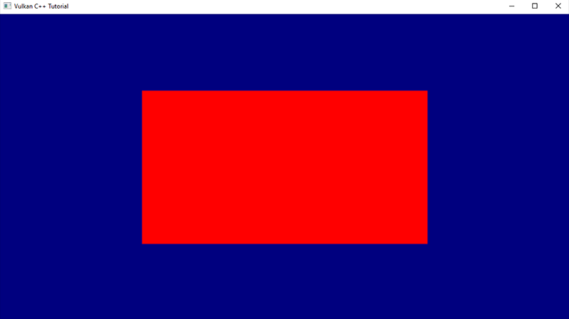

# Lesson 25: Going 3D
So far all that we've created is one flat triangle, which is still pretty far from a proper 3D scene. I think it's time to change this.

Our vertices already have three dimensional coordinates, only that we're not using the third dimension yet. So we should be able to create a three-dimensional object without any changes to the pipeline. Let's modify our vertex buffer to contain a cube:

``` C++
constexpr size_t vertexCount = 36;
const std::array< float, 8 * vertexCount > vertices = {
    // front               (red)
    -.5f, -.5f, .5f, 1.f,  1.f, 0.f, 0.f, 1.f,
    .5f, -.5f, .5f, 1.f,   1.f, 0.f, 0.f, 1.f,
    -.5f, .5f, .5f, 1.f,   1.f, 0.f, 0.f, 1.f,
    .5f, -.5f, .5f, 1.f,   1.f, 0.f, 0.f, 1.f,
    .5f, .5f, .5f, 1.f,    1.f, 0.f, 0.f, 1.f,
    -.5f, .5f, .5f, 1.f,   1.f, 0.f, 0.f, 1.f,

    // back                (yellow)
    -.5f, -.5f, -.5f, 1.f, 1.f, 1.f, 0.f, 1.f,
    .5f, -.5f, -.5f, 1.f,  1.f, 1.f, 0.f, 1.f,
    -.5f, .5f, -.5f, 1.f,  1.f, 1.f, 0.f, 1.f,
    .5f, -.5f, -.5f, 1.f,  1.f, 1.f, 0.f, 1.f,
    .5f, .5f, -.5f, 1.f,   1.f, 1.f, 0.f, 1.f,
    -.5f, .5f, -.5f, 1.f,  1.f, 1.f, 0.f, 1.f,

    // left                (violet)
    -.5f, -.5f, .5f, 1.f,  1.f, 0.f, 1.f, 1.f,
    -.5f, -.5f, -.5f, 1.f, 1.f, 0.f, 1.f, 1.f,
    -.5f, .5f, .5f, 1.f,   1.f, 0.f, 1.f, 1.f,
    -.5f, -.5f, .5f, 1.f,  1.f, 0.f, 1.f, 1.f,
    -.5f, .5f, -.5f, 1.f,  1.f, 0.f, 1.f, 1.f,
    -.5f, .5f, .5f, 1.f,   1.f, 0.f, 1.f, 1.f,

    // right               (green)
    .5f, -.5f, .5f, 1.f,   0.f, 1.f, 0.f, 1.f,
    .5f, -.5f, -.5f, 1.f,  0.f, 1.f, 0.f, 1.f,
    .5f, .5f, -.5f, 1.f,   0.f, 1.f, 0.f, 1.f,
    .5f, -.5f, .5f, 1.f,   0.f, 1.f, 0.f, 1.f,
    .5f, .5f, -.5f, 1.f,   0.f, 1.f, 0.f, 1.f,
    .5f, .5f, .5f, 1.f,    0.f, 1.f, 0.f, 1.f,

    // top                 (turquoise)
    -.5f, -.5f, .5f, 1.f,  0.f, 1.f, 1.f, 1.f,
    .5f, -.5f, .5f, 1.f,   0.f, 1.f, 1.f, 1.f,
    .5f, -.5f, -.5f, 1.f,  0.f, 1.f, 1.f, 1.f,
    -.5f, -.5f, .5f, 1.f,  0.f, 1.f, 1.f, 1.f,
    .5f, -.5f, -.5f, 1.f,  0.f, 1.f, 1.f, 1.f,
    -.5f, -.5f, -.5f, 1.f, 0.f, 1.f, 1.f, 1.f,

    // bottom              (blue)
    -.5f, .5f, .5f, 1.f,   0.f, 0.f, 1.f, 1.f,
    .5f, .5f, .5f, 1.f,    0.f, 0.f, 1.f, 1.f,
    .5f, .5f, -.5f, 1.f,   0.f, 0.f, 1.f, 1.f,
    -.5f, .5f, .5f, 1.f,   0.f, 0.f, 1.f, 1.f,
    .5f, .5f, -.5f, 1.f,   0.f, 0.f, 1.f, 1.f,
    -.5f, .5f, -.5f, 1.f,  0.f, 0.f, 1.f, 1.f,
};
```

The cube is centered around the origin. Every face is made out of two triangles, therefore we need six vertices per face[^1]. I gave every face a different color to make it easier to see what's going on on the screen.

Running this version we still see just a plain red rectangle instead of a three dimensional object. That is okay because we're looking at our cube straight on and thus cannot expect to see anything but the front face. But something's not quite right here: a cube is supposed to have square faces, this thing on screen however is clearly wider than it is high. Worse even, if we resize the window it changes its dimensions and aspect ratio.



To understand why that is we need to have a look at the coordinate system that the Vulkan rendering pipeline operates with. We already briefly touched upon the subject when we were discussing our graphics pipeline setup in lessons 14 - 16. The pipeline expects the output of the vertex shader to be so-called normalized device coordinates. By default this is a right-handed coordinate system with the y-axis pointing downwards[^2] and the origin in the middle of the window. That means the top of the window is mapped to a coordinate of y=-1 and the bottom to y=+1, the left window border is at x=-1 and the right border at x=+1. That explains why our cube face initially has a rectangular shape and changes dimensions when we resize the window: an x value of 0.5 is always halfway between the middle of the window and its right border, the same applies to the y axis.


Okay, that is good to know, but what do we do about it? We want our cube to look like a cube, so somehow need to modify our vertex coordinates so that they take the window dimensions into account.

This is probably a good point to talk about transformations. In the context of graphics a transformation is an operation that modifies a coordinate (i.e. a vector) in a specific way so that it ends up in a different location. If you apply the same transformation to all vertex coordinates of an object you can e.g. realize translations (i.e. move the object around), scaling (make the object bigger or smaller) and rotations. Mathematically transformations are expressed as a multiplication of a matrix with the coordinate vector. I'm not going to go into details here, if you are interested in a more extensive explanation I suggest you watch the video that is linked in the footnotes - it's by far the best tutorial on linear transformations that I know.

What we need right now is called a projection transformation, because it projects the 3D coordinates of our vertices onto the 2D plane of our screen. There are two common types of projection: perspective and orthographic. Perspective projection is what you are used to from most 3D games, it simulates the real world experience where objects appear to become smaller with increasing distance from the viewer. The main usecase for orthographic projections is in technical software such as 3D modelling and CAD programs. Distant objects retain the same size as close ones, which creates a somewhat weird visual appearance but makes it easier to judge proportions etc. Mathematically the difference between the two is: in a perspective projection the imaginary rays of light that project the 3D scene onto the screen intersect at your eye (the camera) and get farther apart with increasing depth (into the screen), whereas in an orthographic projection they run in parallel. This is the reason why the latter is also sometimes called a parallel projection.

 Projection")