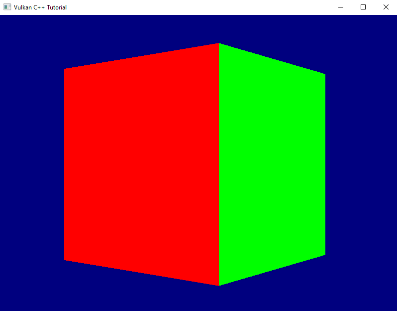

# Depth Testing
Many of you have probably already spotted the problem that makes our rotating cube look so weird: we did not yet enable depth testing. Our pipeline just renders the geometry in the order in which it is coming in and does not care which triangle is actually closer to the camera. The result is that the red front face is rendered first, but because it is covered completely by all the other faces which are rendered afterwards we never get to see it. For the same reason the top and bottom faces are always completely visible - they are rendered last on top of everything else.

So let's go and fix this. The first thing to do is to enable depth-testing in the pipeline. To do so we need to create a `PipelineDepthStencilStateCreateInfo` and pass it to our `GraphicsPipelineCreateInfo`.

`PipelineDepthStencilStateCreateInfo` looks like this:

``` C++
struct PipelineDepthStencilStateCreateInfo
{
    ...
    PipelineDepthStencilStateCreateInfo& setFlags( vk::PipelineDepthStencilStateCreateFlags flags_ );
    PipelineDepthStencilStateCreateInfo& setDepthTestEnable( vk::Bool32 depthTestEnable_ ) 
    PipelineDepthStencilStateCreateInfo& setDepthWriteEnable( vk::Bool32 depthWriteEnable_ );
    PipelineDepthStencilStateCreateInfo& setDepthCompareOp( vk::CompareOp depthCompareOp_ );
    PipelineDepthStencilStateCreateInfo& setDepthBoundsTestEnable( vk::Bool32 depthBoundsTestEnable_ );
    PipelineDepthStencilStateCreateInfo& setMinDepthBounds( float minDepthBounds_ );
    PipelineDepthStencilStateCreateInfo& setMaxDepthBounds( float maxDepthBounds_ );
    PipelineDepthStencilStateCreateInfo& setStencilTestEnable( vk::Bool32 stencilTestEnable_ );
    PipelineDepthStencilStateCreateInfo& setFront( const vk::StencilOpState& front_ );
    PipelineDepthStencilStateCreateInfo& setBack( const vk::StencilOpState& back_ );    
    ...
};
```

- once more we can ignore the `flags_` because there are none defined
- `setDepthTestEnable` enables / disables the actual depth test itself, i.e. the comparison between the new fragment and the value that is currently in the depth buffer for that fragment coordinate. Fragments that fail this test are not processed any further.
- `setDepthWriteEnable` specifies whether the new depth value is actually written to the depth buffer. In most cases you'll want to set this to true(1).
- `setDepthCompareOp` allows you to specify the function that is used for comparing the new depth value with the old one. In most cases this will be `CompareOp::eLess` but there might be situations where a different comparison is required.
- `setDepthBoundsTestEnable` specifies if the depth values are tested also against  `minDepthBounds_` and `maxDepthBounds_` and are discarded if they're outside of this range.
- stencil testing, which you can activate with `setStencilTestEnable`, is a technique that allows you to only render certain portions of the scene. Insofar it is similar to the scissor operation (see lesson 16), but much more powerful. Essentially this looks at the stencil value for this fragment in the buffer and discards the fragment if a certain condition for that value is not met.
- `setFront` and `setBack` are related to the stencil test. We won't use that feature for now, therefore we can ignore those two functions (their parameter is a bit more involved, so I don't want to go into that here).

Alright, let's enable depth testing for our pipeline:

``` C++
vk::UniquePipeline create_graphics_pipeline(
    const vk::Device& logicalDevice,
    const vk::ShaderModule& vertexShader,
    const vk::ShaderModule& fragmentShader,
    const vk::RenderPass& renderPass,
    const vk::Extent2D& viewportExtent,
    const std::vector< vk::Format >& vertexFormats
)
{
    ...
    const auto depthStencilState = vk::PipelineDepthStencilStateCreateInfo{}
        .setDepthTestEnable( true )
        .setDepthWriteEnable( true )
        .setDepthCompareOp( vk::CompareOp::eLess )
        .setDepthBoundsTestEnable( false )
        .setStencilTestEnable( false );

    const auto pipelineCreateInfo = vk::GraphicsPipelineCreateInfo{}
        .setStages( shaderStageInfos )
        .setPVertexInputState( &vertexInputState )
        .setPInputAssemblyState( &inputAssemblyState )
        .setPViewportState( &viewportState )
        .setPRasterizationState( &rasterizationState )
        .setPMultisampleState( &multisampleState )
        .setPDepthStencilState( &depthStencilState )
        .setPColorBlendState( &colorBlendState )
        .setLayout( *pipelineLayout )
        .setRenderPass( renderPass );
    ...
}
```

That is of course not enough. A depth test needs an image attachment to store the depth values, and we did not create one so far. Let's change that:

``` C++
vk::UniqueRenderPass create_render_pass(
    const vk::Device& logicalDevice,
    const vk::Format& colorFormat
)
{
    ...
    const auto depthAttachment = vk::AttachmentDescription{}
        .setFormat( vk::Format::eD32Sfloat )
        .setSamples( vk::SampleCountFlagBits::e1 )
        .setLoadOp( vk::AttachmentLoadOp::eClear )
        .setStoreOp( vk::AttachmentStoreOp::eDontCare )
        .setStencilLoadOp( vk::AttachmentLoadOp::eDontCare )
        .setStencilStoreOp( vk::AttachmentStoreOp::eDontCare )
        .setInitialLayout( vk::ImageLayout::eUndefined )
        .setFinalLayout( vk::ImageLayout::eDepthStencilAttachmentOptimal );

    const auto depthAttachmentRef = vk::AttachmentReference{}
        .setAttachment( 1 )
        .setLayout( vk::ImageLayout::eDepthStencilAttachmentOptimal );

    const auto subpass = vk::SubpassDescription{}
        .setPipelineBindPoint( vk::PipelineBindPoint::eGraphics )
        .setPDepthStencilAttachment( &depthAttachmentRef )
        .setColorAttachments( colorAttachmentRef );

    const auto attachments = std::array< vk::AttachmentDescription, 2>{ colorAttachment, depthAttachment };
    const auto renderPassCreateInfo = vk::RenderPassCreateInfo{}
        .setAttachments( attachments )
        .setSubpasses( subpass );
    ...
}
```

We've talked about attachments and subpasses quite a bit back in lesson 17. The relevant changes for a depth attachment are the format (we only need one float value per fragment, hence the `eD32Sfloat`(2)) and the final layout. Everything else is the same as for the color attachment.

Running this version yields an exception and a validation error:
```
... VkFramebufferCreateInfo attachmentCount of 1 does not match attachmentCount of 2 of VkRenderPass ...
```

Of course. Our pipeline now expects the framebuffer to come with a depth attachment, which of course it doesn't have yet. Let's fix that by pretending we already have a depth image view that we could pass to the framebuffer creation function:

``` C++
std::vector< vk::UniqueFramebuffer > create_framebuffers(
    const vk::Device& logicalDevice,
    const std::vector< vk::UniqueImageView >& imageViews,
    const vk::ImageView& depthImageView,
    const vk::Extent2D& imageExtent,
    const vk::RenderPass& renderPass
)
{
    std::vector< vk::UniqueFramebuffer > result;
    for( const auto& v : imageViews )
    {
        std::array< vk::ImageView, 2 > attachments = { *v, depthImageView };
        const auto frameBufferCreateInfo = vk::FramebufferCreateInfo{}
            .setRenderPass( renderPass )
            .setAttachments( attachments )
            .setWidth( imageExtent.width )
            .setHeight( imageExtent.height )
            .setLayers( 1 );

        result.push_back( logicalDevice.createFramebufferUnique( frameBufferCreateInfo ) );
    }

    return result;
}
``` 

We only need one depth image view because it is only used during the actual rendering and we only ever draw a single frame at the same time.

So far, so good, unfortunately we don't have a depth image view yet. Where do we get that from? The `imageViews` for the rendering output are members of our `swapchain` class, so it seems logical that it also owned the depth image. However, while the former are created for us by the `SwapchainKHR` class we will have to do it ourselves for the depth image. The logical device gives us what we need:

``` C++
class Device
{
    ...
    UniqueImage createImageUnique( const ImageCreateInfo& createInfo, ... ) const;
    ...
};
```
... with
``` C++
struct ImageCreateInfo
{
    ...
    ImageCreateInfo& setFlags( vk::ImageCreateFlags flags_ );
    ImageCreateInfo& setImageType( vk::ImageType imageType_ );
    ImageCreateInfo& setFormat( vk::Format format_ );
    ImageCreateInfo& setExtent( const vk::Extent3D& extent_ );
    ImageCreateInfo& setMipLevels( uint32_t mipLevels_ );
    ImageCreateInfo& setArrayLayers( uint32_t arrayLayers_ );
    ImageCreateInfo& setSamples( vk::SampleCountFlagBits samples_ );
    ImageCreateInfo& setTiling( vk::ImageTiling tiling_ );
    ImageCreateInfo& setUsage( vk::ImageUsageFlags usage_ );
    ImageCreateInfo& setSharingMode( vk::SharingMode sharingMode_ );
    ImageCreateInfo& setQueueFamilyIndices( const container_t<const uint32_t>& queueFamilyIndices_ )
    ImageCreateInfo& setInitialLayout( vk::ImageLayout initialLayout_ );
    ...
}
```
Wow, not that easy, given that we just would like to have an image. Anyway, let's unpack:

- there are actually quite a number of `ImageCreateFlags` defined. However, we don't need any of them yet.
- the `imageType_` specifies whether we want to create a 1d, 2d or 3d image
- the `Format` parameter should be familiar by now. For the depth image we obviously should use the same format that we specified for our attachment above
- the `extent_` defines the dimensions of the image to create. It's a 3D extent so that the same function can cover all use cases (Vulkan is a C interface, so there are no overloads possible), we can just set the 3rd dimension to 1
- the `mipLevels_` parameter relates to a technique called mip mapping. I won't go into details here, suffice it to say that it uses the same image in different resolutions to mitigate rendering artefacts when a textured object is further away from the camera. We don't use this technique yet, so we can set this parameter to 1.
- we talked about `arrayLayers` back in lesson 18. We're still not going to use this technique here, so we set this parameter to 1 as well
- `samples_` is again the number of multisample fragments rendered for each pixel on screen. 
- the `tiling` parameter controls the internal layout of the image data in GPU memory. We don't have any special requirements here, so we just use `eOptimal`.
- `usage_` specifies how we intend to use this image in the pipeline.
- the `sharingMode_` specifies whether the image is going to be used by multiple queues
- the `queueFamilyIndices_` are only relevant in cases where the image is going to be shared between queues, i.e. where the sharing mode is `eConcurrent`
- `initialLayout` - just as for the attachment descriptions - specifies the initial layout that this image will have.

With that knowledge, let's create a first version of our depth image creation:

```C++
gpu_image create_depth_image(
    const vk::Device& logicalDevice,
    const vk::Extent2D& imageExtent
)
{
    const auto createInfo = vk::ImageCreateInfo{}
        .setImageType( vk::ImageType::e2D )
        .setFormat( vk::Format::eD32Sfloat )
        .setExtent( vk::Extent3D{ imageExtent.width, imageExtent.height, 1 } )
        .setMipLevels( 1 )
        .setArrayLayers( 1 )
        .setSamples( vk::SampleCountFlagBits::e1 )
        .setTiling( vk::ImageTiling::eOptimal )
        .setUsage( vk::ImageUsageFlagBits::eDepthStencilAttachment )
        .setSharingMode( vk::SharingMode::eExclusive )
        .setInitialLayout( vk::ImageLayout::eUndefined );
    return logicalDevice.createImageUnique( createInfo );
}
```

We're not done here though. Remember how it wasn't enough to create a `vk::Buffer` but instead we needed to explicitly allocate the memory for it? We need to do exactly the same here. Let's therefore create an equivalent to our `gpu_image` struct:

```C++
struct gpu_image
{
    vk::UniqueImage image;
    vk::UniqueDeviceMemory memory;
};
```

... and expand our `create_depth_image` function to also allocate the memory:

``` C++
gpu_image create_depth_image(
    const vk::PhysicalDevice& physicalDevice,
    const vk::Device& logicalDevice,
    const vk::Extent2D& imageExtent
)
{
    const auto createInfo = ...
    auto image = logicalDevice.createImageUnique( createInfo );

    const auto memoryRequirements = logicalDevice.getImageMemoryRequirements( *image );
    const auto memoryProperties = physicalDevice.getMemoryProperties();

    const auto memoryIndex = vcpp::find_suitable_memory_index(
        memoryProperties,
        memoryRequirements.memoryTypeBits,
        vk::MemoryPropertyFlagBits::eDeviceLocal );

    const auto allocateInfo = vk::MemoryAllocateInfo{}
        .setAllocationSize( memoryRequirements.size )
        .setMemoryTypeIndex( memoryIndex );

    auto memory = logicalDevice.allocateMemoryUnique( allocateInfo );
    logicalDevice.bindImageMemory( *image, *memory, 0u );

    return { std::move( image ), std::move( memory ) };
}
```

With that function we can create the image, but `create_framebuffer` needs an `ImageView`. Well, that shouldn't be too hard, we already have `create_image_view` to create an `ImageView` from an image. The problem is that this function currently has the `ImageAspectFlags` hardcoded to `eColor`. We need to set a flag of `eDepth`, so we need to expose that parameter:

``` C++
vk::UniqueImageView create_image_view(
    const vk::Device& logicalDevice,
    const vk::Image& image,
    const vk::Format& format,
    const vk::ImageAspectFlags flags = vk::ImageAspectFlagBits::eColor
)
{
    const auto subresourceRange = vk::ImageSubresourceRange{}
        .setAspectMask( flags )
        ...
}
```

As said above, the swapchain should own the depth image and the image view and pass it on to the framebuffer creation. So we need to adjust the `swapchain` constructor a bit to actually create them:

``` C++
swapchain::swapchain(
    const vk::PhysicalDevice& physicalDevice,
    const vk::Device& logicalDevice,
    const vk::RenderPass& renderPass,
    const vk::SurfaceKHR& surface,
    const vk::SurfaceFormatKHR& surfaceFormat,
    const vk::Extent2D& imageExtent,
    std::uint32_t maxImagesInFlight
)
    : m_logicalDevice{ logicalDevice }
    , m_swapchain{ create_swapchain( logicalDevice, surface, surfaceFormat, imageExtent, maxImagesInFlight ) }
    , m_maxImagesInFlight{ maxImagesInFlight }
    , m_imageViews{ create_swapchain_image_views( logicalDevice, *m_swapchain, surfaceFormat.format ) }
    , m_depthImage{ create_depth_image( physicalDevice, logicalDevice, imageExtent ) }
    , m_depthImageView{ create_image_view( 
        logicalDevice, 
        *m_depthImage.image, 
        vk::Format::eD32Sfloat, 
        vk::ImageAspectFlagBits::eDepth ) }
{
    m_framebuffers = create_framebuffers( logicalDevice, m_imageViews, *m_depthImageView, imageExtent, renderPass );
    ...
}
```

Obviously we need to adjust the constructor call in `main` accordingly as well. This version compiles, but it doesn't render anything and we get a lot of validation errors:

```
... VkRenderPassBeginInfo struct has a clearValueCount of 1 but there must be at least 2 entries in pClearValues array to account for the highest index attachment in VkRenderPass ...
```

Once again the fact that Vulkan really only does what we ask it to do bites us: we have created a depth attachment for our render pass, but we didn't specify a clear value for that attachment. That means that the depth buffer contains arbitrary garbage and so the depth testing cannot work propoerly. The solution is pretty trivial: we already specify a clear value for the color attachment, so we just need to extend that code a bit:

``` C++
void record_command_buffer(
    const vk::CommandBuffer& commandBuffer,
    const vk::Pipeline& pipeline,
    const vk::RenderPass& renderPass,
    const vk::Framebuffer& frameBuffer,
    const vk::Extent2D& renderExtent,
    const vk::Buffer& vertexBuffer,
    const std::uint32_t vertexCount
)
{
    const auto clearValues = std::array< vk::ClearValue, 2 >{
        vk::ClearValue{}.setColor( std::array< float, 4 >{ { 0.f, 0.f, .5f, 1.f } } ),
        vk::ClearValue{}.setDepthStencil( vk::ClearDepthStencilValue{ 1.f, 0 } )
    };
    ...
}
```

And now we see a correctly rendered rotating cube on screen. Yay!



Before I finish, an apology: last time I promised to also improve the render loop. However, it turned out that this lesson is long enough already. Therefore the improvement will have to wait until next time.


1. Note that if depth writing is enabled, the depth values will be calculated and written to the depth image even if you disable the actual testing. This can be useful for certain special effects.
2. Strictly speaking this format might not be available on all hardware, so in a real-world application you probably should design for some more flexibility