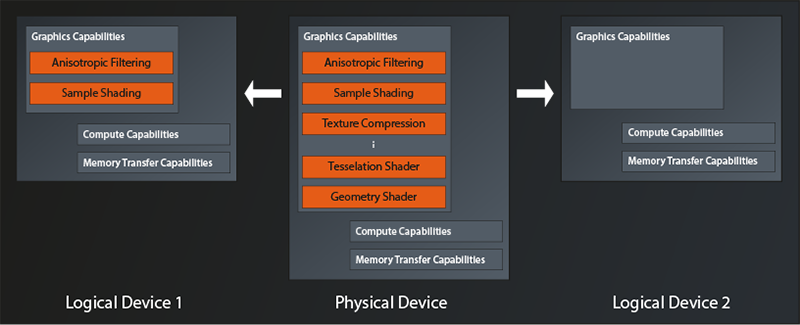
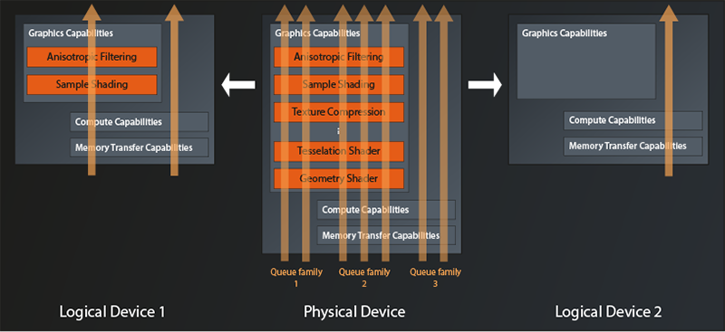

# Logical Devices and Queues

## Logical Devices
So we do have a handle to the physical device that we want to work with. One might think that we could now just start to use it directly. Well, not so fast my friends. Vulkan is designed for maximum performance, and therefore it wants to know upfront how we intend to use the GPU so it can optimize for our use case. For this purpose Vulkan introduces the concept of logical devices. 

You can think of a logical device as a kind of virtual GPU that is tailored exactly to what you need for your application. But to be clear: we're not talking about an additional abstraction level that introduces overhead. It's just a means that allows Vulkan to configure the physical GPU in the best way possible for your application by only turning on features that are actually going to be used. An example of this is depicted in the following diagram(1):



So we have a physical device here that offers quite a few features like e.g. anisotropic filtering, texture compression, tesselation and geometry shaders, and so on. The application on the left configures its logical device to only use anisotropic filtering and sample shading. All the other features of the physical device are being left switched off. The application on the right on the other hand does not turn on any of the graphics features for its logical device, potentially because it only wants to use the compute capabilities.

## Queues and queue families
Another concept that becomes relevant when creating a logical device are the so-called queues. They too are a means to optimize hardware utilization and thus performance. Let me try to explain.
The architecture of modern GPUs is tailored to massive parallelization of tasks. They can compute the same little program (the shader, or more generic: the kernel) several hundredfold at the same time. But that means that one work package might not actually utilize all that processing power. Imagine e.g. a game that wants to calculate the game physics on the GPU while at the same time rendering the next frame. It might be that neither of the two tasks actually requires the full processing capacity of the device. If we were only able to issue commands to the device as a whole, those tasks would probably have to be executed sequentially (or require some very complex shader programming) and leave us with reduced performance while the GPU is constantly underutilized. 
That's where the concept of queues comes into play. You can think of a queue as a dedicated processing lane on the physical device that supports one or more specific types of tasks. A Vulkan device will almost always provide more than one of them, organized in so called queue families. Each queue family groups one or more queues of the same type (i.e. with identical capabilities) that are able to execute in parallel.

So, when creating the logical device, you also need to specify how many queues of which type (i.e. of which queue family) you intend to use. We can visualize this by extending the diagram above as follows:



The physical device in this example exposes three queue families. One that only supports graphics operations, one which additionally offers compute and memory transfer operations, and one which only supports the latter two. A maximum of two queues can be allocated simultaneously from the first family, three from the second and two again from the third.

The logical device on the left is configured to use one queue from families two and three. Apparently the application wants to parallelize compute tasks with rendering tasks. The logical device on the right only has one queue configured, so the application indeed only intends to use Vulkan for compute operations.

One final note before we actually start implementing: while it is possible to create multiple logical devices from the same physical device, there is no good reason to do so. You won't get any better parallelization than by using one logical device with multiple queues, it is more work and you loose some options for synchronization and data transfer. Multiple logical devices only make sense when you want to work with multiple physical devices at the same time. But that's something we won't go into in this tutorial.

## Creating the logical device 
The logical device is created by the physical device instance:
```
class PhysicalDevice
{
    ...
    vk::UniqueDevice vk::PhysicalDevice::createDeviceUnique( const vk::DeviceCreateInfo&, ... );
    ...
};
```
As you can see, in Vulkan the logical devices are just called `Device`. `vk::DeviceCreateInfo` provides this (simplified) interface:
```
struct DeviceCreateInfo
{
    ...
    DeviceCreateInfo& setFlags( DeviceCreateFlags flags_ );
    DeviceCreateInfo& setPEnabledLayerNames( const container_type< const char* const >& layerNames_ );
    DeviceCreateInfo& setPEnabledExtensionNames( const container_type< const char* const >& extensionNames_ );
    DeviceCreateInfo& setPEnabledFeatures( const PhysicalDeviceFeatures* pEnabledFeatures_ );
    DeviceCreateInfo& setQueueCreateInfos( const container_type< DeviceQueueCreateInfo >& queueCreateInfos_ );
    ...
};
```
The first property we can set are again some flags. As before, this parameter is reserved for future use, so we can ignore the method.

Next in line are the names of enabled layers and extensions. This looks familiar, right? Didn't we already have those parameters when we looked at the `vk::InstanceCreateInfo`?  Indeed, Vulkan distinguishes between instance-level layers and extensions, and device-level layers and extensions(2). I promise, we'll get to those very soon, for now let's ignore them again.

Remember that we were able to query the physical device for it's features? The next method allows us to selectively enable those features for our logical device. They're off by default, so in best C++ spirit you don't pay for what you don't use in Vulkan. We're not going to use any features initially, so for now we'll ignore this parameter as well.

Which leaves the `queueCreateInfos`. As described above Vulkan requires us to tell it upfront how many queues of which queue families we intend to use, so that it can configure the physical device optimally. Let's look at the create info:
```
struct DeviceQueueCreateInfo
{
    ...
    DeviceQueueCreateInfo& setFlags( DeviceQueueCreateFlags flags_ );
    DeviceQueueCreateInfo& setQueueFamilyIndex( uint32_t queueFamilyIndex_ );
    DeviceQueueCreateInfo& setQueueCount( uint32_t queueCount_ );
    DeviceQueueCreateInfo& setQueuePriorities( const container_type< const float >& queuePriorities_ );
    ...
};
```
The `flags` parameter is once again reserved for future use (I'll keep mentioning this to avoid questions - after all, flags usually are something pretty important when configuring a library or similar).
With the next function we can set the index of the queue family we want to create one or more queues from, and with `setQueueCount` we tell Vulkan how many of those queues we'd like to have available. Via `setQueuePriorities` you have to assign relative priorities to each of the created queues, with 1.0 being the maximum and 0.0 the minimum. This becomes important if the device runs into a situation where it can't execute all the requested operations at the same time and needs to prioritize. 

So with one of these structures we can tell Vulkan to create a number of queues from one family. But what if we wanted to create queues from different families? That's why `DeviceCreateInfo::setQueueCreateInfos` accepts a container of these structs, you just create one struct for each family that you need.

Cool, so we could now initialize our `DeviceQueueCreateInfo` structures and pass them to `DeviceCreateInfo. The problem is just: how do we know which queue family index we need to use? To be able to answer this question, we can ask the physical device for information on the queue families it provides:
```
class PhysicalDevice
{
    ...
    std::vector< QueueFamilyProperties > getQueueFamilyProperties(...) const;
    ...
};
```
As you might have guessed, this function returns one entry for each available queue family in the vector. `QueueFamilyProperties` only contains two properties that are of interest to us at the moment:
```
struct QueueFamilyProperties
{
    ...
    QueueFlags queueFlags;
    uint32_t queueCount;
    ...
};
```
`queueCount` gives us the maximum number of queues that you can create from this family. `queueFlags` is a bitfield (see [lesson 1]) that tells us which operations this queue supports. The possible flag bits are:
- `vk::QueueFlagBits::eGraphics`: the queue supports graphics operations
- `vk::QueueFlagBits::eCompute`: the queue supports compute operations
- `vk::QueueFlagBits::eTransfer`: the queue supports transfer of data between GPU memory and main memory 
- `vk::QueueFlagBits::eSparseBinding`: sparse binding is an advanced feature where resources (e.g. images) do not have to reside in GPU memory completely. We won't go into this topic in this tutorial.

So we now can get an overview of the queue families and their capabilities:
```
...

void print_queue_family_properties( const vk::QueueFamilyProperties& props, unsigned index )
{
    std::cout << 
        "\n    Queue Family " << index << ":\n" <<
        "\n        queue count: " << props.queueCount <<
        "\n        supports graphics operations: " << ( props.queueFlags & vk::QueueFlagBits::eGraphics ? "yes" : "no" ) <<
        "\n        supports compute operations: " << ( props.queueFlags & vk::QueueFlagBits::eCompute ? "yes" : "no" ) <<
        "\n        supports transfer operations: " << ( props.queueFlags & vk::QueueFlagBits::eTransfer ? "yes" : "no" ) <<
        "\n        supports sparse binding operations: " << ( props.queueFlags & vk::QueueFlagBits::eSparseBinding ? "yes" : "no" ) <<
        "\n";
}

...

int main()
{
    ...
    const auto queueFamilies = physicalDevice.getQueueFamilyProperties();
    std::cout << "\nAvailable queue families:\n";
    unsigned familyIndex = 0;
    for ( const auto& qf : queueFamilies )
    {
        print_queue_family_properties( qf, familyIndex );
        ++familyIndex;
    }
    ...
}
```

Compile and run this and you will get output along those lines:
```
Available queue families:

    Queue Family 0:

        queue count: 1
        supports graphics operations: yes
        supports compute operations: yes
        supports transfer operations: yes
        supports sparse binding operations: no

    Queue Family 1:

        queue count: 1
        supports graphics operations: yes
        supports compute operations: yes
        supports transfer operations: yes
        supports sparse binding operations: no

    Queue Family 2:

        queue count: 1
        supports graphics operations: yes
        supports compute operations: yes
        supports transfer operations: yes
        supports sparse binding operations: no

    Queue Family 3:

        queue count: 1
        supports graphics operations: yes
        supports compute operations: yes
        supports transfer operations: yes
        supports sparse binding operations: no
```
In this case it seems there are multiple queue families with identical capabilities. This might be due to some internal differences between the queues which cannot be expressed via the Vulkan interface. Another reason might be that queues from the same family can share resources with minimal overhead. So an implementation might expose multiple queue families with the same capabilities if the hardware implementation does not allow for that.

multiple queues. So, while in many cases you might get away with simply selecting the first queue, you should not rely on that being the queue family that supports the functionality you need. You might also find that there actually is no single queue family that has everything you need, in this case you'll have to use different queues for different tasks.

We'll again keep it relatively simple in this tutorial and just assume that the physical device has a queue family that fulfills all our needs and select that(3):
```
std::uint32_t get_suitable_queue_family( 
    const std::vector< vk::QueueFamilyProperties >& queueFamilies,
    vk::QueueFlags requiredFlags
)
{
    std::uint32_t index = 0;
    for ( const auto& q : queueFamilies )
    {
        if ( ( q.queueFlags & requiredFlags ) == requiredFlags )
            return index;
        ++index;
    }
    throw std::runtime_error( "No suitable queue family found" );
}
```
And with this helper function in place we can finally fill our `QueueCreateInfo` structure. We just have to remember that we're obliged to set the priorities, even if we have just one single queue(4).
``` 
const auto queueFamilyIndex = get_suitable_queue_family(
    queueFamilies,
    vk::QueueFlagBits::eCompute
);
std::cout << "\nSelected queue family index: " << queueFamilyIndex << "\n";

const auto queuePriority = 1.f;
const auto queueCreateInfos = std::vector< vk::DeviceQueueCreateInfo >{
    vk::DeviceQueueCreateInfo{}
        .setQueueFamilyIndex( queueFamilyIndex )
        .setQueueCount( 1 )
        .setQueuePriorities( queuePriority )
};
```
I can hear you shouting at me now because I asked for a compute queue, not a graphics one. Yes, I know, most of you are reading this tutorial because they want to do graphics programming. And I promise, we'll get to that eventually. But setting up a graphics pipeline in Vulkan is a pretty complex task, so there's quite a way to go still. I therefore think it is better to focus on the simpler problem of getting compute pipeline running first. That will already teach us a lot of the concepts and fundamentals that we'll need in in any case. That way we can see some success and then build on what we've learned to get the graphics working.

Anyway: now that we have our `queueCreateInfos`, we're finally able to create our logical device.
```
const auto deviceCreateInfo = vk::DeviceCreateInfo{}
    .setQueueCreateInfos( queueCreateInfos );

const auto logicalDevice = physicalDevice.createDeviceUnique( deviceCreateInfo );
```
Compile and run to make sure everything works. Then, as before, let's wrap all the logical device creation in a function to keep  `main` nice and clean.
```
vk::UniqueDevice create_logical_device( const vk::PhysicalDevice& physicalDevice )
{
    ...
    return physicalDevice.createDeviceUnique( deviceCreateInfo );
}

int main()
{
    ...
    const auto instance = create_instance();
    const auto physicalDevice = create_physical_device( *instance );
    const auto logicalDevice = create_logical_device( physicalDevice );
    ...
}
```
Okay, that's it for now. We have our logical device configured and ready to use. Next time we'll take a small detour and talk about layers and extensions. After that, we'll start to actually do something with our graphics hardware.


1. This visualization shows a conceptual view, it is not a representation of actual GPU hardware architecture.
2. Actually, device-level layers have been deprecated for a while now and are only kept as part of the interface for backwards-compatibility
3. In the original Vulkan tutorial, the available queues are actually already queried when selecting the physical device. This is definitely the more robust way to do it, and I recommend considering this approach for any production code. This is a tutorial, so I try to keep things simple by assuming the queues we need are available on the selected device (I actually did not yet encounter a system that supported Vulkan and didn't have a graphics and a compute queue family)
4. In this case the function expects an `ArrayProxyNoTemporaries` (see the [introduction]() ), therefore we cannot pass an rvalue to the function.