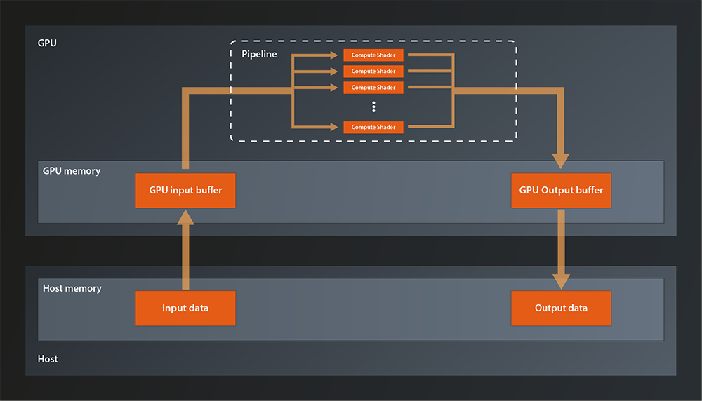

# Lesson 6: Memory Buffers

So, we're now finally at a point where we can start implementing our first Vulkan pipeline. As said, it's going to be a compute pipeline because that is the shorter and more straightforward route to doing something meaningful with Vulkan. But rest assured, the graphics stuff will follow after.

A compute pipeline is conceptually very simple: the data 'flows' from the pipeline input through exactly one shader stage (the compute shader) to the output. The key advantage of such a pipeline compared to a classic CPU is its massive parallelization capacity. The GPU can run hundreds of incarnations of the shader kernel at the same time on its processing units, each one usually working with one element of the input data.

We'll implement a 'one-shot' calculation, i.e. we will copy one block of input data to the GPU, let the pipeline process the data and copy the result back to our main memory (the read-back step will be added once we have a working compute pipeline in place), as shown in the following picture:



That doesn't look too complicated, right? How about we just get started?

## Creating the host buffers
As said, we first need a buffer in main memory that holds the data we want to process. In C++ the default data structure for such a buffer is either an array or a vector, depending on whether we know the size at compile time or not. In our case an array seems appropriate for now.
```cpp
constexpr size_t numElements = 500;
auto inputData = std::array< int, numElements >{};
std::iota( inputData.begin(), inputData.end(), 0 );
```
As you can see I've initialized the input data with ascending integers starting at 0. And while we're at it let's also create the buffer that will receive the processed data:
```cpp
auto outputData = std::array< float, numElements >{};
```
No need to initialize anything here, we'll overwrite the data anyway.

## Creating the GPU buffers
So, we now have our buffers allocated in main memory. Next thing we need are corresponding buffers in GPU memory that we can transfer our data to and from. Luckily it turns out that you can create something called `Buffer` from the Vulkan `Device`, which sounds exactly like what we need:
```cpp
class Device
{
    ...
    UniqueBuffer createBufferUnique( const vk::BufferCreateInfo&, ... );
    ...
};
```
There is also the non-unique version, but as mentioned in lesson 2 we'll use the unique wrappers wherever possible. Let's have a look at the `BufferCreateInfo` structure:
```cpp
struct BufferCreateInfo
{
    ...
    BufferCreateInfo& setFlags( BufferCreateFlags flags_ );
    BufferCreateInfo& setSize( DeviceSize size_ );
    BufferCreateInfo& setUsage( BufferUsageFlags usage_ );
    BufferCreateInfo& setSharingMode( SharingMode sharingMode_ );
    BufferCreateInfo& setQueueFamilyIndices( const container_t< const uint32_t >& queueFamilyIndices_ );
    ...
};
```
For a change the `BufferCreateFlags` are actually used and not only reserved for the future. However, we don't need to define any special creation flags for now, so we can still ignore them.

`setSize` should be self-explanatory, it's the size of the buffer in bytes.

The `BufferUsageFlags` are a bit overwhelming at first because of the sheer number of flags. But for simple data buffers like ours we just need to set `vk::BufferUsageFlagBits::eStorageBuffer` .

The sharing mode is either `vk::SharingMode::eExclusive`, which means only one queue will ever access the buffer at the same time. Or it is `vk::SharingMode::eConcurrent` which means this buffer might be accessed by multiple queues simultaneously. We have only one queue, so we'll use the exclusive mode.

Setting the `queueFamilyIndices` is only necessary if the sharing mode is concurrent, so we can ignore that too.

Which means we can create the gpu buffers like this:
```cpp
const auto inputBufferCreateInfo = vk::BufferCreateInfo{}
    .setSize( sizeof( inputData ) )
    .setUsage( vk::BufferUsageFlagBits::eStorageBuffer )
    .setSharingMode( vk::SharingMode::eExclusive );

auto inputBuffer = logicalDevice->createBufferUnique( inputBufferCreateInfo );
```
We now could copy that code to create the output buffer, but that would be an unnecessary duplication I'd say. Let's instead package it into a utility function.
```cpp
auto createGPUBuffer( const vk::Device& logicalDevice, std::uint64_t size ) -> vk::UniqueBuffer
{
    const auto bufferCreateInfo = vk::BufferCreateInfo{}
        .setSize( size )
        .setUsage( vk::BufferUsageFlagBits::eStorageBuffer )
        .setSharingMode( vk::SharingMode::eExclusive );

    return logicalDevice.createBufferUnique( bufferCreateInfo );
}
```
... and call that twice for our input and output buffers:
```cpp
const auto inputBuffer = createGPUBuffer( *logicalDevice, sizeof( inputData ) );
const auto outputBuffer = createGPUBuffer( *logicalDevice, sizeof( outputData ) );
```
