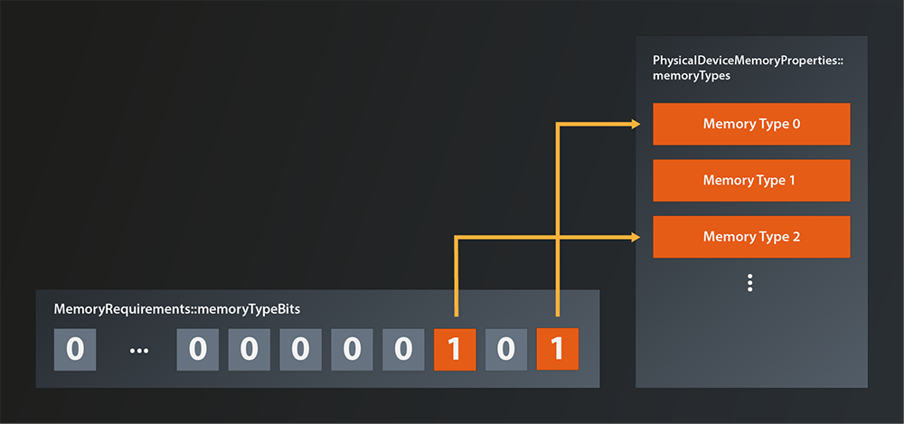

# Memory Buffers

So, we're now finally at a point where we can start implementing our first Vulkan pipeline. As said, it's going to be a compute pipeline because that is the shorter and more straightforward route to doing something meaningful with Vulkan. But rest assured, the graphics stuff will follow after.

A compute pipeline is conceptually very simple: the data 'flows' from the pipeline input through exactly one shader stage (the compute shader) to the output. The key advantage of such a pipeline compared to a classic CPU is its massive parallelization capacity. The GPU can run hundreds of incarnations of the shader kernel at the same time on its processing units, each one usually working with one element of the input data.

We'll implement a 'one-shot' calculation, i.e. we will copy one block of input data to the GPU, let the pipeline process the data and copy the result back to our main memory, as shown in the following picture:


That doesn't look too complicated, right? How about we just get started?

## Creating the host buffers
As said, we first need a buffer in main memory that holds the data we want to process. In C++ the default data structure for such a buffer is either an array or a vector, depending on whether we know the size at compile time or not. In our case an array seems appropriate for now.
```
constexpr size_t numElements = 500;
auto inputData = std::array< int, numElements >{};
int counter = 0;
std::generate( inputData.begin(), inputData.end(), [&counter]() { return counter++; } );
```
As you can see I've initialized the input data with ascending integers starting at 0. And while we're at it let's also create the buffer that will receive the processed data:
```
auto outputData = std::array< float, numElements >{};
```
No need to initialize anything here, we'll overwrite the data anyway.

## Creating the GPU buffers
So, we now have our buffers allocated in main memory. Next thing we need are corresponding buffers in GPU memory that we can transfer our data to and from. Luckily it turns out that you can create something called `Buffer` from the Vulkan `Device`, which sounds exactly like what we need:
```
class Device
{
    ...
    UniqueBuffer createBufferUnique( const vk::BufferCreateInfo&, ... );
    ...
};
```
There is also the non-unique version, but as mentioned in lesson 2 we'll use the unique wrappers wherever possible. Let's have a look at the `BufferCreateInfo` structure:
```
struct BufferCreateInfo
{
    ...
    BufferCreateInfo& setFlags( BufferCreateFlags flags_ );
    BufferCreateInfo& setSize( DeviceSize size_ );
    BufferCreateInfo& setUsage( BufferUsageFlags usage_ );
    BufferCreateInfo& setSharingMode( SharingMode sharingMode_ );
    BufferCreateInfo& setQueueFamilyIndices( const container_t< const uint32_t >& queueFamilyIndices_ );
    ...
};
```
For a change the `BufferCreateFlags` are actually used and not only reserved for the future. However, we don't need to define any special creation flags for now, so we can still ignore them. 

`setSize` should be self-explanatory, it's the size of the buffer in bytes.

The `BufferUsageFlags` are a bit overwhelming at first because of the sheer number of flags. But for simple data buffers like ours we just need to set `vk::BufferUsageFlagBits::eStorageBuffer` .

The sharing mode is either `vk::SharingMode::eExclusive`, which means only one queue will ever access the buffer at the same time. Or it is `vk::SharingMode::eConcurrent` which means this buffer might be accessed by multiple queues simultaneously. We have only one queue, so we'll use the exclusive mode. 

Setting the `queueFamilyIndices` is only necessary if the sharing mode is concurrent, so we can ignore that too.

Which means we can create the gpu buffers like this:
```
const auto inputBufferCreateInfo = vk::BufferCreateInfo{}
    .setSize( sizeof( inputData ) )
    .setUsage( vk::BufferUsageFlagBits::eStorageBuffer )
    .setSharingMode( vk::SharingMode::eExclusive );

auto inputBuffer = logicalDevice->createBufferUnique( inputBufferCreateInfo );
```
We now could copy that code to create the output buffer, but that would be an unnecessary duplication I'd say. Let's instead package it into a utility function.
```
vk::UniqueBuffer create_gpu_buffer( const vk::Device& logicalDevice, std::uint32_t size )
{
    const auto bufferCreateInfo = vk::BufferCreateInfo{}
        .setSize( size )
        .setUsage( vk::BufferUsageFlagBits::eStorageBuffer )
        .setSharingMode( vk::SharingMode::eExclusive );
    
    return logicalDevice.createBufferUnique( bufferCreateInfo );
}
```
... and call that twice for our input and output buffers:
```
const auto inputBuffer = create_gpu_buffer( *logicalDevice, sizeof( inputData ) );
const auto outputBuffer = create_gpu_buffer( *logicalDevice, sizeof( outputData ) );
```

Cool, we have the GPU buffers, now we would like to copy our input data from main memory to the GPU buffer. How do we do that? 

The standard way to copy blocks of raw memory in C++ is still the old `memcpy` function, if we had a pointer to the GPU memory we could use that. But how would we obtain such a pointer? 

Well, a bit of searching yields a function that somehow seems to do what we want:
```
class Device
{
    ...
    void* mapMemory( DeviceMemory memory, DeviceSize offset, DeviceSize size, ... ) const;
    ...
};
```
The documentation for the corresponding C-function says this function is used to "Map a memory object into application address space" and it's result is a "host-accessible pointer to the beginning of the mapped range". So we should be able to use this pointer as the destination for memcpy. 
Sounds great, and the parameters `offset` and `size` are self-explanatory enough. But what is the `DeviceMemory`? We have a `Buffer`, is that the same? Probably not, otherwise it wouldn't be two types. But what is it then?


## Allocating device memory
The answer is that Vulkan separates the management of the actual memory from its semantic meaning, i.e. from how it is used. This separation enables optimization techniques like allocating a big block of memory and updating it as a whole, but actually using different parts of it for different resources.
So actually our diagram from above becomes a bit more accurate if we modify it like this:

[diagram]

Long story short: we need to explicitly allocate the memory and then attach it to the buffer. The way to do the allocation is with the following function:
```
class Device
{
    ...
    DeviceMemory allocateMemory( const MemoryAllocateInfo& allocateInfo_, ... );
    ...
};
```
and the `allocateInfo_` interface looks like this
```
struct MemoryAllocateInfo
{
    ...
    MemoryAllocateInfo& setAllocationSize( vk::DeviceSize allocationSize_ );
    MemoryAllocateInfo& setMemoryTypeIndex( uint32_t memoryTypeIndex_ );
    ...
};
```
So we need the allocation size - fair enough, that was to be expected. But now what the heck is the memory type index? I mean, we just want to allocate a block of memory, how complicated can that be?

Now, GPU memory management in Vulkan is indeed a bit more involved than the memory model we're used to, and the reason is - as so often - enabling performance optimizations. Higher level APIs such as OpenGL or DirectX 11 take care of managing device memory under the hood, but this comes at a cost: the driver implementation basically has to guess how an application intends to use its resources. Will it create another fifty texture images just like the one it just did? Will that big block of memory be accessed from the host over and over again or will the data just sit there and be read by the GPU? Is the application going to destroy resources explicitly once they are not used anymore? It is obviously impossible for a driver to always guess correctly. Chances are therefore that the performance of many applications will not be as good as it could.

Vulkan on the other hand requires us to manage device memory ourselves and be explicit about how we want to use it. For that purpose it introduces the concepts of memory heaps and memory types. Memory heaps are representations of the actual physical types of memory available (e.g. the GPU V-Ram or the host's main memory), whereas memory types are a virtual construct on top that describes how the respective memory can be used (some details to follow below).

So, to be able to determine the memory type index we need, we first need a list of available memory types and their properties. This we can obtain with the following function:
```
class PhysicalDevice
{
    ...
    PhysicalDeviceMemoryProperties getMemoryProperties();
    ...
};
```
And the returned structure looks like this
```
struct PhysicalDeviceMemoryProperties
{
    ...
    uint32_t memoryTypeCount;
    container_t< MemoryType > memoryTypes;
    uint32_t memoryHeapCount;
    containter_t< MemoryHeap > memoryHeaps;
    ...
};
```
As we can see it contains a list of the available memory types. The index we are looking for is an index into that container. The structure also contains a list of the available memory heaps, but since each memory type references its corresponding heap we don't need to care about those.

The `MemoryType` struct looks like this:
```
struct MemoryType
{
    ...
    MemoryPropertyFlags propertyFlags;
    uint32_t heapIndex;
    ...
};
```
As you probably guessed, the `propertyFlags` denote the properties of the respective memory type. I won't go into the meaning of all flags here, at this point only the first three are relevant for us:
- `eDeviceLocal` means that the memory is physically connected to the GPU
- `eHostVisible` means that the host can access the memory directly 
- `eHostCoherent` means that host and device always 'see' the memory in the same state, i.e. there are no pending cache flushes etc from either side.

As said before, the `heapIndex` denotes the heap this memory type is based off.

That is all well and good, but we still have no clue how to select the correct memory type. Luckily the logical device knows which requirements our buffer has on the memory it is willing to work with:
```
class Device
{
    ...
    vk::MemoryRequirements getBufferMemoryRequirements( vk::Buffer, ... );
    ...
};
```
The `MemoryRequirements` struct looks like this:
```
struct MemoryRequirements
{
    ...

    vk::DeviceSize size;
    vk::DeviceSize alignment;
    uint32_t memoryTypeBits;
    ...
};
```
`size` should be self-explanatory. The `alignment` requirements become relevant when the memory is assigned to a resource, we'll ignore them for now. 

The most interesting field for us right now is the `memoryTypeBits`. This one is telling us is which memory indices are acceptable from the buffer's perspective. It's a bitfield, i.e. if the memory type at index 0 is suitable, the rightmost bit (the "1 bit") of `memoryTypBits` will be set. If the type at index 1 is suitable, the next bit (the "2 bit") will be set and so on. Here's an example illustration where memory types 0 and 2 do meet the memory requirements.



That means we can cycle through the list of available memory types and see which ones are suitable for our input buffer like so:
```
const auto memoryRequirements = logicalDevice->getBufferMemoryRequirements( *inputBuffer );
const auto memoryProperties = physicalDevice.getMemoryProperties();
for( 
    std::uint32_t memoryType = 1, i = 0; 
    i < memoryProperties.memoryTypeCount; 
    ++i, memoryType <<= 1 
)
{
    if( ( memoryRequirements.memoryTypeBits & memoryType ) > 0 )
    {
        // found a suitable memory type
    }
}
```
But wait, it seems there might be multiple memory types that fit the buffer requirements. Otherwise the structure wouldn't need a bitmask, a simple index would do. But if we still have more than one possible memory type, which one do we select?

Well, the buffer is not the only one that has requirements on the memory. We ourselves have requirements, too. We want to copy data to that memory from our main memory and this is not possible for all types of GPU memory. In terms of the `MemoryPropertyFlags` described above that means that we want the memory to be `eHostVisible` and `eHostCoherent`. So let's add our requirements to the selection of the memory index:
```
const auto memoryRequirements = logicalDevice->getBufferMemoryRequirements( *inputBuffer );
const auto memoryProperties = physicalDevice.getMemoryProperties();
const auto requiredMemoryFlags = vk::MemoryPropertyFlagBits::eHostVisible| vk::MemoryPropertyFlagBits::eHostCoherent;
for(
    std::uint32_t memoryType = 1, i = 0; 
    i < memoryProperties.memoryTypeCount; 
    ++i, memoryType <<= 1 
)
{
    if( 
        ( memoryRequirements.memoryTypeBits & memoryType ) > 0 &&
        ( ( memoryProperties.memoryTypes[i].propertyFlags & requiredMemoryFlags ) == requiredMemoryFlags )
    )
    {
        // found a suitable memory type
    }
}
```
So we in principle do have the correct memory index right now, only that the code does look a bit messier than I'd like it to. I'll therefore refactor the index retrieval into a utility function:
```
std::uint32_t find_suitable_memory_index(
    const vk::PhysicalDeviceMemoryProperties& memoryProperties,
    std::uint32_t allowedTypesMask,
    vk::MemoryPropertyFlags requiredMemoryFlags
)
{
    for( 
        std::uint32_t memoryType = 1, i = 0; 
        i < memoryProperties.memoryTypeCount; 
        ++i, memoryType <<= 1 
    )
    {
        if( 
            ( allowedTypesMask & memoryType ) > 0 &&
            ( ( memoryProperties.memoryTypes[i].propertyFlags & requiredMemoryFlags ) == requiredMemoryFlags )
        )
        {
            return i;
        }
    }

    throw std::runtime_error( "could not find suitable gpu memory" );
}
```
... and call it when we do the memory allocation:
```
const auto memoryIndex = find_suitable_memory_index( 
    memoryProperties, 
    memoryRequirements.memoryTypeBits, 
    requiredMemoryFlags );

const auto allocateInfo = vk::MemoryAllocateInfo{}
    .setAllocationSize( memoryRequirements.size )
    .setMemoryTypeIndex( memoryIndex );

auto memory = logicalDevice.allocateMemoryUnique( allocateInfo );
```
Make sure to use the allocation size that is returned in the memory requirements, as that might differ from the size of your data(1).

## Mapping GPU memory and binding it to the buffer
With the memory being allocated we can now finally map the memory and copy our data into it:
```
const auto mappedMemory = logicalDevice->mapMemory( *memory, 0, sizeof( inputData ) );
memcpy( mappedMemory, inputData.data(), sizeof( inputData ) );    
logicalDevice->unmapMemory( *memory );
```
Note that we can immediately unmap the memory after the copy operation. This is possible because we chose a host coherent memory type.
Nice, but we're not fully done yet. We do have our data in GPU memory, but unfortunately our buffer doesn't know about that memory yet. Let's tell it:
```
logicalDevice->bindBufferMemory( *inputBuffer, *memory, 0u );
```
Phew, that was much more work than expected, right? But at last we have our data in GPU memory. We'd now have to do pretty much the same again for the output buffer. However, since we'll use buffer and memory always together in this tutorial(2), I'll instead extend the `create_gpu_buffer` function and do all the allocation and binding in there:
```
struct gpu_buffer
{
    vk::UniqueBuffer buffer;
    vk::UniqueDeviceMemory memory;
};

gpu_buffer create_gpu_buffer( const vk::PhysicalDevice& physicalDevice, const vk::Device& logicalDevice, std::uint32_t size )
{
    const auto bufferCreateInfo = vk::BufferCreateInfo{}
        .setSize( size )
        .setUsage( vk::BufferUsageFlagBits::eStorageBuffer )
        .setSharingMode( vk::SharingMode::eExclusive );
    auto buffer = logicalDevice.createBufferUnique( bufferCreateInfo );

    const auto memoryRequirements = logicalDevice.getBufferMemoryRequirements( *buffer );
    const auto memoryProperties = physicalDevice.getMemoryProperties();
    const auto requiredMemoryFlags = 
        vk::MemoryPropertyFlagBits::eHostVisible | vk::MemoryPropertyFlagBits::eHostCoherent;
    
    const auto memoryIndex = find_suitable_memory_index( 
        memoryProperties, 
        memoryRequirements.memoryTypeBits, 
        requiredMemoryFlags );

    const auto allocateInfo = vk::MemoryAllocateInfo{}
        .setAllocationSize( memoryRequirements.size )
        .setMemoryTypeIndex( memoryIndex );

    auto memory = logicalDevice.allocateMemoryUnique( allocateInfo );
    
    logicalDevice.bindBufferMemory( *buffer, *memory, 0u );

    return { std::move( buffer ), std::move( memory ) };
}
```
... and that simplifies the code in `main` to:
```
...
const auto inputBuffer = create_gpu_buffer( physicalDevice, *logicalDevice, sizeof( inputData ) );
const auto outputBuffer = create_gpu_buffer( physicalDevice, *logicalDevice, sizeof( outputData ) );
        
const auto mappedInputMemory = logicalDevice->mapMemory( *inputBuffer.memory, 0, sizeof( inputData ) );
memcpy( mappedInputMemory, inputData.data(), sizeof( inputData ) );    
logicalDevice->unmapMemory( *inputBuffer.memory );
...
```
Note that we don't do any mapping or copying for the output buffer as there is no relevant data in that one yet.

That has been quite a big chunk of work this time. Now that we have our input data in GPU memory we can start to think about what we actually want to do with it, and that's what we're going to do in the next lesson.

1. e.g. because the driver needs some space to store meta information for the buffer
2. Note that it is considered bad practice to allocate individual chunks of memory for each resource because of the performance impact. We'll do that here for clarity and to get things working as quickly as possible. Once you're more familiar with the workings of memory management you should definitely look at fueling many resources from a common buffer.

Further reading:

https://gpuopen.com/learn/vulkan-device-memory/
https://developer.nvidia.com/vulkan-memory-management