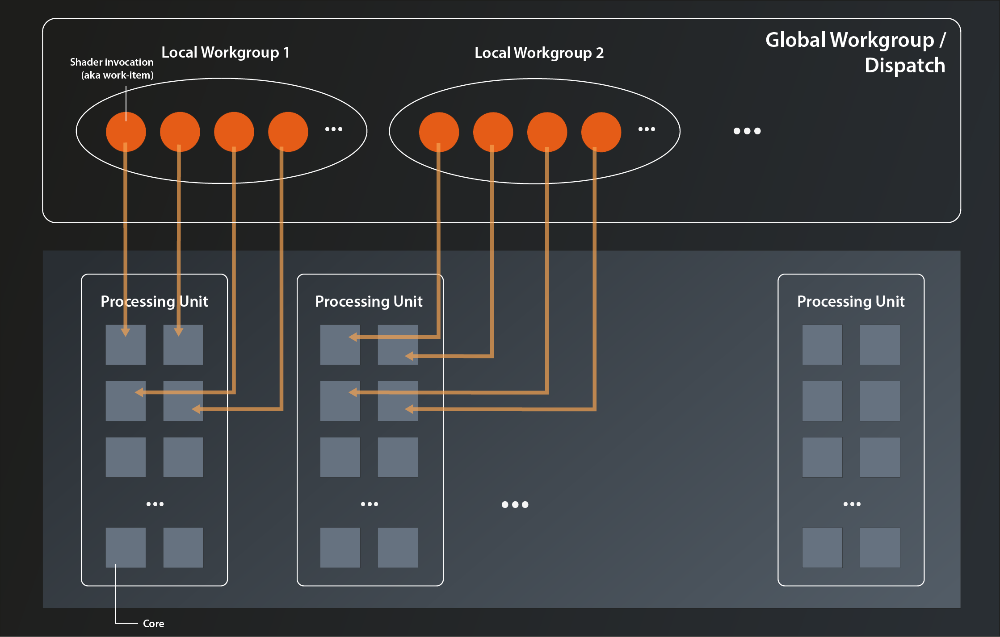

# Shaders
Shaders are small programs that are executed on the GPU hardware, usually a lot of them in parallel. Vulkan and OpenGL shaders are written in a language called GLSL (GL Shading Language)(1), which is very similar to C. The shaders are compiled and uploaded to the graphics hardware every time the Vulkan application runs. There are multiple types of shaders that allow you to customize the graphics pipeline at different points, e.g. vertex-, fragment- or geometry shaders. For our compute pipeline however there is only one relevant type, which is the compute shader.

## GLSL basics
The most basic shader we can write in GLSL looks something like this:
```
#version 450

void main() 
{
    
}
```
To C and C++ programmers this looks pretty familiar, right? The first line, starting with a hash, is indeed called a preprocessor directive just like in C and C++. Every shader should start with this version identifier that denotes the GLSL language version the shader is written in. This allows the compiler to process the code in the best possible way and do detailed checks according to the denoted version.

Most of the other preprocessor directives will be intuitive for C and c++ programmers: `#define`, `#undef`, `#ifdef`, `#pragma`, `#error` etc. There are also a few that are specific to GLSL, like `#version`, but ultimately there's nothing new here.

The main function is slightly different compared to it's C/C++ counterparts in that it doesn't have a return value. Shaders do not return values. But otherwise functions are declared and used in the same way as in C/C++. 

## compiling the shader
Another difference between Vulkan and OpenGL is that Vulkan requires us to precompile the shaders. In OpenGL the GLSL code is loaded by the application and then compiled and linked into a program explicitly. Since all of that happens at runtime, the respective driver on the user's device needs to do all the required heavylifting. This makes OpenGL drivers even more complex than they need to be anyway and may lead to subtle differences in behaviour or even bugs because of the different compiler implementations.

In Vulkan, the GLSL code has to be precompiled into an intermediate binary representation called SPIR-V before loading it into the application and handing it over to the runtime. So instead of raw GLSL the shaders are shipped with the application as SPIR-V bytecode. Compiling SPIR-V to the native binary code for the GPU is much less complex, the drivers can thus be simpler and the potential for bugs and divergences is reduced quite significantly.

The GLSL to SPIR-V compiler that comes with the Vulkan SDK is located in its `bin` folder and is called `glslc`. It's basic usage is very straightforward:
```
> glslc  <glsl_shader_filename>  -o <compiled_shader_filename>
```
So let's compile our minimal shader from above. Create a folder `shaders` in the project root. In that folder create a text file named `compute.comp`(2) and paste the above code into the file. Then create another folder `shaders` in the `build\bin` directory and finally run this command(3):
```
> glslc shaders/compute.comp -o build/bin/shaders/compute.spv
```
That command should terminate without any output (indicating success) and you now should see the file `compute.spv` in your `build/bin/shaders` folder.

Nice, we have the shader code in a format now that can be used by Vulkan. However, I don't want to manually repeat the compilation whenever I change the shader code, so let's instead add it as a build step to our `CMakeLists.txt`:
```
add_custom_target( compute_shader
    COMMAND             "glslc" "${VULKAN_TUTORIAL_PROJECT_ROOT}/shaders/compute.comp" -o "shaders/compute.spv"
    WORKING_DIRECTORY   "${CMAKE_BINARY_DIR}/bin"
)
```
Now the shader should be compiled every time you build and run the project.

## loading the shader
Okay, we have the precompiled shader now. The next step is to load it into the application and pass it on to Vulkan. The Vulkan C++ representation of a shader is `vk::ShaderModule` and it is created like this:
```
class Device
{
    ...
    UniqueShaderModule createShaderModuleUnique( const ShaderModuleCreateInfo& createInfo, ... );
    ...
};
```
No surprises so far, let's look at `ShaderModuleCreateInfo`:
```
struct ShaderModuleCreateInfo
{
    ...
    ShaderModuleCreateInfo& setFlags( vk::ShaderModuleCreateFlags );
    ShaderModuleCreateInfo& setCode( const vk::container_t< const std::uint32_t >& );
    ...
};
```
As so often, the flags are just there for future use, which means that we really only have one parameter to set - the shader code in the form of a 32bit uint buffer. Which means that the whole process of creating the `ShaderModule` is very straightforward:
```
vk::UniqueShaderModule create_shader_module( 
    const vk::Device& logicalDevice, 
    const std::filesystem::path& path 
)
{
    std::ifstream is{ path, std::ios::binary };
    if ( !is.is_open() )
        throw std::runtime_error( "Could not open file" );

    auto buffer = std::vector< std::uint32_t >{};
    const auto bufferSizeInBytes = std::filesystem::file_size( path );
    buffer.resize( std::filesystem::file_size( path ) / sizeof( std::uint32_t ) );

    is.seekg( 0 );
    is.read( reinterpret_cast< char* >( buffer.data() ), bufferSizeInBytes );

    const auto createInfo = vk::ShaderModuleCreateInfo{}.setCode( buffer );
    return logicalDevice.createShaderModuleUnique( createInfo );
}
```
The only thing we need to pay a bit of attention to is the mismatch between what the standard library expects when reading data (a pointer to a byte buffer) and what Vulkan expects (a `uint32_t` buffer). I've packaged the shader module creation into it's own function from the start because it makes the code in main clearer and we're definitely going to need it more often in the future when we get to the graphics shaders. So with that we can load our compiled compute shader:
```
const auto computeShader = create_shader_module( *logicalDevice, "./shaders/compute.spv" );
``` 

## extending the shader code
The shader we have so far is obviously not useful for anything. Let's change that. Let's assume our goal is to multiply each input element by 4.2, which is still not particularly useful, but at least we could demonstrate that the pipeline works and the values are computed. So what we want to do is something like this:
```
void main()
{
    outputBuffer = inputBuffer * 4.2;   // does not compile
}
```
That won't work of course. If you try to compile the shader in that stage, `glslc` will complain that neither `outputBuffer` nor `inputBuffer` are declared. Ultimately we want the buffers to be the GPU buffers we created in the last lesson. But since we don't know how to do that yet, let's create some dummy buffers directly in the shader:
```
int inputBuffer[512];
float outputBuffer[512];
```
That solves the issue with the undeclared variables, but now we have a new problem. Just like in C++ it is not possible to just multiply a buffer by a factor. And even if it were possible - the whole point of our compute pipeline is to parallelize the calculation by running the shader many times in parallel. So we don't want the shader code to process the whole buffer, we want each shader instance to only process one element in that buffer. Something along these lines:
```
void main()
{
    outputBuffer[processingIndex] = inputBuffer[processingIndex] * 4.2;
}
```
So we need the `processingIndex`, i.e. the index of the data element that the specific shader invocation is supposed to process. 
To be able to set this in a meaningful way, we have to take a quick detour and look into how graphics hardware is organized and how Vulkan models compute shader invocations to make use of that hardware.

As mentioned before in this tutorial, GPUs have hundreds of small general purpose processing cores. They are much simpler than the cores in a modern CPU, but because they are so many they can do parallel computations on big datasets really fast. Those small cores are grouped into larger processing units which share registers, caches, scheduler etc and can run multiple batches of work in a hyperthreaded way.

The two main concepts in Vulkan to organize this massive parallelization are the so-called local and global workgroups. Local workgroups are defined in the shader code itself and thus cannot be modified at runtime. A local workgroup essentially defines how many instances of the shader are to be executed simultaneously. In the simplest case the workgroup size is just a one-dimensional number, but Vulkan also allows you to specify two- and three-dimensional workgroups.(4)

Global workgroups (aka Dispatches) on the other hand are created by the host application at runtime. A global workgroup defines how many local workgroups are to be run in parallel. You might wonder why that differentiation was made instead of just having one type of workgroup that directly specifies the number of parallel computations. The reason is that this two-level hierarchy is much better tailored to the architecture of the GPUs, as the driver can better distribute the local workgroups to the available processing units. In addition, the shader invocations in one local workgroup can access workgroup-local memory and share state and data (something we won't go into further detail here).



We'll talk more about dispatching the global workgroups in a later episode. For now let's focus on the local workgroups. As said, those are defined in the shader code by specifying the workgroup layout:
```
layout( local_size_x = 8, local_size_y = 8, local_size_z = 4 ) in;
```
This is an example of a three-dimensional local workgroup. In our current usecase the multiple dimensions don't really add any value, so we can go with a one-dimensional one:
```
layout( local_size_x = 64 ) in;
```
As you can see, you can omit the y and z dimension if it's 1. Note that we're setting the workgroup size to be smaller than the number of elements in our buffer. It is a recommended best practice to keep local workgroups relatively small (<=64) so that they can fit into one processing unit. That means of course that we'll have to issue eight of them in our dispatch from the application to process all our data.

Now that we have the workgroup size defined, specifying the correct index into our data is actually very straightforward, as GLSL provides the builtin variables `gl_WorkGroupID`, `gl_WorkGroupSize` and `gl_LocalInvocationID`:
void main()
{
    uint processingIndex = gl_WorkGroupID.x * gl_WorkGroupSize.x + gl_LocalInvocationID.x;
    outputBuffer[processingIndex] = inputBuffer[processingIndex] * 4.2;
}
`gl_WorkGroupID` is the index of the current workgroup in the dispatch and `gl_LocalInvocationID` is the index of the shader invocation within this workgroup. The size of a local workgroup can be obtained with `gl_WorkGroupSize`. All three variables are 3-dimensional vectors, just as the workgroup can be 3-dimensional. So obviously we'd need to also take the y and z values into account if our workgroups had more than one dimension.

So far so good. Our shader is still not doing anything useful, because it isn't connected to actual input and output buffers yet. Before we can modify it accordingly though we need to understand a bit more about how the compute pipeline works. We'll therefore leave it as is for the moment and start working on the pipeline next time.

1. The GLSL Vulkan profile differs slightly from the one for OpenGL, mostly in that it removes deprecations. Some OpenGL shaders therefore might not compile directly for Vulkan without modifications. However, those modifications should usually be pretty minor.
2. There is no official standard that specifies the extension of .glsl shaders. However, the extensions `.vert`, `.frag` and `.comp` are very common for vertex, fragment and compute shaders respectively. They are also recognized by most tools that work with GLSL (e.g. VS code extensions).
3. Installing the Vulkan SDK should have put its `bin` directory in your path so that the executable is found automatically. If that is not the case you should add that directory to your path by hand and try again.
4. To my knowledge this is pure convenience for when you have to deal with two- and three-dimensional datasets (plus maybe a bit of heritage from graphics programming). I.e. there is no practical difference on the hardware between a one-dimensional workgroup with 256 parallel invocations, and a three-dimensional one with a size of 8x8x4.
5. In case you want to set a bigger workgroup size, be sure to check the value of vk::PhysicalDeviceProperties::limits::maxComputeWorkGroupInvocations (see lesson 3). That tells you the maximum number of parallel invocations in a local workgroup the device supports.

Further reading:

https://stackoverflow.com/questions/54750009/compute-shader-and-workgroup