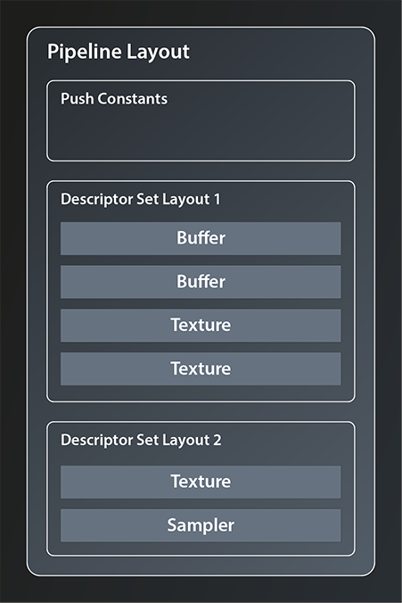
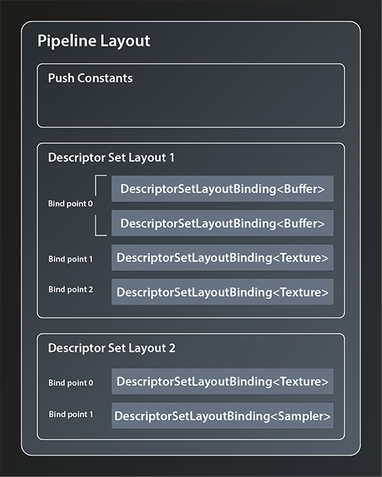

# The Compute Pipeline

So, we have the data that we want to process uploaded to GPU memory. We have the shader module that is supposed to process the data precompiled and ready to use (at least technically). We have the logical device configured with a compute queue that would be able to run the processing commands. The problem is: none of these building blocks know anything about one another yet. The queue has no idea that it is supposed to run our shader module, and the shader has no idea where to find the data to process. We somehow need to bring those building blocks together. For that purpose we need to create a pipeline.

## Pipelines
A pipeline object represents the configuration of the whole processing chain on the GPU. This includes the layout of the different stages and how the data flows between them, as well as the concrete shaders that are to be used in the various stages and the layout of the data itself.
Graphics pipelines can get very very complex, with multiple shader stages and additional graphics functionality like blending modes, backface culling, primitive topology etc. plus all the associated data. Fortunately for us compute pipelines are much simpler as they essentially only have one stage: the compute shader stage.

Pipelines are created via the logical device. There are dedicated functions for each type of pipeline:
```
class Device
{
    ...
    // return values are actually ResultValue< UniquePipeline >, see chapter 2
    UniquePipeline createGraphicsPipelineUnique( PipelineCache pipelineCache, const GraphicsPipelineCreateInfo& createInfo, ... );  
    UniquePipeline createComputePipelineUnique( PipelineCache pipelineCache, const ComputePipelineCreateInfo& createInfo, ... );
    UniquePipeline createRayTracingPipelineKHRUnique( ... );
    ...
};
```
So we need two parameters for our compute pipeline. The `PipelineCache` is a helper object that can be used to speed up pipeline (re-)creation. It is recommended to use, but you can also pass in a temporary object. That's what we will do in this tutorial. 
The `ComputePipelineCreateInfo` looks like this:
```
struct ComputePipelineCreateInfo
{
    ...
    ComputePipelineCreateInfo& setFlags( vk::PipelineCreateFlags flags_ );
    ComputePipelineCreateInfo& setStage( const vk::PipelineShaderStageCreateInfo& stage_ );
    ComputePipelineCreateInfo& setLayout( vk::PipelineLayout layout_ );
    ComputePipelineCreateInfo& setBasePipelineHandle( vk::Pipeline basePipelineHandle_ );
    ComputePipelineCreateInfo& setBasePipelineIndex( int32_t basePipelineIndex_ );
    ...
};
```
There is quite a number of flag bits we could set as the `PipelineCreateFlags`, but none of them are really relevant for us at this point. The functions related to the `BasePipeline` come into play when you want to derive one pipeline from another one (a bit like class inheritance in C++). We're not going to need that here either. Which leaves two functions that we need to look at: `setStage` and `setLayout`.

## The Compute Shader Stage
As said, compute pipelines are pretty straightforward in that they only have the compute stage. How that stage is to be configured concretely is determined by a `PipelineShaderStageCreateInfo` structure which looks like this:
```
struct PipelineShaderStageCreateInfo
{
    ...    
    PipelineShaderStageCreateInfo& setFlags( vk::PipelineShaderStageCreateFlags flags_ );
    PipelineShaderStageCreateInfo& setStage( vk::ShaderStageFlagBits stage_ );
    PipelineShaderStageCreateInfo& setModule( vk::ShaderModule module_ );
    PipelineShaderStageCreateInfo& setPName( const char* pName_ );
    PipelineShaderStageCreateInfo& setPSpecializationInfo( const vk::SpecializationInfo* pSpecializationInfo_ ) ;
    ...
};
```
That's quite a few potentially relevant fields, let's look at them one by one:
- once more, although there are some `PipelineShaderStageCreateFlagBits` specified, we can ignore the `flags_` parameter for our usecase.
- the `stage_` parameter determines the stage in the pipeline that this create info configures. For us that is obviously `ShaderStageFlagBits::eCompute`
- `module_` is the shader module we created in the last lesson. 
- `setPName` is used to specify the entry point into the shader, i.e. the name of the top-level function to call for this shader stage. That makes sense because SPIR-V allows for multiple entry points in one shader. However, multiple entry points are to my knowledge not yet supported by GLSL, so creating such a shader module would be more involved than simply compiling GLSL code. We'll therefore stick to `main` as our shader entry point. 
- `SpecializationInfo` can be used to configure so-called specialization constants. That's a mechanism that allows for configuring a shader at pipeline creation time, e.g. for configuring the local workgroup size according to the device's capabilities. We won't use this feature, so we'll ignore also this function.

That means we can create our `PipelineShaderStageCreateInfo` like so:
```
const auto shaderStageInfo = vk::PipelineShaderStageCreateInfo{}
    .setStage( vk::ShaderStageFlagBits::eCompute )
    .setPName( "main" )
    .setModule( *computeShader );
```
That wasn't too hard, was it? With that our pipeline would know already which shader to use.

## Pipeline Layout
Let's now look at the second structure that we need to create our pipeline, the `PipelineLayout`. That one represents the configuration of the pipeline in terms of how the data that is processed in the pipeline is structured. It is created using the familiar pattern:
```
class Device
{
    ...
    UniquePipelineLayout createPipelineLayoutUnique( const vk::PipelineLayoutCreateInfo& , ... );
    ...
};
```
... with:
```
struct PipelineLayoutCreateInfo
{
    ...
    PipelineLayoutCreateInfo & setFlags( vk::PipelineLayoutCreateFlags flags_ );
    PipelineLayoutCreateInfo & setSetLayouts( const container_t< const vk::DescriptorSetLayout >& setLayouts_ );
    PipelineLayoutCreateInfo & setPushConstantRanges( const container_t< const vk::PushConstantRange>& pushConstantRanges_ );
    ...
};
```
The flags are once again reserved for future use. Push constants are a mechanism to send small amounts of data to the shaders in a fast way. We may cover them later, but for now we just want to get the pipeline working so we'll ignore the `pushConstantRanges_` as well. Which means that we only need to set the `DescriptorSetLayout`s. So what are those?

To explain that we need to first talk about descriptors. The Vulkan pipeline and it's shaders do not access data resources (like e.g. images and buffers) directly. Instead descriptors are used as proxy objects. This indirection allows for the pipeline to be created once and then remain unchanged while still being able to work with changing resources. Those descriptors are always grouped in `DescriptorSet`s, you cannot create a descriptor that is not part of such a set.

We'll get to actually creating `DescriptorSet`s in the next lesson. To create our `PipelineLayout` however, we don't need the actual set but only its layout. As said, the `PipelineLayout` represents the structure of the data the pipeline is going to work with, so we need to give it the structure of the descriptor sets we're intending to use. This is what the `DescriptorSetLayout` is for. A `PipelineLayout` can contain multiple `DescriptorSetLayout`s, as depicted in the following example:



There is, however, a limitation to the number of descriptor sets that can be bound to one pipeline. This limit is device dependent and can be as low as 4(1).

So let's see how we can create our layout:
```
class Device
{
    ...
    UniqueDescriptorSetLayout createDescriptorSetLayoutUnique( const vk::DescriptorSetLayoutCreateInfo&, ... );
    ...
};
```
Again the familiar pattern. The create info is very simple, it looks like this:
```
struct DescriptorSetLayoutCreateInfo
{
    ...
    DescriptorSetLayoutCreateInfo& setFlags( vk::DescriptorSetLayoutCreateFlags flags_ );
    DescriptorSetLayoutCreateInfo& setBindings( const container_t< const vk::DescriptorSetLayoutBinding >& bindings_ );
    ...
};
```
There are a few flags defined but we don't need any for our use case, so let's concentrate on the second function. That takes a collection of `DescriptorSetLayoutBinding`s. Those bindings define which concrete types of resources make up the `DescriptorSetLayout` and in which order. Let me try to illustrate this by refining the example from before:



`DescriptorSetLayoutBinding` offers the following interface:
```
struct DescriptorSetLayoutBinding
{
    ...
    DescriptorSetLayoutBinding& setBinding( uint32_t binding_ );
    DescriptorSetLayoutBinding& setDescriptorType( vk::DescriptorType descriptorType_ );
    DescriptorSetLayoutBinding& setDescriptorCount( uint32_t descriptorCount_ );
    DescriptorSetLayoutBinding& setStageFlags( vk::ShaderStageFlags stageFlags_ );
    DescriptorSetLayoutBinding& setImmutableSamplers( const container_t<const vk::Sampler>& immutableSamplers_ );
    ...
};
```
- the first parameter, the `binding_`, defines the so-called bind point of this descriptor. You can think of the bind point as the index of the slot in the descriptor set that this resource occupies (see also the image above).
- `descriptorType` is straightforward as it simply identifies the resource type this descriptor is representing. There are quite a few possible resource types available, in our case `eStorageBuffer` is the right one to use because both our input and output data are just that: storage buffers.
- you can actually bind multiple descriptors of the same type to one bind point, which is what the `descriptorCount_` parameter is for.
- the `stageFlags_` define which shader stages are allowed to access the descriptor(s). Since we only have the compute stage, we'll just pass the `eCompute` flag.
- finally, we can ignore the `immutableSamplers_` parameter for now because we do not have a sampler resource.

So, with that information we can create the bindings for our input and output buffer and feed them into the create info from which we create the `DescriptorSetLayout`.
```
vk::UniqueDescriptorSetLayout create_descriptor_set_layout( const vk::Device& logicalDevice )
{
    const auto bindings = std::array< vk::DescriptorSetLayoutBinding, 2 >{
        vk::DescriptorSetLayoutBinding{}
            .setBinding( 0 )
            .setStageFlags( vk::ShaderStageFlagBits::eCompute )
            .setDescriptorType( vk::DescriptorType::eStorageBuffer )
            .setDescriptorCount( 1 ),
        vk::DescriptorSetLayoutBinding{}
            .setBinding( 1 ) 
            .setStageFlags( vk::ShaderStageFlagBits::eCompute )
            .setDescriptorType( vk::DescriptorType::eStorageBuffer )
            .setDescriptorCount( 1 ),
    };
    const auto descriptorSetLayoutCreateInfo = vk::DescriptorSetLayoutCreateInfo{}
        .setBindings( bindings );

    return logicalDevice.createDescriptorSetLayoutUnique( descriptorSetLayoutCreateInfo );
}
```
So we bind one descriptor representing a storage buffer to binding point one and another one to binding point two.

## Completing the Shader Code
Let's take a quick detour back to our compute shader now. Because we have defined the data layout and told our pipeline the bind points for our data buffers, we can now actually complete the shader code and get rid of the dummy buffers. As said, the shaders access data via the descriptors, so all we need to do now is to tell our shader the bind points of the descriptors that represent the input and output buffer. In GLSL this is done by defining so-called Shader Storage Buffer Objects:
```
layout( binding = 0 ) readonly buffer inputBufferLayout
{
    uint inputBuffer[];
};

layout( binding = 1 ) writeonly buffer outputBufferLayout
{
    float outputBuffer[];
};
```
As you can see there is a direct correspondence between the descriptor set layout that we specified above and the `layout` directives in the shaders. It is essential that the declaration of the bind points for the resources match, otherwise our pipeline won't work correctly. The `readonly` and `writeonly` qualifiers should be self explanatory. You can omit them in which case the resource will be readwrite. Since you can use the same layout declaration syntax for different types of resources, you have to specify the type explicitly. In our case it is `buffer`. The last identifier is the name of the layout.

You might wonder why it is necessary to declare the actual buffers again in between the parentheses. The answer is that you can structure the buffer into multiple different data blocks as displayed in the following example:
```
layout( binding = 2 ) buffer MyExampleBuffer
{
  mat4 matrix;
  vec4 vector;
  float lotsOfFloats[];
};
```
The only requirement is that the size of all fields is known and fixed except for the last one. We don't need this feature, nevertheless we have to adhere to the syntax and give our buffers a name. Anyway, our shader is now complete and should be fully functional once we're able to invoke it properly from our pipeline.

## Creating the Pipeline
Speaking of the pipeline: with the descriptor set layout defined, we now have all the pieces needed to create it:
```
vk::UniquePipeline create_compute_pipeline(
    const vk::Device& logicalDevice,
    const vk::DescriptorSetLayout& descriptorSetLayout,
    const vk::ShaderModule& computeShader
)
{
    const auto pipelineLayoutCreateInfo = vk::PipelineLayoutCreateInfo{}
        .setSetLayouts( descriptorSetLayout );

    const auto pipelineLayout = logicalDevice.createPipelineLayoutUnique( pipelineLayoutCreateInfo );
    const auto pipelineCreateInfo = vk::ComputePipelineCreateInfo{}
        .setStage( 
            vk::PipelineShaderStageCreateInfo{}
                .setStage( vk::ShaderStageFlagBits::eCompute )
                .setPName( "main" )
                .setModule( computeShader )
        )
        .setLayout( *pipelineLayout );

    return logicalDevice.createComputePipelineUnique( vk::PipelineCache{}, pipelineCreateInfo ).value;
}

int main()
{
    try
    {
        ...
        const auto descriptorSetLayout = create_descriptor_set_layout( *logicalDevice );
        const auto pipeline = create_compute_pipeline( *logicalDevice, *descriptorSetLayout, *computeShader );
    }
    ...
}
```
Wohoa, we've created our compute pipeline. It has the compute shader and also knows the descriptor layout for our input and output buffers so that it can pass those on to the shader.

There are still a few things missing though. For one, the pipeline knows the layout of the descriptor sets but we didn't actually create any descriptor set yet. Second, it still needs to be told what to do with all that(1). That's what we're going to cover in the next chapter.


1. See https://vulkan.gpuinfo.org/displaydevicelimit.php?name=maxBoundDescriptorSets&platform=windows
2. This might seem a bit stupid - the pipeline should execute the shaders on the input data of course. Well, that might be obvious for you in this simple case. But Vulkan is designed to handle much more complex scenarios. Therefore we need to tell it exactly what we want

Further reading:
https://vkguide.dev/docs/chapter-4/descriptors/
https://www.khronos.org/opengl/wiki/Shader_Storage_Buffer_Object