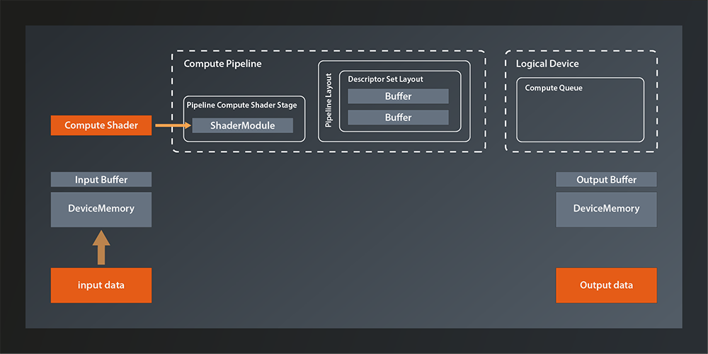

# Descriptors

Before we continue, let's do a quick recap on where we are at right now:



- we have the logical device with the appropriate queue to run a compute pipeline
- we have our input data uploaded to a buffer on the GPU
- we also have a GPU and a main memory buffer ready to store the results
- we have the compute pipeline configured to have the right descriptor set layout for our buffers
- our compute shader is finished and attached to the pipeline

What is still missing for a fully functional setup is:
- although the pipeline knows the correct descriptor set layout, we did not yet create any actual descriptor set that we could bind to the pipeline. So the pipeline still has no way to access the data in our GPU buffers.
- our device still has no idea that it is supposed to run this pipeline now on its queue (remember, we might have configured a device with multiple queues as well as created multiple pipelines. Which pipeline should run on which queue? This is something Vulkan cannot simply guesss, you have to tell it)
- and of course we'll need to copy our results back to main memory after the computation, so that we can use them

We'll take care of creating the descriptor sets today. In the next lesson we'll then finally put everything together.

## Allocating Descriptor Sets
If you search a bit in the Vulkan C++ interface you will find that the function we probably want to use to create our descriptor set is this one:
```
class Device
{
    ...
    std::vector< DescriptorSet > allocateDescriptorSets( const DescriptorSetAllocateInfo&, ... );
    ...
};
```
Interesting, why is this function called `allocate...` instead of `create...`? And why is there no `...Unique` version of it? Let's look at the `DescriptorSetAllocateInfo` to try and answer these questions:
```
struct DescriptorSetAllocateInfo
{
    ...
    DescriptorSetAllocateInfo& setSetLayouts( const container_t< const DescriptorSetLayout >& setLayouts_ );
    DescriptorSetAllocateInfo& setDescriptorPool( DescriptorPool descriptorPool_ );
    ...
};
```
`setSetLayouts` is straightforward enough: we need to provide a layout for each descriptor set we want to allocate. So in our case we just need to pass the one descriptor set layout we created in the last episode, because that's the only descriptor set we need. But what about the `DescriptorPool`?

Turns out that descriptor sets not just created like most other structures we've come across so far. Instead they are allocated from a `DescriptorPool`. The concept is pretty much the same as with memory pools in C / C++ and it's obviously another optimization in Vulkan. This also explains the absence of a unique handle for the descriptor sets - since they are allocated from a pool, they will be cleaned up automatically when the pool is destroyed(1).

So we need to create such a pool before we can allocate the descriptor sets. Creating the pool follows the familiar pattern:
```
vk::UniqueDescriptorPool createDescriptorPoolUnique( const DescriptorPoolCreateInfo& createInfo );
```
... and the `DescriptorPoolCreateInfo` looks like this:
```
struct DescriptorPoolCreateInfo
{
    ...
    DescriptorPoolCreateInfo& setFlags( vk::DescriptorPoolCreateFlags flags_ );
    DescriptorPoolCreateInfo& setPoolSizes( const container_t<const vk::DescriptorPoolSize >& poolSizes_ );
    DescriptorPoolCreateInfo& setMaxSets( uint32_t maxSets_ );
    ...
};
```
There are a few `DescriptorPoolCreateFlags` defined but we can ignore them for now(1). Let's look at the pool sizes parameter:
```
struct DescriptorPoolSize
{
    ...
    DescriptorPoolSize& setType( vk::DescriptorType type_ );
    DescriptorPoolSize& setDescriptorCount( uint32_t descriptorCount_ );
    ...
};
```
Okay, that looks pretty straightforward. One instance of `DescriptorPoolSize` just represents a descriptor type and a count. So with that we define the maximum number of descriptors of a certain type the pool will be able to provide. You can specify multiple `DescriptorPoolSizes` for the same descriptor type, in which case the total number of descriptors the pool can provide will simply be the sum of all specified sizes.

But what about the `maxSets_` parameter in `DescriptorPoolCreateInfo`? Well, this defines how many descriptor sets can be allocated from the pool in total. You have to adhere to both limits, the one for the number of sets and also the one for the number of descriptors. Since that relationship between `poolSizes_` and `maxSets_` is a bit confusing, let me give you an example: 
- let's say you specify the pool sizes to be two `DescriptorType::eStorageBuffer`s and two `DescriptorType::eSampledImage`s
- let's also assume you set `maxSets_` to be two
- then you could either allocate two descriptor sets, each containing one buffer and one image (so the total number of descriptors allocated is two for each descriptor type)
- or you could allocate one set with two buffers and one with two images (same thing, total number of descriptors of each type is two)
- or you could allocate one set with two buffers and one image and another one with only one image
- etc, you get the idea.

So, as it looks we now have everything to create the pool according to our needs and allocate our one required descriptor set:
```
vk::UniqueDescriptorPool create_descriptor_pool( const vk::Device& logicalDevice )
{
    const auto poolSize = vk::DescriptorPoolSize{}
        .setType( vk::DescriptorType::eStorageBuffer )
        .setDescriptorCount( 2 );
    const auto poolCreateInfo = vk::DescriptorPoolCreateInfo{}
        .setMaxSets( 1 )
        .setPoolSizes( poolSize );
    return logicalDevice.createDescriptorPoolUnique( poolCreateInfo );
}

int main()
{ 
    try
    {
        ...    
        const auto descriptorPool = create_descriptor_pool( *logicalDevice );
        const auto allocateInfo = vk::DescriptorSetAllocateInfo{}
            .setSetLayouts( *descriptorSetLayout )
            .setDescriptorPool( *descriptorPool );
        const auto descriptorSets = logicalDevice->allocateDescriptorSets( allocateInfo );
    }
    ...
}
```
Nice, we have the concrete descriptor set now. Unfortunately there still seems to be no connection to our actual buffers. Why is this again so complicated?

The reason here is that the layout of the descriptor set is not going to change. After all, our whole pipeline and shaders are tailored to that layout. The actual data in the buffers, the images etc on the other hand are pretty likely to change in a real world application. Since we don't want to continuously allocate and release descriptor sets, there is this additional level of indirection that separates the descriptor set from the data. The flipside is that we have to do an extra step to connect our descriptor set with the resources it represents. This is called updating the descriptor set:
```
class Device
{
    ...
    void updateDescriptorSets( 
        const container_t< vk::WriteDescriptorSet >& writeDescriptorSet,
        const container_t< vk::CopyDescriptorSet >& copyDescriptorSet,
        ...
    );
    ...
};
```
Since we don't want to copy any descriptor sets, we can focus on the `writeDescriptorSet` parameter.
```
struct WriteDescriptorSet
{
    ...
    WriteDescriptorSet& setDstSet( vk::DescriptorSet dstSet_ );
    WriteDescriptorSet& setDstBinding( uint32_t dstBinding_ );
    WriteDescriptorSet& setDescriptorType( vk::DescriptorType descriptorType_ );
    WriteDescriptorSet& setDstArrayElement( uint32_t dstArrayElement_ );
    WriteDescriptorSet& setDescriptorCount( uint32_t descriptorCount_ )
    WriteDescriptorSet& setImageInfo( const container_t< const vk::DescriptorImageInfo >& imageInfo_ );
    WriteDescriptorSet& setBufferInfo( const container_t< const vk::DescriptorBufferInfo >& bufferInfo_ );
    WriteDescriptorSet& setTexelBufferView( const container_t< const vk::BufferView >& texelBufferView_ );
    ...
};
```
That struct looks a bit more involved. Let's unpack the fields:
- `dstSet` is straightforward, it's the descriptor set we want to update. 
- `dstBinding` as well, that's the first bind point we want to update. The number of bind points to update is derived from the number of elements passed to the `set...Info` functions.
- the `descriptorType_` should also be clear
- `dstArrayElement` and `descriptorCount_` are a bit less straightforward. You might remember from the last lesson that it is possible to bind multiple resources of the same type to one bind point in the descriptor set layout. In our simple case we did not make use of that feature, but imagine you are binding a dozen or more texture images to one bind point. If only one texture in the middle of that set changes, it would be very inefficient to update all descriptors at that bind point. Therefore Vulkan allows you to set the index and the count of descriptors you want to update. In our case we can ignore both fields since we only have one resource at each bind point.
- we can ignore `imageInfo_` and `texelBufferView_` as well for now because we don't deal with images yet. 
- which leaves the `DescriptorBufferInfo`, so let's look at that:
```
struct DescriptorBufferInfo
{
    ...
    DescriptorBufferInfo& setBuffer( vk::Buffer buffer_ );
    DescriptorBufferInfo& setOffset( vk::DeviceSize offset_ );
    DescriptorBufferInfo& setRange( vk::DeviceSize range_ );
    ...
};
```
Now that looks straightforward enough. We can specify the buffer we want to bind to the respective descriptor and optionally an offset and range in that buffer.

Which means that we now can actually connect our buffers with the descriptors:
```
const auto bufferInfos = std::vector< vk::DescriptorBufferInfo >{
    vk::DescriptorBufferInfo{}
        .setBuffer( *inputBuffer.buffer )
        .setOffset( 0 )
        .setRange( sizeof( inputData ) ),
    vk::DescriptorBufferInfo{}
        .setBuffer( *outputBuffer.buffer )
        .setOffset( 0 )
        .setRange( sizeof( outputData ) ),
};
const auto writeDescriptorSet = vk::WriteDescriptorSet{}
    .setDstSet( descriptorSets[0] )
    .setDstBinding( 0 )
    .setDescriptorType( vk::DescriptorType::eStorageBuffer )
    .setBufferInfo( bufferInfos );
    
logicalDevice->updateDescriptorSets( writeDescriptorSet, {} );
```
And that's it. We've created and updated our descriptor sets. One remaining problem is that our pipeline still doesn't know about that descriptor set. We also did not yet address the question of how to actually execute our pipeline on the device. We'll cover both of that in the next lesson when we'll finally get our pipeline running.


1. You can explicitly release individual descriptor sets instead of letting them be cleaned up automatically when the pool is destroyed. In that case you need to set the `DescriptorPoolCreateFlagBits::eFreeDescriptorSet` flag when creating the pool.

Further reading:
https://www.intel.com/content/www/us/en/developer/articles/training/api-without-secrets-introduction-to-vulkan-part-6.html#inpage-nav-3-1